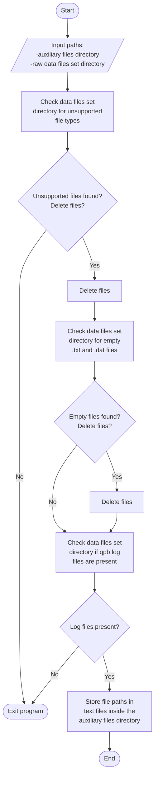

# validate_qpb_data_files.py flowchart

```mermaid
flowchart TD
    
    Start([Start]) --> Inputs[/Input paths:
    -auxiliary files directory
    -raw data files set directory
    /]
    
    %% Script checks for unsupported file types
    Inputs --> RemoveUnsupported[
        Check data files set 
        directory for unsupported 
        file types
        ]
    RemoveUnsupported --> UnsupportedFiles{
        Unsupported files found?
        Delete files?
        }
    UnsupportedFiles -- Yes --> DeleteFiles[Delete files]
    UnsupportedFiles -- No --> Exit([Exit program])
    
    %% Script checks for empty file types
    DeleteFiles --> RemoveEmpty[
        Check data files set 
        directory for empty 
        .txt and .dat files
        ]
    RemoveEmpty --> EmptyFiles{
        Empty files found?
        Delete files?
        }
    EmptyFiles -- Yes --> DeleteEmptyFiles[Delete files]
    EmptyFiles -- No --> CheckQPB
    
    %% Script checks qpb log files are present indeed
    DeleteEmptyFiles --> CheckQPB[
        Check data files set 
        directory if qpb log 
        files are present
        ]
    CheckQPB --> LogFiles{Log files present?}
    LogFiles -- No --> Exit
    LogFiles -- Yes --> StorePaths[
        Store file paths in 
        text files inside the 
        auxiliary files directory
        ]
    
    StorePaths --> End([End])
```
