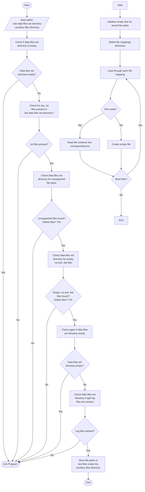

# validate_qpb_data_files.py flowchart

```mermaid
flowchart TD
    
    Start([Start]) --> Inputs[/Input paths:
    -raw data files set directory
    -auxiliary files directory
    /]
    
    %% Script checks if data files set directory is empty
    Inputs --> CheckDirectory[
        Check if data files set 
        directory is empty
        ]
    CheckDirectory --> EmptyDirectory{
        Data files set 
        directory empty?
        }
    EmptyDirectory -- Yes --> Exit([Exit program])

    %% Script checks if any qpb log files are present
    EmptyDirectory -- No --> CheckTxtFiles[
        Check for any .txt 
        files present in 
        the data files set directory?
        ]
    CheckTxtFiles --> TxtFilesPresent{
            .txt files present?
            }
    TxtFilesPresent -- No --> Exit([Exit program])

    %% Script checks for unsupported file types
    TxtFilesPresent -- Yes --> RemoveUnsupported[
        Check data files set 
        directory for unsupported 
        file types
        ]
    RemoveUnsupported --> UnsupportedFiles{
        Unsupported files found?
        Delete files? Y/N
        }
    UnsupportedFiles -- No --> Exit([Exit program])
    
    %% Script checks for empty file types
    UnsupportedFiles -- Yes --> RemoveEmpty[
        Check data files set 
        directory for empty 
        .txt and .dat files
        ]
    RemoveEmpty --> EmptyFiles{
        Empty .txt and .dat 
        files found?
        Delete files? Y/N
        }
    EmptyFiles -- No --> Exit([Exit program])
    EmptyFiles -- Yes --> CheckEmptyDirectory[
        Check again if data files 
        set directory empty
    ]
    CheckEmptyDirectory --> EmptyDirectory2{
        Data files set 
        directory empty?
        }
    EmptyDirectory2 -- Yes --> Exit([Exit Program])
    
    
    %% Script checks qpb log files are present indeed
    EmptyDirectory2 -- No --> CheckQPB[
        Check data files set 
        directory if qpb log 
        files are present
        ]
    CheckQPB --> LogFiles{Log files present?}
    LogFiles -- No --> Exit
    LogFiles -- Yes --> StorePaths[
        Store file paths in 
        text files inside the 
        auxiliary files directory
        ]
    
    %% Script checks qpb log files are present indeed

            A[Start] --> B[Initialize empty lists for stored file paths]
            B --> C[Define file mappings dictionary]
            C --> D[Loop through each file mapping]
            D --> E{File exists?}
            E -- Yes --> F[Read file contents into corresponding list]
            E -- No --> G[Create empty file]
            F --> H{More files?}
            G --> H
            H -- Yes --> D
            H -- No --> I[End]


    StorePaths --> End([End])
```
