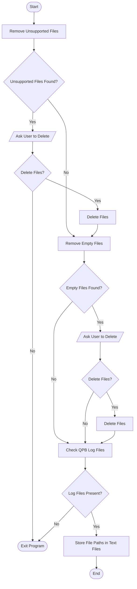

# validate_qpb_data_files.py flowchart

```mermaid

flowchart TD
    Start([Start]) --> RemoveUnsupported[Remove Unsupported Files]
    RemoveUnsupported --> UnsupportedFiles{Unsupported Files Found?}
    
    UnsupportedFiles -- Yes --> AskUser[/Ask User to Delete/]
    UnsupportedFiles -- No --> RemoveEmpty[Remove Empty Files]
    
    AskUser --> UserResponse{Delete Files?}
    UserResponse -- Yes --> DeleteFiles[Delete Files]
    UserResponse -- No --> Exit([Exit Program])
    
    DeleteFiles --> RemoveEmpty
    
    RemoveEmpty --> EmptyFiles{Empty Files Found?}
    EmptyFiles -- Yes --> AskUserEmpty[/Ask User to Delete/]
    EmptyFiles -- No --> CheckQPB[Check QPB Log Files]
    
    AskUserEmpty --> UserResponseEmpty{Delete Files?}
    UserResponseEmpty -- Yes --> DeleteEmptyFiles[Delete Files]
    UserResponseEmpty -- No --> CheckQPB
    
    DeleteEmptyFiles --> CheckQPB
    
    CheckQPB --> LogFiles{Log Files Present?}
    LogFiles -- No --> Exit
    LogFiles -- Yes --> StorePaths[Store File Paths in Text Files]
    
    StorePaths --> End([End])
```
