# Jackknife Analysis Script Flowchart

## Design Goal
Apply jackknife resampling to correlator data as a preprocessing step,
computing statistical averages and uncertainties while maintaining clean
HDF5 structure for downstream analysis.

## Flowchart

```mermaid
flowchart TD
    %% START
    Start([Start Jackknife Analysis]) --> CLIValidation[Validate CLI Arguments:<br/>Input HDF5 file exists<br/>Output directory writable<br/>Derivative method valid]
    
    %% SETUP
    CLIValidation --> SetupLogging[Initialize Logging:<br/>filesystem_utilities.LoggingWrapper]
    SetupLogging --> LoadHDF5[Load Input HDF5:<br/>HDF5Analyzer initialization]
    
    %% VALIDATION
    LoadHDF5 --> ValidateDatasets{Required Datasets<br/>Present?}
    ValidateDatasets -- Missing g5-g5 or g4γ5-g5 --> EarlyExit[Log: Missing required datasets<br/>Exit with error]
    ValidateDatasets -- Datasets found --> GroupParameters[Group by Parameters:<br/>analyzer.group_by_multivalued_tunable_parameters<br/>Exclude: MPI_geometry, Configuration_label]
    
    %% PARAMETER GROUPING
    GroupParameters --> CheckGroups{Valid Groups<br/>Found?}
    CheckGroups -- No groups --> EarlyExit
    CheckGroups -- Groups found --> InitProcessor[Initialize JackknifeProcessor:<br/>_jackknife_processor.JackknifeProcessor<br/>Configure derivative method]
    
    %% MAIN PROCESSING LOOP
    InitProcessor --> ProcessLoop[For Each Parameter Group...]
    ProcessLoop --> LoadGroupData[Load Correlator Data:<br/>analyzer.dataset_values for g5-g5 & g4γ5-g5<br/>Stack into 2D arrays configs×time]
    
    LoadGroupData --> ValidateGroupData{Group Data Valid?}
    ValidateGroupData -- Invalid --> LogSkip[Log: Skipping group<br/>Continue to next group]
    ValidateGroupData -- Valid --> ExtractMetadata[Extract Configuration Metadata:<br/>Configuration labels & QPB filenames]
    
    %% JACKKNIFE PROCESSING (from _jackknife_processor.py)
    ExtractMetadata --> JackknifeCore[Apply Jackknife Processing:<br/>processor.process_correlator_group]
    
    %% DETAILED JACKKNIFE STEPS
    JackknifeCore --> ValidateInput[validate_input_data:<br/>Check min configurations<br/>Validate array shapes<br/>Check for NaN/infinite values]
    ValidateInput --> GenerateSamples[generate_jackknife_samples:<br/>Create N jackknife replicas<br/>Each excluding 1 configuration]
    
    GenerateSamples --> CalcStatistics[calculate_jackknife_statistics:<br/>Compute mean & error estimates<br/>For g5-g5 and g4γ5-g5]
    CalcStatistics --> CalcDerivatives[calculate_finite_difference_derivative:<br/>Apply 4th-order centered difference<br/>Handle boundary conditions]
    CalcDerivatives --> PackageResults[Package Results:<br/>Samples, means, errors<br/>Metadata & statistics]
    
    %% VIRTUAL DATASETS
    PackageResults --> CreateVirtual[Create Virtual Datasets:<br/>analyzer.transform_dataset<br/>Add all jackknife results]
    CreateVirtual --> LogSuccess[Log: Group processed successfully]
    LogSuccess --> CheckMoreGroups{More Groups<br/>to Process?}
    
    CheckMoreGroups -- Yes --> ProcessLoop
    CheckMoreGroups -- No --> ValidateResults{Any Groups<br/>Processed?}
    
    %% RESULTS HANDLING
    ValidateResults -- None --> ProcessingFailed[Log: No groups processed<br/>Exit with error]
    ValidateResults -- Some/All --> SaveResults[Save Results:<br/>analyzer.save_transformed_data<br/>Maintain HDF5 structure<br/>Include virtual datasets]
    
    %% FINAL STEPS
    SaveResults --> AddDescriptions[Add Dataset Descriptions:<br/>_add_dataset_descriptions<br/>Comprehensive metadata]
    AddDescriptions --> Cleanup[Cleanup:<br/>Close analyzer<br/>Terminate logging]
    Cleanup --> Success[Log: Analysis completed<br/>Report processed groups]
    
    %% ERROR PATHS
    LogSkip --> CheckMoreGroups
    ProcessingFailed --> End
    EarlyExit --> End
    Success --> End([End])
    
    %% STYLING
    classDef inputOutput fill:#e1f5fe
    classDef process fill:#f3e5f5
    classDef decision fill:#fff3e0
    classDef jackknife fill:#e8f5e8
    classDef config fill:#fce4ec
    classDef exit fill:#ffebee
    classDef success fill:#e8f8f5
    
    class LoadHDF5,SaveResults,AddDescriptions inputOutput
    class CLIValidation,SetupLogging,LoadGroupData,ExtractMetadata,CreateVirtual,Cleanup process
    class ValidateDatasets,CheckGroups,ValidateGroupData,ValidateResults,CheckMoreGroups decision
    class JackknifeCore,ValidateInput,GenerateSamples,CalcStatistics,CalcDerivatives,PackageResults jackknife
    class ConfigModule,ProcessorModule config
    class EarlyExit,ProcessingFailed,LogSkip exit
    class Success success
```

## Auxiliary Modules Detail

### _config.py Configuration Module
- **Dataset Naming Patterns**: Clean names like `g5g5_mean_values`
- **Finite Difference Methods**: 2nd & 4th order stencils with
  coefficients
- **Processing Parameters**: Exclusion lists, minimum configurations
- **Dataset Descriptions**: Comprehensive documentation for all outputs

### _jackknife_processor.py Processing Module
- **JackknifeProcessor Class**: Main processing orchestration
- **validate_input_data**: Data quality checks and validation
- **generate_jackknife_samples**: Statistical resampling implementation
- **calculate_jackknife_statistics**: Mean & error computation
- **calculate_finite_difference_derivative**: Numerical derivatives with
  boundary handling

## Key Components

### Main Script (apply_jackknife_analysis.py)
- **CLI Interface**: Click-based command line with comprehensive options
- **HDF5Analyzer Integration**: Modern data loading and management
- **Parameter Grouping**: Automatic grouping by tunable parameters
- **Virtual Dataset Creation**: Clean integration of results back into HDF5
- **Error Handling**: Robust validation and graceful failure handling

### Configuration Module (_config.py)
- **Dataset Naming**: Clean, consistent naming patterns (`g5g5_mean_values` vs old verbose names)
- **Finite Difference Methods**: Configurable 2nd and 4th order stencils
- **Processing Parameters**: Min configurations, exclusion lists, validation rules
- **Dataset Descriptions**: Comprehensive documentation for all output datasets

### Jackknife Processor (_jackknife_processor.py)
- **JackknifeProcessor Class**: Main orchestration of statistical analysis
- **Data Validation**: Shape checking, NaN detection, minimum sample size
- **Jackknife Sampling**: Statistical resampling with systematic exclusion
- **Error Estimation**: Jackknife-based uncertainty quantification
- **Derivative Calculation**: Finite difference with proper boundary handling

### Key Processing Steps

1. **Data Loading**: Use HDF5Analyzer to load correlator data efficiently
2. **Parameter Grouping**: Group by all tunable parameters except Configuration_label
3. **Validation**: Ensure sufficient data quality and quantity
4. **Jackknife Resampling**: Create N samples, each excluding one configuration
5. **Statistical Analysis**: Compute means and errors for all quantities
6. **Derivative Calculation**: Apply finite differences with boundary management
7. **Virtual Dataset Creation**: Add results back to HDF5Analyzer as virtual datasets
8. **Export**: Use save_transformed_data() to maintain hierarchical structure

### Data Flow

**Input**: HDF5 file with correlator datasets and parameter attributes
↓
**Grouping**: Organize by parameter combinations (excluding Configuration_label)
↓
**Processing**: Apply jackknife analysis to each group independently
↓
**Results**: Clean dataset names with comprehensive descriptions
↓
**Output**: HDF5 file with same structure + jackknife analysis results

### Error Handling Strategy

- **Early Exit**: Check for required datasets before processing
- **Group-Level Resilience**: Skip invalid groups, continue with others
- **Comprehensive Logging**: Track all decisions and failures
- **Validation**: Multi-level data quality checks
- **Graceful Failure**: Always provide meaningful error messages

## Improvements Over Original

### Code Organization
- **Modular Design**: Three focused files instead of monolithic script
- **Separation of Concerns**: Config, processing, and orchestration separated
- **Reusable Components**: Processor class can be used independently

### Data Handling
- **HDF5Analyzer Integration**: Modern, efficient data management
- **Clean Dataset Names**: Short, consistent naming convention
- **Automatic Gvar Recognition**: Mean/error pairs automatically detected
- **Hierarchical Structure**: Maintains input file organization

### Processing Focus
- **Pure Preprocessing**: Removed PCAC mass calculation (moved to analysis)
- **Configurable Methods**: Support for multiple finite difference orders
- **Robust Validation**: Comprehensive data quality checks
- **Better Error Handling**: Continue processing despite individual failures

### Documentation
- **Comprehensive Descriptions**: Every dataset thoroughly documented
- **Clear Configuration**: All parameters explicitly defined
- **Detailed Logging**: Track processing decisions and outcomes
