# Jackknife Analysis Script Flowchart

## Design Goal
Apply jackknife resampling to correlator data as a preprocessing step,
computing statistical averages and uncertainties while maintaining clean
HDF5 structure for downstream analysis.

## Flowchart

```mermaid
flowchart TD
    %% START
    Start([Start Jackknife Analysis]) --> CLIValidation[Validate CLI Arguments:<br/>Input HDF5 file exists<br/>Output directory writable<br/>Min configurations valid]
    
    %% SETUP
    CLIValidation --> SetupLogging[Initialize Logging:<br/>filesystem_utilities.LoggingWrapper]
    SetupLogging --> LoadHDF5[Load Input HDF5:<br/>HDF5Analyzer initialization]
    
    %% VALIDATION
    LoadHDF5 --> ValidateDatasets{Required Datasets<br/>Present?}
    ValidateDatasets -- Missing g5-g5 or g4γ5-g5 --> EarlyExit[Log: Missing required datasets<br/>Exit with error]
    ValidateDatasets -- Datasets found --> GroupParameters[Group by Parameters:<br/>analyzer.group_by_multivalued_tunable_parameters<br/>Exclude: MPI_geometry, Configuration_label]
    
    %% PARAMETER GROUPING
    GroupParameters --> CheckGroups{Valid Groups<br/>Found?}
    CheckGroups -- No groups --> EarlyExit
    CheckGroups -- Groups found --> InitProcessor[Initialize JackknifeProcessor:<br/>_jackknife_processor.JackknifeProcessor<br/>Configure derivative method]
    
    %% MAIN PROCESSING LOOP
    InitProcessor --> ProcessLoop[For Each Parameter Group...]
    ProcessLoop --> CreateGroupName[Create Descriptive Group Name:<br/>_create_descriptive_group_name<br/>e.g. 'jackknife_analysis_m0p06_n6_Brillouin']
    
    CreateGroupName --> LoadGroupData[Load Correlator Data:<br/>analyzer.dataset_values for g5-g5 & g4γ5-g5<br/>Stack into 2D arrays configs×time]
    
    LoadGroupData --> ValidateGroupData{Group Data Valid?}
    ValidateGroupData -- Invalid --> LogSkip[Log: Skipping group<br/>Continue to next group]
    ValidateGroupData -- Valid --> ExtractMetadata[Extract Configuration Metadata:<br/>_extract_ordered_configuration_metadata<br/>Configuration labels & QPB filenames]
    
    %% JACKKNIFE PROCESSING (from _jackknife_processor.py)
    ExtractMetadata --> JackknifeCore[Apply Jackknife Processing:<br/>processor.process_correlator_group]
    
    %% DETAILED JACKKNIFE STEPS
    JackknifeCore --> ValidateInput[validate_input_data:<br/>Check min configurations<br/>Validate array shapes<br/>Check for NaN/infinite values]
    ValidateInput --> GenerateSamples[generate_jackknife_samples:<br/>Create N jackknife replicas<br/>Each excluding 1 configuration]
    
    GenerateSamples --> CalcStatistics[calculate_jackknife_statistics:<br/>Compute mean & error estimates<br/>For g5-g5 and g4γ5-g5]
    CalcStatistics --> CalcDerivatives[calculate_finite_difference_derivative:<br/>Apply 4th-order centered difference<br/>Handle boundary conditions]
    CalcDerivatives --> PackageResults[Package Results:<br/>Samples, means, errors<br/>Clean dataset names: g5g5, g4g5g5 variants]
    
    %% CONTINUE PROCESSING
    PackageResults --> StoreResults[Store Group Results:<br/>Add to all_processing_results<br/>Include metadata & config data]
    StoreResults --> LogSuccess[Log: Group processed successfully]
    LogSuccess --> CheckMoreGroups{More Groups<br/>to Process?}
    
    CheckMoreGroups -- Yes --> ProcessLoop
    CheckMoreGroups -- No --> ValidateResults{Any Groups<br/>Processed?}
    
    %% RESULTS HANDLING
    ValidateResults -- None --> ProcessingFailed[Log: No groups processed<br/>Exit with error]
    ValidateResults -- Some/All --> CreateHDF5Output[Create HDF5 Output:<br/>_hdf5_output.create_jackknife_hdf5_output<br/>Descriptive group names + attributes]
    
    %% FINAL STEPS
    CreateHDF5Output --> Cleanup[Cleanup:<br/>Close analyzer<br/>Terminate logging]
    Cleanup --> Success[Log: Analysis completed<br/>Report processed groups]
    
    %% ERROR PATHS
    LogSkip --> CheckMoreGroups
    ProcessingFailed --> End
    EarlyExit --> End
    Success --> End([End])
    
    %% STYLING
    classDef inputOutput fill:#e1f5fe
    classDef process fill:#f3e5f5
    classDef decision fill:#fff3e0
    classDef jackknife fill:#e8f5e8
    classDef config fill:#fce4ec
    classDef exit fill:#ffebee
    classDef success fill:#e8f8f5
    classDef hdf5 fill:#f0f4ff
    
    class LoadHDF5,CreateHDF5Output inputOutput
    class CLIValidation,SetupLogging,LoadGroupData,ExtractMetadata,CreateGroupName,StoreResults,Cleanup process
    class ValidateDatasets,CheckGroups,ValidateGroupData,ValidateResults,CheckMoreGroups decision
    class JackknifeCore,ValidateInput,GenerateSamples,CalcStatistics,CalcDerivatives,PackageResults jackknife
    class InitProcessor config
    class EarlyExit,ProcessingFailed,LogSkip exit
    class Success success
    class CreateHDF5Output hdf5
```

## Auxiliary Modules Detail

### _jackknife_config.py Configuration Module
- **Dataset Naming Patterns**: Clean names like g5g5_mean_values,
  g4g5g5_derivative_jackknife_samples
- **Finite Difference Methods**: 2nd & 4th order stencils with
  coefficients and boundary handling
- **Processing Parameters**: Exclusion lists, minimum configurations,
  validation rules
- **Dataset Descriptions**: Comprehensive documentation for all output
  datasets
- **Constants**: Default derivative method (4th order), compression
  settings, required datasets

### _jackknife_processor.py Processing Module
- **JackknifeProcessor Class**: Main orchestration of statistical
  analysis
- **validate_input_data**: Shape checking, NaN detection, minimum sample
  size validation
- **generate_jackknife_samples**: Statistical resampling with systematic
  exclusion
- **calculate_jackknife_statistics**: Mean & error computation using
  jackknife formulas
- **calculate_finite_difference_derivative**: Numerical derivatives with
  proper boundary handling
- **extract_configuration_metadata**: Extract configuration labels and
  QPB filenames

### _hdf5_output.py Output Module
- **create_jackknife_hdf5_output**: Main function for HDF5 file creation
- **_get_input_directory_structure**: Preserve original directory
  hierarchy
- **_store_jackknife_datasets**: Store all jackknife analysis results
  with descriptions
- **_store_metadata_arrays**: Store configuration metadata (labels,
  filenames, geometries)
- **Compression handling**: Configurable compression with appropriate
  settings

## Key Components

### Main Script (apply_jackknife_analysis.py)
- **CLI Interface**: Click-based command line with comprehensive options
- **HDF5Analyzer Integration**: Modern data loading and management
- **Parameter Grouping**: Automatic grouping by tunable parameters
  (excluding Configuration_label)
- **Descriptive Group Naming**: Creates meaningful names like
  `jackknife_analysis_m0p06_n6_Brillouin`
- **Error Handling**: Robust validation and graceful failure handling

### Key Processing Steps

1. **Data Loading**: Use HDF5Analyzer to load correlator data
   efficiently
2. **Parameter Grouping**: Group by all tunable parameters except
   Configuration_label
3. **Descriptive Naming**: Generate meaningful group names from
   parameter values
4. **Validation**: Ensure sufficient data quality and quantity
5. **Jackknife Resampling**: Create N samples, each excluding one
   configuration
6. **Statistical Analysis**: Compute means and errors for all quantities
7. **Derivative Calculation**: Apply finite differences with boundary
   management
8. **HDF5 Output**: Custom structured output with proper metadata

### Data Flow

**Input**: HDF5 file with correlator datasets and parameter attributes  
↓  
**Grouping**: Organize by parameter combinations (excluding
Configuration_label)  
↓  
**Processing**: Apply jackknife analysis to each group independently  
↓  
**Naming**: Create descriptive group names from parameter values  
↓  
**Results**: Clean dataset names with comprehensive descriptions  
↓  
**Output**: HDF5 file with hierarchical structure + descriptive group
names

### Error Handling Strategy

- **Early Exit**: Check for required datasets before processing
- **Group-Level Resilience**: Skip invalid groups, continue with others
- **Comprehensive Logging**: Track all decisions and failures
- **Validation**: Multi-level data quality checks
- **Graceful Failure**: Always provide meaningful error messages

## Improvements Over Original

### Code Organization
- **Modular Design**: Four focused files instead of monolithic script
- **Separation of Concerns**: Config, processing, output, and
  orchestration separated
- **Reusable Components**: Processor and output modules can be used
  independently

### Data Handling
- **HDF5Analyzer Integration**: Modern, efficient data management
- **Clean Dataset Names**: Short, consistent naming convention (g5g5
  series, g4g5g5 series)
- **Descriptive Group Names**: Self-documenting group names with
  parameter values
- **Hierarchical Structure**: Maintains input file organization with
  improvements

### Processing Features
- **Parameter-Based Naming**: Groups named by actual parameter values,
  not indices
- **Robust Parameter Filtering**: Always filters Configuration_label
  correctly
- **Configurable Methods**: Support for multiple finite difference
  orders
- **Better Error Handling**: Continue processing despite individual
  failures

### Output Quality
- **Comprehensive Descriptions**: Every dataset thoroughly documented
- **Proper Metadata Storage**: Configuration labels, filenames,
  geometries as datasets
- **Attribute Organization**: Parameters stored as group attributes for
  easy access
- **Compression Support**: Configurable compression for efficient
  storage

### Documentation
- **Clear Configuration**: All parameters explicitly defined in config
  module
- **Detailed Logging**: Track processing decisions and outcomes
- **Modular Documentation**: Each module has clear responsibilities