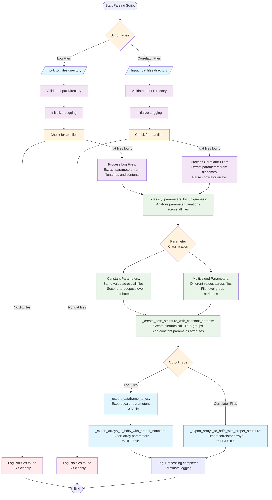

# Parsing Scripts Flowchart

## Design Goal
Convert raw simulation files into structured, hierarchical HDF5 format
for efficient analysis.

## Flowchart

## Key Components

### Shared Library Functions (_shared_parsing.py)
- **`_classify_parameters_by_uniqueness`**: Separates constant from
  multivalued parameters
- **`_create_hdf5_structure_with_constant_params`**: Builds HDF5
  hierarchy with proper attribute placement
- **`_export_arrays_to_hdf5_with_proper_structure`**: Writes data
  following project structure protocol
- **`_export_dataframe_to_csv`**: Handles CSV export with logging
- **`_check_parameter_mismatches`**: Validates parameter consistency

### Script-Specific Processing
- **Log Files**: Extract from both filenames and file contents, export
  to CSV + HDF5
- **Correlator Files**: Extract from filenames, parse correlator arrays,
  export to HDF5 only

### Early Exit Mechanism
Both scripts now check for relevant files before processing and exit
cleanly if none found.