# Calculate PCAC Mass Script Flowchart

## Design Goal
Calculate PCAC (Partially Conserved Axial Current) mass from
jackknife-analyzed correlator data using the streamlined formula:

    PCAC_mass = 0.5 * g4g5g5_derivative / g5g5_truncated

The refactored script eliminates configuration bloat while preserving
full functionality in just 120 lines of clean, maintainable code.

## Flowchart

```mermaid
flowchart TD
    %% START
    Start([Start: calculate_PCAC_mass.py]) --> ValidateConfig[Validate Configuration:<br/>validate_pcac_config<br/>Check truncation consistency]
    
    %% SETUP PHASE
    ValidateConfig --> SetupPaths[Setup File Paths:<br/>Output directory resolution<br/>Log directory configuration]
    SetupPaths --> InitLogging[Initialize Logging:<br/>create_script_logger<br/>File logging if enabled]
    
    %% MAIN PROCESSING
    InitLogging --> FindGroups[Find Analysis Groups:<br/>find_analysis_groups<br/>Search for required datasets]
    FindGroups --> CheckGroups{Groups Found?}
    CheckGroups -- No --> ErrorExit[Error: No valid groups<br/>Exit with error message]
    CheckGroups -- Yes --> OpenFiles[Open HDF5 Files:<br/>Input: read mode<br/>Output: write mode]
    
    %% GROUP PROCESSING LOOP
    OpenFiles --> ProcessLoop[For Each Valid Group...]
    ProcessLoop --> TypeCheck[Type-Safe Dataset Access:<br/>Verify items are h5py.Dataset<br/>Skip if validation fails]
    TypeCheck --> CopyParent[Copy Parent Attributes:<br/>copy_parent_attributes<br/>Preserve hierarchy metadata]
    
    %% DATA PROCESSING
    CopyParent --> ReadData[Read Required Data:<br/>g4g5g5_derivative_jackknife_samples<br/>g5g5_jackknife_samples]
    ReadData --> ValidateSamples{Min Samples<br/>≥ 10?}
    ValidateSamples -- No --> SkipGroup[Skip Group:<br/>Log insufficient samples warning]
    ValidateSamples -- Yes -->     CalcPCAC["Calculate PCAC Mass:<br/>calculate_pcac_mass<br/>factor * derivative / g5g5_truncated"]
    
    %% RESULTS PROCESSING
    CalcPCAC --> CalcStats[Calculate Statistics:<br/>calculate_jackknife_statistics<br/>Mean and error values]
    CalcStats --> CreateGroup[Create Output Group:<br/>Mirror input hierarchy]
    CreateGroup --> SaveResults[Save Results with Compression:<br/>PCAC_mass_jackknife_samples<br/>PCAC_mass_mean_values<br/>PCAC_mass_error_values]
    
    %% METADATA AND COMPLETION
    SaveResults --> CopyMetadata[Copy Metadata:<br/>copy_metadata<br/>Datasets + group attributes]
    CopyMetadata --> NextGroup{More Groups?}
    NextGroup -- Yes --> ProcessLoop
    NextGroup -- No --> ReportResults[Report Results:<br/>Success/failure counts<br/>Output file path]
    
    %% COMPLETION
    SkipGroup --> NextGroup
    ReportResults --> LogEnd[Log Script End:<br/>Mark completion status]
    LogEnd --> End([End: Processing Complete])
    
    %% ERROR HANDLING
    ErrorExit --> End
    
    %% STYLING
    classDef processBox fill:#e1f5fe,stroke:#0277bd,stroke-width:2px
    classDef dataBox fill:#f3e5f5,stroke:#7b1fa2,stroke-width:2px
    classDef decisionBox fill:#fff3e0,stroke:#ef6c00,stroke-width:2px
    classDef successBox fill:#e8f5e8,stroke:#2e7d32,stroke-width:2px
    classDef errorBox fill:#ffebee,stroke:#c62828,stroke-width:2px
    
    class ValidateConfig,SetupPaths,InitLogging,FindGroups processBox
    class ReadData,CalcPCAC,CalcStats,SaveResults,CopyMetadata dataBox
    class CheckGroups,ValidateSamples,NextGroup decisionBox
    class ReportResults,LogEnd,End successBox
    class ErrorExit,SkipGroup errorBox
```



## Key Features

### Minimal Configuration
- **PCAC_MASS_FACTOR**: 0.5 (physics constant)
- **TRUNCATE_START/END**: 2 (match derivative length)
- **Required datasets**: g4g5g5_derivative + g5g5 jackknife samples

### Streamlined Processing
- **Type-safe dataset access**: Validates h5py.Dataset before slicing
- **Parent attribute preservation**: Copies second-to-deepest group
  attributes
- **Error resilience**: Continues processing if individual groups fail
- **Clean HDF5 structure**: No file-level attributes, matches input
  hierarchy

### Performance Optimizations
- **Minimal validation**: Essential checks only
- **Efficient group processing**: Single pass through valid groups
- **Compressed output**: gzip compression for jackknife samples
- **Memory efficient**: Processes one group at a time

## CLI Usage

```bash
# Basic usage
python calculate_PCAC_mass.py -i jackknife_analysis.h5 -o pcac_mass.h5

# With logging
python calculate_PCAC_mass.py -i input.h5 -o output.h5 -log_on

# Custom directories
python calculate_PCAC_mass.py -i input.h5 -o output.h5 -out_dir /results/ -log_dir /logs/
```

## Code Reduction Achievement
- **Before**: 400+ lines of complex configuration and validation
- **After**: 120 lines of clean, focused implementation
- **Reduction**: 70% smaller while maintaining full functionality

The refactored script demonstrates that professional code doesn't
require complexity - just clear purpose and minimal implementation.