# Calculate PCAC Mass Script Flowchart

## Design Goal
Calculate PCAC (Partially Conserved Axial Current) mass from
jackknife-analyzed correlator data using the streamlined formula:

    PCAC_mass = 0.5 * g4g5g5_derivative / g5g5_truncated

The script implements dynamic validation, configurable documentation,
and robust data processing with minimal complexity.

## Flowchart

```mermaid
flowchart TD
    %% START
    Start([Start: calculate_PCAC_mass.py]) --> ValidateConfig[Validate Configuration:<br/>validate_pcac_config<br/>Check truncation params & datasets]
    
    %% SETUP PHASE  
    ValidateConfig --> SetupPaths[Setup File Paths:<br/>Handle full vs filename paths<br/>os.path.join for cross-platform]
    SetupPaths --> InitLogging[Initialize Logging:<br/>create_script_logger<br/>Optional file logging]
    
    %% MAIN PROCESSING
    InitLogging --> FindGroups[Find Analysis Groups:<br/>find_analysis_groups<br/>Search for required datasets]
    FindGroups --> CheckGroups{Groups Found?}
    CheckGroups -- No --> ErrorExit[Error: No valid groups<br/>Raise ValueError and exit]
    CheckGroups -- Yes --> ValidateFile[Validate File Consistency:<br/>validate_pcac_file_consistency<br/>Check data relationships]
    
    %% FILE VALIDATION
    ValidateFile --> FileConsistency["File Validation:<br/>g5g5_length - TRUNCATE_START - TRUNCATE_END<br/>== derivative_length"]
    FileConsistency --> OpenFiles[Open HDF5 Files:<br/>Input: read mode<br/>Output: write mode]
    
    %% DOCUMENTATION
    OpenFiles --> AddDocumentation[Add Analysis Documentation:<br/>ANALYSIS_DOCUMENTATION attributes<br/>Date, source, methodology]
    AddDocumentation --> ProcessLoop[For Each Valid Group...]
    
    %% GROUP PROCESSING
    ProcessLoop --> TypeCheck["Type-Safe Dataset Access:<br/>Check isinstance(item, h5py.Dataset)<br/>Skip invalid items"]
    TypeCheck --> ValidTypes{Valid Dataset<br/>Types?}
    ValidTypes -- No --> SkipGroup[Skip Group:<br/>Log warning & continue]
    ValidTypes -- Yes --> CopyParent[Copy Parent Attributes:<br/>copy_parent_attributes<br/>Preserve hierarchy metadata]
    
    %% DATA PROCESSING  
    CopyParent --> ReadData[Read Required Data:<br/>g4g5g5_derivative_jackknife_samples<br/>g5g5_jackknife_samples]
    ReadData --> CalcPCAC["Calculate PCAC Mass:<br/>calculate_pcac_mass<br/>0.5 * derivative / g5g5_truncated"]
    
    %% TRUNCATION LOGIC
    CalcPCAC --> TruncateG5G5["Truncate g5g5 Data:<br/>Remove TRUNCATE_START initial points<br/>Remove TRUNCATE_END final points"]
    TruncateG5G5 --> SafeDivide["Safe Division:<br/>safe_divide function<br/>Handle inf/nan values"]
    
    %% RESULTS PROCESSING
    SafeDivide --> CalcStats[Calculate Statistics:<br/>calculate_jackknife_statistics<br/>Mean and error values]
    CalcStats --> CreateGroup[Create Output Group:<br/>Mirror input hierarchy]
    CreateGroup --> SaveResults[Save Results:<br/>PCAC_mass_jackknife_samples<br/>PCAC_mass_mean_values<br/>PCAC_mass_error_values]
    
    %% METADATA AND COMPLETION  
    SaveResults --> CopyMetadata[Copy Metadata:<br/>copy_metadata<br/>Datasets + group attributes]
    CopyMetadata --> NextGroup{More Groups?}
    NextGroup -- Yes --> ProcessLoop
    NextGroup -- No --> ReportResults[Report Results:<br/>Total groups processed<br/>Relative output path]
    
    %% COMPLETION
    SkipGroup --> NextGroup
    ReportResults --> LogEnd[Log Script End:<br/>Mark completion status]
    LogEnd --> End([End: Processing Complete])
    
    %% ERROR HANDLING
    ErrorExit --> End
    
    %% STYLING
    classDef processBox fill:#e1f5fe,stroke:#0277bd,stroke-width:2px
    classDef dataBox fill:#f3e5f5,stroke:#7b1fa2,stroke-width:2px
    classDef decisionBox fill:#fff3e0,stroke:#ef6c00,stroke-width:2px
    classDef successBox fill:#e8f5e8,stroke:#2e7d32,stroke-width:2px
    classDef errorBox fill:#ffebee,stroke:#c62828,stroke-width:2px
    
    class ValidateConfig,SetupPaths,InitLogging,FindGroups,ValidateFile processBox
    class ReadData,CalcPCAC,TruncateG5G5,SafeDivide,CalcStats,SaveResults,CopyMetadata,AddDocumentation dataBox
    class CheckGroups,ValidTypes,NextGroup decisionBox
    class ReportResults,LogEnd,End successBox
    class ErrorExit,SkipGroup errorBox
```



## Key Features

### Dynamic Configuration
- **validate_pcac_config()**: Validates truncation parameters and
  dataset structure
- **ANALYSIS_DOCUMENTATION**: Configurable methodology descriptions
- **File consistency validation**: Checks data relationships once per
  file

### Robust Processing
- **Type-safe dataset access**: Validates h5py.Dataset before operations
- **Safe mathematics**: Uses safe_divide() for numerical stability
- **Parent attribute preservation**: Maintains HDF5 hierarchy
- **Streamlined workflow**: No failure tracking, just process valid
  groups

### Path Intelligence
- **Cross-platform paths**: Uses os.path.join() for compatibility
- **Flexible output**: Handles full paths vs filenames automatically
- **Relative path display**: Shows project-relative paths in output

## Analysis Formula

```
PCAC_mass = 0.5 * g4g5g5_derivative / g5g5_truncated

where:
- g5g5_truncated = g5g5[TRUNCATE_START:-TRUNCATE_END]
- Factor 0.5 comes from lattice PCAC relation
- Time range: t=3 to t=T-2 (after truncation)
```

## CLI Usage

```bash
# Basic usage with defaults
python calculate_PCAC_mass.py -i jackknife_analysis.h5

# Custom output location
python calculate_PCAC_mass.py -i input.h5 -o /results/pcac_mass.h5

# With logging
python calculate_PCAC_mass.py -i input.h5 -o output.h5 -log_on
```

## Code Evolution
- **Removed**: Complex configuration hierarchies, failure tracking,
  hardcoded lengths
- **Added**: Dynamic validation, configurable documentation, relative
  paths
- **Maintained**: Full functionality with 60% less code complexity
