# Calculate PCAC Mass Script Flowchart

## Design Goal
Calculate PCAC (Partially Conserved Axial Current) mass from
jackknife-analyzed correlator data by computing the ratio of
g4g5g5_derivative to truncated g5g5 correlators, preserving statistical
uncertainties through jackknife error propagation.

## Flowchart

```mermaid
flowchart TD
    %% START
    Start([Start: calculate_PCAC_mass.py]) --> ValidateConfig[Validate Configuration:<br/>_pcac_mass_config.validate_configuration<br/>Check truncation consistency]
    
    %% SETUP PHASE
    ValidateConfig --> SetupDirs[Setup Directories:<br/>Output directory from input file path<br/>Log directory from output directory]
    SetupDirs --> InitLogging[Initialize Logging:<br/>create_script_logger<br/>File and/or console logging]
    InitLogging --> LogConfig[Log Configuration Parameters:<br/>Truncation: start=2, end=2<br/>PCAC factor: 0.5<br/>Validation settings]
    
    %% FILE ANALYSIS
    LogConfig --> OpenAnalyzer[Open HDF5Analyzer:<br/>Inspect file structure<br/>Identify active groups]
    OpenAnalyzer --> FindGroups[Find Analysis Groups:<br/>_find_analysis_groups]
    
    FindGroups --> CheckDatasets{Both Datasets<br/>Present?<br/>g4g5g5_derivative &<br/>g5g5_samples}
    CheckDatasets -- Missing datasets --> ErrorExit[Log Error:<br/>Required datasets not found<br/>Exit with error code 1]
    CheckDatasets -- Found --> CountGroups[Count Valid Groups:<br/>Log group count<br/>Prepare processing]
    
    %% PROCESSING SETUP
    CountGroups --> OpenFiles[Open HDF5 Files:<br/>Input file in read mode<br/>Output file in write mode]
    OpenFiles --> AddFileAttrs[Add File-Level Attributes:<br/>pcac_mass_factor = 0.5<br/>truncate_start = 2<br/>truncate_end = 2]
    
    %% MAIN PROCESSING LOOP
    AddFileAttrs --> ProcessLoop[For Each Group...]
    ProcessLoop --> ShowProgress{Verbose Mode?}
    ShowProgress -- Yes --> PrintProgress[Print Progress:<br/>Group N/Total]
    ShowProgress -- No --> CreateOutputGroup
    PrintProgress --> CreateOutputGroup[Create Output Group:<br/>Mirror input hierarchy]
    
    CreateOutputGroup --> CopyParentAttrs[Copy Parent Attributes:<br/>copy_parent_attributes<br/>Preserve hierarchy metadata]
    CopyParentAttrs --> ProcessGroup[Process Single Group:<br/>_process_single_pcac_mass_group]
    
    %% SINGLE GROUP PROCESSING (Detailed)
    ProcessGroup --> ReadDatasets[Read Datasets with Alternatives:<br/>_read_dataset_with_alternatives<br/>Support backward compatibility]
    ReadDatasets --> ValidateDims[Validate Dimensions:<br/>g4g5g5_derivative: 44 elements<br/>g5g5: 48 elements<br/>validate_correlator_dimensions]
    
    ValidateDims --> ValidateConsistency[Validate Jackknife Consistency:<br/>validate_jackknife_consistency<br/>Same number of samples]
    ValidateConsistency --> CheckMinSamples{Min Samples<br/>≥ 10?}
    CheckMinSamples -- No --> GroupError[Log Warning:<br/>Insufficient samples]
    CheckMinSamples -- Yes --> PhysicalValidation{Skip<br/>Validation?}
    
    %% VALIDATION BRANCH
    PhysicalValidation -- No --> ValidatePhysics[Check Correlator Physics:<br/>check_correlator_physicality<br/>- Positive values<br/>- Decreasing behavior<br/>- Min value threshold]
    PhysicalValidation -- Yes --> TruncateG5G5
    ValidatePhysics --> CheckIssues{Validation<br/>Issues?}
    CheckIssues -- Yes --> HandleIssues{Skip Invalid<br/>Groups?}
    CheckIssues -- No --> TruncateG5G5
    HandleIssues -- Yes --> NextGroup[Skip to Next Group]
    HandleIssues -- No --> GroupError
    
    %% CALCULATION
    TruncateG5G5[Truncate g5g5 Correlator:<br/>truncate_correlator<br/>Remove 2 from start, 2 from end<br/>Length: 48 → 44]
    TruncateG5G5 --> VerifyTruncation{Truncation<br/>Correct?<br/>Length = 44}
    VerifyTruncation -- No --> GroupError
    VerifyTruncation -- Yes --> CalculatePCAC[Calculate PCAC Mass:<br/>calculate_pcac_mass<br/>0.5 × derivative / g5g5_truncated<br/>Safe division handling]
    
    CalculatePCAC --> ValidateResults{Skip<br/>Validation?}
    ValidateResults -- No --> CheckPCACResults[Validate PCAC Results:<br/>_validate_pcac_mass_results<br/>- Check NaN/inf values<br/>- Check max value limit<br/>- Check dimensions]
    ValidateResults -- Yes --> CalcStatistics
    CheckPCACResults --> ResultIssues{Issues<br/>Found?}
    ResultIssues -- Yes --> HandleIssues
    ResultIssues -- No --> CalcStatistics
    
    %% OUTPUT GENERATION
    CalcStatistics[Calculate Statistics:<br/>calculate_jackknife_statistics<br/>Mean and error values]
    CalcStatistics --> SaveDatasets[Save Output Datasets:<br/>- PCAC_mass_jackknife_samples<br/>- PCAC_mass_mean_values<br/>- PCAC_mass_error_values<br/>With compression]
    
    SaveDatasets --> CopyMetadata[Copy Metadata Datasets:<br/>- gauge_configuration_labels<br/>- mpi_geometry_values<br/>- qpb_log_filenames<br/>- Number_of_gauge_configurations]
    CopyMetadata --> CopyGroupAttrs[Copy Group Attributes:<br/>All input group attributes<br/>Add processing metadata]
    CopyGroupAttrs --> UpdateCounters[Update Counters:<br/>successful++]
    
    %% LOOP CONTROL
    UpdateCounters --> MoreGroups{More Groups?}
    MoreGroups -- Yes --> ProcessLoop
    MoreGroups -- No --> ReportResults[Report Results:<br/>Log successful/failed counts<br/>Console output summary]
    
    GroupError --> UpdateFailed[Update Counters:<br/>failed++]
    UpdateFailed --> CheckErrorHandling{Skip Invalid<br/>Groups Setting?}
    CheckErrorHandling -- Yes --> NextGroup
    CheckErrorHandling -- No --> ErrorExit
    NextGroup --> MoreGroups
    
    %% COMPLETION
    ReportResults --> CheckFailures{Any Failures?}
    CheckFailures -- Yes & Don't Skip --> ErrorExit
    CheckFailures -- Yes & Skip --> SuccessWithWarnings[Log Script End:<br/>Completed with warnings<br/>Some groups skipped]
    CheckFailures -- No --> Success[Log Script End:<br/>All groups successful]
    
    SuccessWithWarnings --> PrintSummary[Print Summary:<br/>✓ PCAC mass calculation complete<br/>Processed: N/Total groups<br/>Output: path/to/file.h5]
    Success --> PrintSummary
    PrintSummary --> End([End])
    ErrorExit --> End
    
    %% STYLING
    classDef error fill:#ffcccc
    classDef warning fill:#fff3cd
    classDef success fill:#d4edda
    classDef validation fill:#cce5ff
    
    class ErrorExit,GroupError error
    class SuccessWithWarnings,NextGroup warning
    class Success,PrintSummary success
    class ValidatePhysics,CheckPCACResults,ValidateDims,ValidateConsistency validation
```



## Input Requirements

| File Type | Required Datasets | Dataset Dimensions |
|-----------|------------------|-------------------|
| Input HDF5 | `g4g5g5_derivative_jackknife_samples` | [n_samples, 44] |
| | `g5g5_jackknife_samples` | [n_samples, 48] |

### Alternative Dataset Names (Backward Compatibility)
- `g4g5g5_derivative_jackknife_samples` alternatives:
  - `g4g5_g5_derivative_jackknife_samples`
  - `derivative_g4g5_g5_jackknife_samples`
- `g5g5_jackknife_samples` alternatives:
  - `g5_g5_jackknife_samples`
  - `Jackknife_samples_of_g5_g5_correlator_2D_array`

## Output Structure

### HDF5 Datasets (per group)
- `PCAC_mass_jackknife_samples` - Full jackknife samples [n_samples, 44]
- `PCAC_mass_mean_values` - Jackknife mean values [44]
- `PCAC_mass_error_values` - Jackknife error values [44]

### Preserved Metadata
- All group attributes from input
- Metadata datasets (gauge configurations, MPI geometry, etc.)
- Processing parameters (truncation settings, PCAC factor)

## Configuration Parameters

Key parameters from `_pcac_mass_config.py`:
- **Truncation**: Remove 2 elements from start and end of g5g5
- **PCAC Factor**: 0.5 (multiplicative factor in formula)
- **Expected Lengths**: g5g5=48, derivative=44, output=44
- **Validation**: Minimum 10 jackknife samples required
- **Error Handling**: Configurable skip invalid groups or fail fast

## CLI Options

```bash
python calculate_PCAC_mass.py [OPTIONS]

Required:
  -i, --input_hdf5_file PATH    Input HDF5 with jackknife analysis
  -o, --output_hdf5_file PATH   Output HDF5 for PCAC mass results

Optional:
  -out_dir PATH                 Output directory (default: input dir)
  --skip_validation             Skip physical validation checks
  -log_on                       Enable file logging
  -log_dir PATH                 Log directory (default: output dir)
  -log_name FILE                Custom log filename
  --verbose, -v                 Show processing progress
```
