# Calculate Effective Mass Script Flowchart

## Design Goal
Calculate effective mass from jackknife-analyzed g5-g5 correlator data
using the two-state periodic formula with configurable symmetrization
and truncation.

    effective_mass = 0.5 * ln((C(t-1) + √(...)) / (C(t+1) + √(...)))

The script implements dynamic validation, safe mathematics, and
streamlined processing.

## Flowchart

```mermaid
flowchart TD
    %% START
    Start([Start: calculate_effective_mass.py]) --> ValidateConfig[Validate Configuration:<br/>validate_effective_config<br/>Check booleans & numeric params]
    
    %% SETUP PHASE
    ValidateConfig --> SetupPaths[Setup File Paths:<br/>Handle full vs filename paths<br/>os.path.join for cross-platform]
    SetupPaths --> InitLogging[Initialize Logging:<br/>create_script_logger<br/>Optional file logging]
    
    %% MAIN PROCESSING
    InitLogging --> FindGroups[Find Analysis Groups:<br/>find_analysis_groups<br/>Search for g5g5 datasets]
    FindGroups --> CheckGroups{Groups Found?}
    CheckGroups -- No --> ErrorExit[Error: No valid groups<br/>Raise ValueError and exit]
    CheckGroups -- Yes --> ValidateFile[Validate File Consistency:<br/>validate_effective_mass_file_consistency<br/>Calculate expected lengths]
    
    %% FILE VALIDATION
    ValidateFile --> FileValidation["File Validation:<br/>Calculate expected effective mass length<br/>Based on truncation settings"]
    FileValidation --> OpenFiles[Open HDF5 Files:<br/>Input: read mode<br/>Output: write mode]
    
    %% DOCUMENTATION
    OpenFiles --> AddDocumentation[Add Analysis Documentation:<br/>ANALYSIS_DOCUMENTATION attributes<br/>Date, source, methodology]
    AddDocumentation --> ProcessLoop[For Each Valid Group...]
    
    %% GROUP PROCESSING
    ProcessLoop --> TypeCheck["Type-Safe Dataset Access:<br/>Check isinstance(item, h5py.Dataset)<br/>Skip invalid items"]
    TypeCheck --> ValidTypes{Valid Dataset<br/>Type?}
    ValidTypes -- No --> SkipGroup[Skip Group:<br/>Log warning & continue]
    ValidTypes -- Yes --> CopyParent[Copy Parent Attributes:<br/>copy_parent_attributes<br/>Preserve hierarchy metadata]
    
    %% DATA PROCESSING
    CopyParent --> ReadData[Read g5g5 Data:<br/>g5g5_jackknife_samples]
    ReadData --> CheckSymmetry{APPLY_SYMMETRIZATION<br/>== True?}
    CheckSymmetry -- Yes --> ApplySymmetry["Apply Symmetrization:<br/>C_sym(t) = 0.5*(C(t) + C(T-t))<br/>symmetrize_correlator()"]
    CheckSymmetry -- No --> CheckTruncation{TRUNCATE_HALF<br/>== True?}
    ApplySymmetry --> CheckTruncation
    
    %% TRUNCATION LOGIC
    CheckTruncation -- Yes --> ApplyTruncation["Apply Half-Length Truncation:<br/>Use first T//2 points<br/>For periodic boundary conditions"]
    CheckTruncation -- No --> CalculateMiddle["Calculate Middle Value:<br/>middle = LOWERING_FACTOR * min(correlator)<br/>Factor: 0.99"]
    ApplyTruncation --> CalculateMiddle
    
    %% EFFECTIVE MASS CALCULATION
    CalculateMiddle --> PrepareTimeSeries["Prepare Time Series:<br/>C(t-1) = correlator[:-2]<br/>C(t+1) = correlator[2:]"]
    PrepareTimeSeries --> TwoStateFormula["Two-State Periodic Formula:<br/>sqrt_prev = safe_sqrt(C(t-1)² - middle²)<br/>sqrt_next = safe_sqrt(C(t+1)² - middle²)"]
    TwoStateFormula --> CalculateRatio["Calculate Ratio:<br/>numerator = C(t-1) + sqrt_prev<br/>denominator = C(t+1) + sqrt_next"]
    CalculateRatio --> SafeLog["Safe Logarithm:<br/>effective_mass = 0.5 * safe_log(ratio)<br/>Handle invalid values"]
    
    %% RESULTS PROCESSING
    SafeLog --> CalcStats[Calculate Statistics:<br/>calculate_jackknife_statistics<br/>Mean and error values]
    CalcStats --> CreateGroup[Create Output Group:<br/>Mirror input hierarchy]
    CreateGroup --> SaveResults[Save Results:<br/>effective_mass_jackknife_samples<br/>effective_mass_mean_values<br/>effective_mass_error_values]
    
    %% METADATA AND COMPLETION
    SaveResults --> CopyMetadata[Copy Metadata:<br/>copy_metadata<br/>Datasets + group attributes]
    CopyMetadata --> NextGroup{More Groups?}
    NextGroup -- Yes --> ProcessLoop  
    NextGroup -- No --> ReportResults[Report Results:<br/>Total groups processed<br/>Relative output path]
    
    %% COMPLETION
    SkipGroup --> NextGroup
    ReportResults --> LogEnd[Log Script End:<br/>Mark completion status]
    LogEnd --> End([End: Processing Complete])
    
    %% ERROR HANDLING
    ErrorExit --> End
    
    %% STYLING
    classDef processBox fill:#e1f5fe,stroke:#0277bd,stroke-width:2px
    classDef dataBox fill:#f3e5f5,stroke:#7b1fa2,stroke-width:2px
    classDef decisionBox fill:#fff3e0,stroke:#ef6c00,stroke-width:2px
    classDef successBox fill:#e8f5e8,stroke:#2e7d32,stroke-width:2px
    classDef errorBox fill:#ffebee,stroke:#c62828,stroke-width:2px
    classDef mathBox fill:#fce4ec,stroke:#ad1457,stroke-width:2px
    
    class ValidateConfig,SetupPaths,InitLogging,FindGroups,ValidateFile processBox
    class ReadData,AddDocumentation,CalcStats,SaveResults,CopyMetadata dataBox
    class CheckGroups,ValidTypes,CheckSymmetry,CheckTruncation,NextGroup decisionBox
    class ReportResults,LogEnd,End successBox
    class ErrorExit,SkipGroup errorBox
    class ApplySymmetry,ApplyTruncation,CalculateMiddle,PrepareTimeSeries,TwoStateFormula,CalculateRatio,SafeLog mathBox
```



## Key Features

### Dynamic Configuration
- **validate_effective_config()**: Validates boolean flags and numeric
  parameters
- **ANALYSIS_DOCUMENTATION**: Configurable methodology descriptions  
- **File consistency validation**: Calculates expected lengths
  dynamically

### Physics Implementation
- **Symmetrization**: Optional C_sym(t) = 0.5*(C(t) + C(T-t))
- **Half-length truncation**: For periodic boundary conditions
- **Two-state formula**: Handles complex square roots and logarithms
- **Safe mathematics**: Uses safe_sqrt() and safe_log() for numerical
  stability

### Processing Intelligence
- **Single dataset input**: Only g5g5_jackknife_samples required
- **Configurable processing**: APPLY_SYMMETRIZATION and TRUNCATE_HALF
  flags
- **Type-safe operations**: Validates h5py.Dataset before processing
- **Robust workflow**: Skips invalid groups, continues processing

## Analysis Formulas

### Symmetrization (Optional)
```
C_sym(t) = 0.5 * (C(t) + C(T-t))
```

### Two-State Periodic Effective Mass
```
middle = LOWERING_FACTOR * min(correlator)  // 0.99 factor

sqrt_prev = √(C(t-1)² - middle²)
sqrt_next = √(C(t+1)² - middle²)

effective_mass = 0.5 * ln((C(t-1) + sqrt_prev) / (C(t+1) + sqrt_next))
```

### Time Ranges
- **No truncation**: t=1 to t=T-2
- **With truncation**: t=1 to t=T//2-2
- **Example (T=48)**: t=1 to t=22 (truncated) or t=1 to t=46 (full)

## CLI Usage

```bash
# Basic usage with defaults  
python calculate_effective_mass.py -i jackknife_analysis.h5

# Custom output location
python calculate_effective_mass.py -i input.h5 -o /results/effective_mass.h5

# With logging
python calculate_effective_mass.py -i input.h5 -o output.h5 -log_on
```

## Configuration Parameters
- **APPLY_SYMMETRIZATION**: True (enable correlator symmetrization)
- **TRUNCATE_HALF**: True (use half-length for periodic BC)  
- **LOWERING_FACTOR**: 0.99 (factor for middle value calculation)

## Code Evolution
- **Removed**: Hardcoded lengths, failure tracking, complex validation
  hierarchies
- **Added**: Dynamic validation, configurable documentation, safe
  mathematics
- **Maintained**: Full physics accuracy with cleaner implementation
