# Calculate Effective Mass Script Flowchart

## Design Goal
Calculate effective mass from jackknife-analyzed g5-g5 correlator data
using configurable methods (two-state periodic, single-state, or cosh
formulas), with optional symmetrization and flexible naming conventions
for pion mass analysis.

## Flowchart

```mermaid
flowchart TD
    %% START
    Start([Start: calculate_effective_mass.py]) --> ValidateConfig[Validate Configuration:<br/>_effective_mass_config.validate_configuration<br/>Check lowering factor, dimensions]
    
    %% SETUP PHASE
    ValidateConfig --> SetupDirs[Setup Directories:<br/>Output directory from input file path<br/>Log directory from output directory]
    SetupDirs --> InitLogging[Initialize Logging:<br/>create_script_logger<br/>File and/or console logging]
    InitLogging --> LogConfig[Log Configuration Parameters:<br/>Method: two_state_periodic<br/>Symmetrization: true/false<br/>Truncate half: true/false<br/>Lowering factor: 0.99]
    
    %% NAMING DECISION
    LogConfig --> CheckNaming{Use Pion<br/>Naming?}
    CheckNaming -- Yes --> SetPionNames[Dataset Names:<br/>pion_effective_mass_*]
    CheckNaming -- No --> SetStandardNames[Dataset Names:<br/>effective_mass_*]
    SetPionNames --> OpenAnalyzer
    SetStandardNames --> OpenAnalyzer
    
    %% FILE ANALYSIS
    OpenAnalyzer[Open HDF5Analyzer:<br/>Inspect file structure<br/>Identify active groups]
    OpenAnalyzer --> FindGroups[Find Analysis Groups:<br/>_find_analysis_groups]
    
    FindGroups --> CheckDataset{g5g5 Dataset Present?}
    CheckDataset -- Missing dataset --> ErrorExit[Log Error:<br/>No g5g5 datasets found<br/>Exit with error code 1]
    CheckDataset -- Found --> CountGroups[Count Valid Groups:<br/>Log group count<br/>Prepare processing]
    
    %% PROCESSING SETUP
    CountGroups --> OpenFiles[Open HDF5 Files:<br/>Input file in read mode<br/>Output file in write mode]
    OpenFiles --> AddFileAttrs[Add File-Level Attributes:<br/>calculation_method<br/>symmetrization_applied<br/>truncate_half<br/>lowering_factor]
    
    %% MAIN PROCESSING LOOP
    AddFileAttrs --> ProcessLoop[For Each Group...]
    ProcessLoop --> ShowProgress{Verbose Mode?}
    ShowProgress -- Yes --> PrintProgress[Print Progress:<br/>Group N/Total]
    ShowProgress -- No --> CreateOutputGroup
    PrintProgress --> CreateOutputGroup[Create Output Group:<br/>Mirror input hierarchy]
    
    CreateOutputGroup --> CopyParentAttrs[Copy Parent Attributes:<br/>copy_parent_attributes<br/>Preserve hierarchy metadata]
    CopyParentAttrs --> ProcessGroup[Process Single Group:<br/>_process_single_effective_mass_group]
    
    %% SINGLE GROUP PROCESSING (Detailed)
    ProcessGroup --> ReadG5G5[Read g5g5 Dataset:<br/>_read_g5g5_dataset<br/>Try primary & alternative names]
    ReadG5G5 --> ValidateDims[Validate Dimensions:<br/>validate_correlator_dimensions<br/>Expected length: 48]
    
    ValidateDims --> ValidateConsistency[Validate Jackknife Consistency:<br/>validate_jackknife_consistency<br/>Get sample count]
    ValidateConsistency --> PhysicalValidation{Skip<br/>Validation?}
    
    %% VALIDATION BRANCH
    PhysicalValidation -- No --> ValidatePhysics[Check Correlator Physics:<br/>check_correlator_physicality<br/>- Positive values<br/>- Decreasing behavior<br/>- Symmetry check<br/>- Min value threshold]
    PhysicalValidation -- Yes --> ApplySymmetrization
    ValidatePhysics --> CheckIssues{Validation<br/>Issues?}
    CheckIssues -- Yes --> HandleIssues{Skip Invalid<br/>Groups?}
    CheckIssues -- No --> ApplySymmetrization
    HandleIssues -- Yes --> NextGroup[Skip to Next Group]
    HandleIssues -- No --> GroupError[Log Warning:<br/>Validation failed]
    
    %% PROCESSING BRANCH
    ApplySymmetrization{Apply Symmetrization?}
    ApplySymmetrization -- Yes --> Symmetrize[Symmetrize Correlator]
    ApplySymmetrization -- No --> SelectMethod
    Symmetrize --> SelectMethod
    
    %% METHOD SELECTION
    SelectMethod{Calculation<br/>Method?}
    SelectMethod -- two_state_periodic --> TwoStatePeriodic[Two-State Periodic Method]
    SelectMethod -- single_state --> SingleState[Single-State Method]
    SelectMethod -- cosh --> CoshMethod[Cosh Method - Not Implemented]
    
    %% TWO-STATE PERIODIC DETAILS
    TwoStatePeriodic --> CalcMiddleValue[Calculate Middle Value]
    CalcMiddleValue --> ShiftArrays[Shift Arrays]
    ShiftArrays --> RemoveExtremes[Remove Extreme Points]
    RemoveExtremes --> TruncateHalf{Truncate Half?}
    TruncateHalf -- Yes --> ApplyTruncation[Truncate to T/2]
    TruncateHalf -- No --> CalculateEffMass
    ApplyTruncation --> CalculateEffMass[Calculate Effective Mass]
    
    %% SINGLE-STATE DETAILS
    SingleState --> ShiftForward[Shift Forward Array]
    ShiftForward --> LogRatio[Calculate Log Ratio]
    LogRatio --> HandleInvalid[Handle Invalid Values]
    
    %% CONVERGENCE
    CalculateEffMass --> ValidateOutput
    HandleInvalid --> ValidateOutput
    CoshMethod --> NotImplemented[Raise NotImplementedError]
    NotImplemented --> GroupError
    
    %% OUTPUT VALIDATION
    ValidateOutput[Validate Output Dimensions:<br/>Check expected length<br/>two-state: 23, single-state: 47]
    ValidateOutput --> DimMatch{Dimensions<br/>Match?}
    DimMatch -- No --> GroupError
    DimMatch -- Yes --> CalcStatistics[Calculate Statistics:<br/>calculate_jackknife_statistics<br/>Mean and error values]
    
    %% OUTPUT GENERATION
    CalcStatistics --> SaveDatasets[Save Output Datasets:<br/>- effective_mass_jackknife_samples<br/>- effective_mass_mean_values<br/>- effective_mass_error_values<br/>With compression]
    
    SaveDatasets --> CopyMetadata[Copy Metadata Datasets:<br/>- gauge_configuration_labels<br/>- mpi_geometry_values<br/>- qpb_log_filenames<br/>- Number_of_gauge_configurations]
    CopyMetadata --> CopyGroupAttrs[Copy Group Attributes:<br/>All input group attributes]
    CopyGroupAttrs --> AddProcessingMeta[Add Processing Metadata:<br/>- effective_mass_method<br/>- symmetrization_applied<br/>- n_jackknife_samples]
    AddProcessingMeta --> UpdateCounters[Update Counters:<br/>successful++]
    
    %% LOOP CONTROL
    UpdateCounters --> MoreGroups{More Groups?}
    MoreGroups -- Yes --> ProcessLoop
    MoreGroups -- No --> ReportResults[Report Results:<br/>Log successful/failed counts<br/>Console output summary]
    
    GroupError --> UpdateFailed[Update Counters:<br/>failed++]
    UpdateFailed --> CheckErrorHandling{Skip Invalid<br/>Groups Setting?}
    CheckErrorHandling -- Yes --> NextGroup
    CheckErrorHandling -- No --> ErrorExit
    NextGroup --> MoreGroups
    
    %% COMPLETION
    ReportResults --> CheckFailures{Any Failures?}
    CheckFailures -- Yes & Don't Skip --> ErrorExit
    CheckFailures -- Yes & Skip --> SuccessWithWarnings[Log Script End:<br/>Completed with warnings<br/>Some groups skipped]
    CheckFailures -- No --> Success[Log Script End:<br/>All groups successful]
    
    SuccessWithWarnings --> PrintSummary[Print Summary:<br/>✓ Effective mass calculation complete<br/>Processed: N/Total groups<br/>Output: path/to/file.h5]
    Success --> PrintSummary
    PrintSummary --> End([End])
    ErrorExit --> End
    
    %% STYLING
    classDef error fill:#ffcccc
    classDef warning fill:#fff3cd
    classDef success fill:#d4edda
    classDef validation fill:#cce5ff
    classDef method fill:#e7f3ff
    
    class ErrorExit,GroupError,NotImplemented error
    class SuccessWithWarnings,NextGroup warning
    class Success,PrintSummary success
    class ValidatePhysics,ValidateOutput,ValidateDims validation
    class TwoStatePeriodic,SingleState,CoshMethod method
```



## Input Requirements

| File Type | Required Dataset | Dataset Dimensions |
|-----------|-----------------|-------------------|
| Input HDF5 | `g5g5_jackknife_samples` | [n_samples, 48] |

### Alternative Dataset Names (Backward Compatibility)
- `g5g5_jackknife_samples` alternatives:
  - `g5_g5_jackknife_samples`
  - `Jackknife_samples_of_g5_g5_correlator_2D_array`
  - `g5g5_correlator_jackknife_samples`

## Output Structure

### HDF5 Datasets (per group)

#### Standard Naming Convention
- `effective_mass_jackknife_samples` - Full jackknife samples
- `effective_mass_mean_values` - Jackknife mean values
- `effective_mass_error_values` - Jackknife error values

#### Pion Naming Convention (--use_pion_naming)
- `pion_effective_mass_jackknife_samples`
- `pion_effective_mass_mean_values`
- `pion_effective_mass_error_values`

### Output Dimensions by Method

| Method | Output Length | Formula |
|--------|--------------|---------|
| two_state_periodic (truncate_half=True) | 23 | (T-2)/2 = (48-2)/2 |
| two_state_periodic (truncate_half=False) | 46 | T-2 = 48-2 |
| single_state | 47 | T-1 = 48-1 |
| cosh | 48 | T = 48 |

### Preserved Metadata
- All group attributes from input
- Metadata datasets (gauge configurations, MPI geometry, etc.)
- Processing parameters (method, symmetrization, lowering factor)

## Configuration Parameters

Key parameters from `_effective_mass_config.py`:
- **Calculation Method**: `two_state_periodic` (default),
  `single_state`, or `cosh`
- **Symmetrization**: Apply C(t) = 0.5*(C(t) + C(T-t))
- **Truncate Half**: For periodic BC, use only first half of correlator
- **Lowering Factor**: 0.99 for numerical stability in two-state formula
- **Expected Lengths**: Input g5g5=48, Output varies by method
- **Validation**: Check positivity, monotonicity, symmetry

## Calculation Methods

### Two-State Periodic (Default)
Most accurate for periodic boundary conditions:
```
middle = min(C) × 0.99
numerator = C(t-1) + sqrt(C(t-1)² - middle²)
denominator = C(t+1) + sqrt(C(t+1)² - middle²)
m_eff = 0.5 × log(numerator/denominator)
```

### Single-State
Simple logarithmic difference:
```
m_eff(t) = log(C(t)/C(t+1))
```

### Cosh Method
For anti-periodic boundary conditions (not yet implemented)

## CLI Options

```bash
python calculate_effective_mass.py [OPTIONS]

Required:
  -i, --input_hdf5_file PATH    Input HDF5 with jackknife analysis
  -o, --output_hdf5_file PATH   Output HDF5 for effective mass results

Optional:
  -out_dir PATH                 Output directory (default: input dir)
  --use_pion_naming            Use 'pion_effective_mass' naming
  --skip_validation            Skip physical validation checks
  -log_on                      Enable file logging
  -log_dir PATH                Log directory (default: output dir)
  -log_name FILE               Custom log filename
  --verbose, -v                Show processing progress
```

## Error Handling

The script provides flexible error handling through configuration:

1. **Validation Failures**: Can skip invalid groups or fail fast
2. **Missing Datasets**: Checks alternative names before failing
3. **Physical Checks**: Optional validation of correlator properties
4. **Numerical Issues**: Safe handling of division by zero and negative
   square roots
5. **Dimension Mismatches**: Clear error messages with expected vs
   actual values
