# Calculate Effective Mass Script Flowchart

## Design Goal
Calculate effective mass from jackknife-analyzed g5-g5 correlator data
using the two-state periodic formula with optional symmetrization. The
refactored script eliminates configuration complexity while supporting
both standard and pion naming conventions in just 140 lines of clean
code.

## Flowchart

```mermaid
flowchart TD
    %% START
    Start([Start: calculate_effective_mass.py]) --> ValidateConfig[Validate Configuration:<br/>validate_effective_config<br/>Check lowering factor bounds]
    
    %% SETUP PHASE
    ValidateConfig --> SetupPaths[Setup File Paths:<br/>Output directory resolution<br/>Log directory configuration]
    SetupPaths --> InitLogging[Initialize Logging:<br/>create_script_logger<br/>File logging if enabled]
    
    %% MAIN PROCESSING
    InitLogging --> FindGroups[Find Analysis Groups:<br/>find_analysis_groups<br/>Search for g5g5_jackknife_samples]
    FindGroups --> CheckGroups{Groups Found?}
    CheckGroups -- No --> ErrorExit[Error: No valid groups<br/>Exit with error message]
    CheckGroups -- Yes --> ChooseNaming[Choose Dataset Names:<br/>Standard or Pion naming<br/>based on --use_pion_naming flag]
    
    %% FILE PROCESSING
    ChooseNaming --> OpenFiles[Open HDF5 Files:<br/>Input: read mode<br/>Output: write mode]
    
    %% GROUP PROCESSING LOOP
    OpenFiles --> ProcessLoop[For Each Valid Group...]
    ProcessLoop --> TypeCheck[Type-Safe Dataset Access:<br/>Verify g5g5 item is h5py.Dataset<br/>Skip if validation fails]
    TypeCheck --> CopyParent[Copy Parent Attributes:<br/>copy_parent_attributes<br/>Preserve hierarchy metadata]
    
    %% DATA PROCESSING
    CopyParent --> ReadData[Read G5G5 Data:<br/>g5g5_jackknife_samples]
    ReadData --> ValidateSamples{Min Samples<br/>≥ 10?}
    ValidateSamples -- No --> SkipGroup[Skip Group:<br/>Log insufficient samples warning]
    ValidateSamples -- Yes --> CheckSymmetry{Apply<br/>Symmetrization?}
    
    %% CORRELATOR PROCESSING
    CheckSymmetry -- Yes --> ApplySymmetry["Apply Symmetrization:<br/>C_sym(t) = 0.5*(C(t) + C(T-t))<br/>symmetrize_correlator"]
    CheckSymmetry -- No --> CheckTruncation{Truncate<br/>Half?}
    ApplySymmetry --> CheckTruncation
    CheckTruncation -- Yes -->     TruncateHalf[Truncate to Half Length:<br/>Use first T/2 elements<br/>For periodic boundary conditions]
    CheckTruncation -- No --> CalcEffective
    TruncateHalf --> CalcEffective
    
    %% EFFECTIVE MASS CALCULATION
    CalcEffective["Calculate Effective Mass:<br/>Two-State Periodic Formula<br/>m_eff = 0.5 * log(ratio)"]
    CalcEffective -->     CalcMiddle["Calculate Middle Value:<br/>middle = lowering_factor * min(C)<br/>lowering_factor = 0.99"]
    CalcMiddle -->     CalcRatio["Calculate Ratio:<br/>numerator = C(t-1) + √(C(t-1)² - middle²)<br/>denominator = C(t+1) + √(C(t+1)² - middle²)"]
    CalcRatio -->     SafeLog["Safe Logarithm:<br/>0.5 * log(numerator/denominator)<br/>Handle invalid values"]
    
    %% RESULTS PROCESSING
    SafeLog --> CalcStats[Calculate Statistics:<br/>calculate_jackknife_statistics<br/>Mean and error values]
    CalcStats --> CreateGroup[Create Output Group:<br/>Mirror input hierarchy]
    CreateGroup --> SaveResults[Save Results with Compression:<br/>effective_mass_jackknife_samples<br/>effective_mass_mean_values<br/>effective_mass_error_values]
    
    %% NAMING OPTIONS
    SaveResults --> CheckNaming{Pion<br/>Naming?}
    CheckNaming -- Yes --> UsePionNames[Dataset Names:<br/>pion_effective_mass_*]
    CheckNaming -- No --> UseStandardNames[Dataset Names:<br/>effective_mass_*]
    UsePionNames --> CopyMetadata
    UseStandardNames --> CopyMetadata
    
    %% METADATA AND COMPLETION
    CopyMetadata[Copy Metadata:<br/>copy_metadata<br/>Datasets + group attributes]
    CopyMetadata --> NextGroup{More Groups?}
    NextGroup -- Yes --> ProcessLoop
    NextGroup -- No --> ReportResults[Report Results:<br/>Success/failure counts<br/>Output file path]
    
    %% COMPLETION
    SkipGroup --> NextGroup
    ReportResults --> LogEnd[Log Script End:<br/>Mark completion status]
    LogEnd --> End([End: Processing Complete])
    
    %% ERROR HANDLING
    ErrorExit --> End
    
    %% STYLING
    classDef processBox fill:#e1f5fe,stroke:#0277bd,stroke-width:2px
    classDef dataBox fill:#f3e5f5,stroke:#7b1fa2,stroke-width:2px
    classDef decisionBox fill:#fff3e0,stroke:#ef6c00,stroke-width:2px
    classDef successBox fill:#e8f5e8,stroke:#2e7d32,stroke-width:2px
    classDef errorBox fill:#ffebee,stroke:#c62828,stroke-width:2px
    classDef physicsBox fill:#e3f2fd,stroke:#1565c0,stroke-width:2px
    
    class ValidateConfig,SetupPaths,InitLogging,FindGroups processBox
    class ReadData,CalcStats,SaveResults,CopyMetadata dataBox
    class CheckGroups,ValidateSamples,CheckSymmetry,CheckTruncation,NextGroup,CheckNaming decisionBox
    class ReportResults,LogEnd,End successBox
    class ErrorExit,SkipGroup errorBox
    class ApplySymmetry,TruncateHalf,CalcEffective,CalcMiddle,CalcRatio,SafeLog physicsBox
```



## Key Features

### Physics Configuration
- **APPLY_SYMMETRIZATION**: True (applies C_sym(t) = 0.5*(C(t) +
  C(T-t)))
- **TRUNCATE_HALF**: True (use first T/2 for periodic BC)
- **LOWERING_FACTOR**: 0.99 (numerical stability factor)

### Two-State Periodic Method
- **Middle value calculation**: `middle = 0.99 * min(correlator)`
- **Ratio formula**: `(C(t-1) + √(C(t-1)² - middle²)) / (C(t+1) +
  √(C(t+1)² - middle²))`
- **Final result**: `m_eff(t) = 0.5 * log(ratio)`

### Naming Conventions
- **Standard**: effective_mass_jackknife_samples,
  effective_mass_mean_values, etc.
- **Pion**: pion_effective_mass_jackknife_samples,
  pion_effective_mass_mean_values, etc.

### Streamlined Processing
- **Single dataset input**: Only g5g5_jackknife_samples required
- **Type-safe access**: Validates h5py.Dataset before operations
- **Safe mathematics**: Handles invalid values in sqrt and log
  operations
- **Clean structure**: No file-level attributes, preserves input
  hierarchy

## CLI Usage

```bash
# Basic usage
python calculate_effective_mass.py -i jackknife_analysis.h5 -o effective_mass.h5

# With pion naming convention
python calculate_effective_mass.py -i input.h5 -o output.h5 --use_pion_naming

# With logging
python calculate_effective_mass.py -i input.h5 -o output.h5 -log_on -log_dir /logs/

# Full customization
python calculate_effective_mass.py -i input.h5 -o output.h5 --use_pion_naming -out_dir /results/ -log_on -log_name custom.log
```

## Expected Output Dimensions
- **Input**: g5g5 correlators with 48 time elements
- **After symmetrization**: Still 48 elements but symmetrized  
- **After truncate_half**: 24 elements - first half only
- **After two-state calculation**: 22 elements - removes first and last
- **Final effective mass**: 22 time points per jackknife sample

## Code Reduction Achievement
- **Before**: 500+ lines of complex configuration hierarchies
- **After**: 140 lines of focused physics implementation  
- **Reduction**: 72% smaller while supporting all features

The refactored script proves that clean physics code can be both minimal
and powerful - complex hierarchies are unnecessary when the
implementation is focused and well-structured.