# Visualize Correlator Analysis Script Flowchart

## Design Goal
Create high-quality multi-sample visualization plots for correlator
analysis results from both PCAC mass and effective mass calculations.
The script processes jackknife samples alongside their statistical
averages from HDF5 analysis results.

The script implements analysis-type-specific configuration, multi-sample
plotting with configurable samples per plot, and comprehensive
visualization infrastructure integration.

## Flowchart

```mermaid
flowchart TD
    %% START
    Start([Start: visualize_correlator_analysis.py]) --> ParseArgs[Parse CLI Arguments:<br/>analysis_type, input_hdf5_file<br/>plots_directory, options]
    
    %% SETUP PHASE
    ParseArgs --> ValidateConfig[Validate Configuration:<br/>validate_visualization_config<br/>Check visualization parameters]
    ValidateConfig --> SetupLogging[Setup Logging:<br/>create_script_logger<br/>Optional file logging with verbose]
    
    %% CONFIGURATION PHASE
    SetupLogging --> GetAnalysisConfig[Get Analysis Configuration:<br/>get_analysis_config function<br/>Load type-specific settings]
    GetAnalysisConfig --> LogParams[Log Input Parameters:<br/>analysis_type, file paths<br/>samples_per_plot setting]
    
    %% VISUALIZATION INFRASTRUCTURE SETUP
    LogParams --> SetupManagers[Setup Visualization Managers:<br/>PlotFileManager for plots_directory<br/>PlotLayoutManager, PlotStyleManager<br/>PlotTitleBuilder]
    SetupManagers --> PrepareSubdir[Prepare Plots Subdirectory:<br/>file_manager.prepare_subdirectory<br/>analysis_config plot_base_directory]
    PrepareSubdir --> CheckClear{clear_existing<br/>== True?}
    CheckClear -- Yes --> ClearExisting[Clear Existing Plots:<br/>Remove old plot files]
    CheckClear -- No --> ProcessData[Process Correlator Data...]
    ClearExisting --> ProcessData
    
    %% MAIN DATA PROCESSING
    ProcessData --> OpenHDF5[Open HDF5 File:<br/>Read mode for analysis results]
    OpenHDF5 --> InitAnalyzer[Initialize HDF5Analyzer:<br/>Find valid analysis groups]
    InitAnalyzer --> FindGroups[Find Analysis Groups:<br/>find_analysis_groups<br/>Search for required datasets]
    FindGroups --> CheckGroups{Groups Found?}
    CheckGroups -- No --> NoGroups[Warning: No Groups<br/>Log warning & exit gracefully]
    CheckGroups -- Yes --> ExtractMetadata[Extract Parent Metadata:<br/>File-level attributes]
    
    %% GROUP PROCESSING LOOP
    ExtractMetadata --> GroupLoop[For Each Valid Group...]
    GroupLoop --> TypeCheck["Validate Group Type:<br/>isinstance Group check<br/>Skip invalid items"]
    TypeCheck --> ValidGroup{Valid Group<br/>Type?}
    ValidGroup -- No --> SkipGroup[Skip Group:<br/>Log warning & continue]
    ValidGroup -- Yes --> LoadDatasets[Load Correlator Datasets:<br/>_load_correlator_datasets<br/>samples, mean, error arrays]
    
    %% DATASET LOADING AND VALIDATION
    LoadDatasets --> CheckDatasets{Datasets Found?}
    CheckDatasets -- No --> SkipGroup
    CheckDatasets -- Yes --> ValidateData[Validate Data Consistency:<br/>_validate_correlator_data<br/>Check dimensions match]
    ValidateData --> LoadLabels[Load Configuration Labels:<br/>_load_configuration_labels<br/>gauge_configuration_labels]
    LoadLabels --> ValidateLabels{Label Count<br/>Matches Samples?}
    ValidateLabels -- No --> SkipGroup
    ValidateLabels -- Yes --> PrepareGroupMeta[Prepare Group Metadata:<br/>Combine group + parent attributes]
    
    %% PLOT CREATION
    PrepareGroupMeta --> CreatePlots[Create Multi-Sample Plots:<br/>_create_multi_sample_plots<br/>Batch samples by samples_per_plot]
    CreatePlots --> CalcPlotCount["Calculate Plot Count:<br/>n_plots = samples divided into batches<br/>by samples_per_plot"]
    CalcPlotCount --> CreateGroupDir[Create Group Subdirectory:<br/>base_plots_dir/group_name]
    CreateGroupDir --> TimeRangeCheck{Time Range<br/>Restriction?}
    TimeRangeCheck -- Yes --> ApplyTimeSlice["Apply Time Range Slice:<br/>_get_time_slice_indices<br/>Slice time_index, data arrays"]
    TimeRangeCheck -- No --> PlotLoop[For Each Plot...]
    ApplyTimeSlice --> PlotLoop
    
    %% INDIVIDUAL PLOT CREATION
    PlotLoop --> ExtractPlotData["Extract Plot Data:<br/>start_idx to end_idx samples<br/>Corresponding labels"]
    ExtractPlotData --> CreateSinglePlot[Create Single Plot:<br/>_create_single_correlator_plot<br/>Samples + jackknife average overlay]
    CreateSinglePlot --> StyleApply["Apply Styling:<br/>PLOT_STYLING configuration<br/>Analysis-specific settings"]
    StyleApply --> GenerateFilename["Generate Filename:<br/>correlator_samples with range<br/>Use file_manager.plot_path"]
    GenerateFilename --> SavePlot[Save Plot:<br/>fig.savefig with output config<br/>plt.close figure]
    SavePlot --> VerboseOutput{verbose flag?}
    VerboseOutput -- Yes --> LogPlotCreated[Log Plot Created:<br/>Display filename]
    VerboseOutput -- No --> NextPlot{More Plots<br/>for Group?}
    LogPlotCreated --> NextPlot
    NextPlot -- Yes --> PlotLoop
    NextPlot -- No --> NextGroup{More Groups?}
    
    %% COMPLETION AND REPORTING
    SkipGroup --> NextGroup
    NextGroup -- Yes --> GroupLoop
    NextGroup -- No --> ReportResults[Report Results:<br/>Count total plots created]
    ReportResults --> CheckSuccess{Plots Created > 0?}
    CheckSuccess -- Yes --> SuccessMessage[Success Message:<br/>Display plots created count<br/>Show relative output path]
    CheckSuccess -- No --> WarningMessage[Warning Message:<br/>No plots created<br/>Suggest checking input]
    SuccessMessage --> LogEnd[Log Script End:<br/>Mark successful completion]
    WarningMessage --> LogEnd
    LogEnd --> End([End: Visualization Complete])
    
    %% ERROR HANDLING
    NoGroups --> End
    
    %% STYLING
    classDef processBox fill:#e1f5fe,stroke:#0277bd,stroke-width:2px
    classDef dataBox fill:#f3e5f5,stroke:#7b1fa2,stroke-width:2px
    classDef decisionBox fill:#fff3e0,stroke:#ef6c00,stroke-width:2px
    classDef plotBox fill:#e8f5e8,stroke:#2e7d32,stroke-width:2px
    classDef successBox fill:#e8f5e8,stroke:#1b5e20,stroke-width:2px
    classDef warningBox fill:#fff8e1,stroke:#f57f17,stroke-width:2px
    classDef errorBox fill:#ffebee,stroke:#c62828,stroke-width:2px
    
    class ParseArgs,ValidateConfig,SetupLogging,GetAnalysisConfig,LogParams,SetupManagers,PrepareSubdir processBox
    class LoadDatasets,ValidateData,LoadLabels,PrepareGroupMeta,ExtractPlotData,StyleApply dataBox
    class CheckClear,CheckGroups,ValidGroup,CheckDatasets,ValidateLabels,TimeRangeCheck,VerboseOutput,NextPlot,NextGroup,CheckSuccess decisionBox
    class CreatePlots,CreateSinglePlot,GenerateFilename,SavePlot,CalcPlotCount,CreateGroupDir,ApplyTimeSlice plotBox
    class SuccessMessage,LogEnd,End successBox
    class WarningMessage,LogPlotCreated warningBox
    class NoGroups,SkipGroup errorBox
```



## Key Features

### Analysis-Type Configuration
- **get_analysis_config()**: Loads type-specific settings for PCAC mass
  vs. effective mass
- **Dynamic Dataset Selection**: Uses analysis_config to determine
  required datasets
- **Configurable Parameters**: samples_per_plot, time_offset, time_range
  restrictions
- **Plot Base Directory**: Analysis-specific subdirectory organization

### Visualization Infrastructure Integration
- **PlotFileManager**: Handles plot file paths and subdirectory
  management  
- **PlotLayoutManager & PlotStyleManager**: Apply consistent styling
  across plots
- **PlotTitleBuilder**: Generate descriptive plot titles from metadata
- **Configuration-Driven Styling**: Uses PLOT_STYLING for output
  parameters

### Multi-Sample Plot Architecture
- **Batched Processing**: Groups jackknife samples into configurable
  batch sizes
- **Sample Range Display**: Shows "Samples X-Y" in plot legends
- **Dual Data Overlay**: Individual samples + jackknife average with
  error bars
- **Time Range Slicing**: Optional time range restrictions per analysis
  type

## Data Processing Flow

### Input Validation Chain
```
HDF5 File → Groups Discovery → Dataset Loading → Dimension Validation → Label Verification
```

### Plot Creation Pipeline
```
Group Data → Sample Batching → Time Slicing → Plot Generation → Styling → File Output
```

## CLI Usage

```bash
# PCAC mass visualization  
python visualize_correlator_analysis.py \
    --analysis_type pcac_mass \
    -i pcac_mass_analysis.h5 \
    -p plots_dir

# Effective mass visualization with options
python visualize_correlator_analysis.py \
    --analysis_type effective_mass \
    -i effective_mass_analysis.h5 \
    -p plots_dir \
    --clear_existing \
    --verbose \
    -log_on
```

## Analysis Type Configurations

### PCAC Mass Analysis
- **Datasets**: PCAC_mass_jackknife_samples, PCAC_mass_mean_values,
  PCAC_mass_error_values
- **Time Offset**: t=2 (PCAC mass starts at t=2)
- **Plot Subdirectory**: "pcac_mass_analysis"

### Effective Mass Analysis  
- **Datasets**: effective_mass_jackknife_samples,
  effective_mass_mean_values, effective_mass_error_values
- **Time Offset**: t=1 (effective mass starts at t=1)
- **Time Range**: Configurable restrictions for periodic boundary
  conditions
- **Plot Subdirectory**: "effective_mass_analysis"

## Architecture Evolution
- **Unified Script**: Single script handles both analysis types vs.
  separate scripts
- **Manager Pattern**: Full integration with project's visualization
  infrastructure
- **Configuration-Driven**: Analysis-specific behavior through config
  dictionaries
- **Robust Error Handling**: Group-level failure isolation with
  comprehensive logging