# Calculate Critical Mass from PCAC Script Flowchart

## Design Goal
Calculate critical bare mass values from PCAC plateau estimates using
linear extrapolation to the chiral limit (PCAC mass = 0). The script
processes CSV files containing plateau PCAC mass estimates, groups data
by lattice parameters, performs robust linear fits using gvar/lsqfit,
and extrapolates to find the critical bare mass where PCAC mass
vanishes.

The script implements comprehensive fit quality validation, physical
reasonableness checks, and exports results with detailed diagnostics for
downstream analysis.

## Flowchart

```mermaid
flowchart TD
    %% START
    Start([Start: calculate_critical_mass_from_pcac.py]) --> ParseArgs[Parse CLI Arguments:<br/>input_csv required<br/>output_directory, logging options]
    
    %% SETUP PHASE
    ParseArgs --> ValidateConfig[Validate PCAC Configuration:<br/>validate_pcac_critical_config<br/>Check required columns]
    ValidateConfig --> SetupLogging[Setup Logging:<br/>create_script_logger<br/>Optional file logging with verbose]
    
    %% PARAMETER LOGGING
    SetupLogging --> LogStart[Log Script Start:<br/>Critical mass from PCAC calculation]
    LogStart --> LogParams[Log Input Parameters:<br/>Input CSV file path<br/>Output directory]
    
    %% DATA LOADING PHASE
    LogParams --> LoadPlateauData[Load Plateau Data:<br/>load_and_validate_plateau_data<br/>Read PCAC plateau CSV]
    LoadPlateauData --> ValidateInputData[Validate Input Data:<br/>validate_pcac_input_data<br/>Check required columns present]
    ValidateInputData --> CheckColumns[Check Required Columns:<br/>Bare_mass, PCAC_plateau_mean<br/>PCAC_plateau_error]
    CheckColumns --> CheckDataPoints{Sufficient Data Points?<br/>len >= 3}
    CheckDataPoints -- No --> DataError[Error: Insufficient Data<br/>Need at least 3 points<br/>Exit with error]
    CheckDataPoints -- Yes --> LogDataCount[Log Data Count:<br/>Number of PCAC plateau points]
    
    %% DATA GROUPING PHASE
    LogDataCount --> GroupData[Group Data by Parameters:<br/>group_data_by_parameters<br/>GROUPING_PARAMETERS list]
    GroupData --> CreateGroups[Create Parameter Groups:<br/>Group by lattice parameters<br/>KL_diagonal_order, Kernel_operator_type, etc.]
    CreateGroups --> CheckGroups{Groups Created?}
    CheckGroups -- No --> SingleGroup[Create Single Group:<br/>Treat all data as one group<br/>Continue processing]
    CheckGroups -- Yes --> LogGroupCount[Log Group Count:<br/>Number of parameter groups]
    
    %% GROUP PROCESSING LOOP
    SingleGroup --> GroupLoop
    LogGroupCount --> GroupLoop[For Each Parameter Group...]
    GroupLoop --> ProcessGroup[Process Parameter Group:<br/>calculate_critical_mass_for_group<br/>Individual linear extrapolation]
    ProcessGroup --> ValidateGroup[Validate Group for Fitting:<br/>validate_group_for_fitting<br/>Check minimum points]
    ValidateGroup --> CheckGroupValid{Group Valid?<br/>Sufficient data points?}
    CheckGroupValid -- No --> SkipGroup[Skip Group:<br/>Log validation failure<br/>Continue to next group]
    CheckGroupValid -- Yes --> ExtractFitData[Extract Fit Data:<br/>x_data = bare_mass values<br/>y_data = PCAC plateau estimates]
    
    %% LINEAR FITTING PHASE
    ExtractFitData --> PrepareGvarData[Prepare Gvar Data:<br/>y_data = gv.gvar mean, error<br/>Create correlated data structure]
    PrepareGvarData --> PerformLinearFit[Perform Linear Fit:<br/>perform_linear_fit function<br/>lsqfit.nonlinear_fit]
    PerformLinearFit --> SetupFitFunction[Setup Fit Function:<br/>linear_function y = p0*x + p1<br/>Initial parameter guess]
    SetupFitFunction --> ExecuteFit[Execute lsqfit:<br/>nonlinear_fit with gvar data<br/>Propagate uncertainties]
    ExecuteFit --> CheckFitSuccess{Fit Successful?}
    CheckFitSuccess -- No --> RecordFailure[Record Fit Failure:<br/>Log fit error message<br/>Continue to next group]
    CheckFitSuccess -- Yes --> CalcQualityMetrics[Calculate Quality Metrics:<br/>calculate_fit_quality_metrics<br/>R², chi², Q-value]
    
    %% FIT QUALITY VALIDATION
    CalcQualityMetrics --> CalcRSquared[Calculate R-Squared:<br/>1 - SS_res/SS_tot<br/>Goodness of fit measure]
    CalcRSquared --> CalcReducedChi2[Calculate Reduced Chi²:<br/>chi2 / degrees_of_freedom<br/>Fit quality assessment]
    CalcReducedChi2 --> ValidateFitQuality[Validate Fit Quality:<br/>validate_fit_quality function<br/>Check against thresholds]
    ValidateFitQuality --> CheckQualityThresholds{Quality Thresholds Met?<br/>R² > min_r_squared<br/>Q > min_q_value}
    CheckQualityThresholds -- No --> LogQualityWarning[Log Quality Warning:<br/>Poor fit quality detected<br/>Continue with results]
    CheckQualityThresholds -- Yes --> CalcCriticalMass[Calculate Critical Mass:<br/>calculate_critical_mass_from_fit<br/>x_critical = -intercept/slope]
    LogQualityWarning --> CalcCriticalMass
    
    %% CRITICAL MASS CALCULATION
    CalcCriticalMass --> CheckSlopeNonZero{Slope ≠ 0?}
    CheckSlopeNonZero -- No --> RecordFailure
    CheckSlopeNonZero -- Yes --> CalcChiralLimit[Calculate Chiral Limit:<br/>Critical mass where PCAC mass = 0<br/>x_crit = -intercept/slope]
    CalcChiralLimit --> PropagateErrors[Propagate Uncertainties:<br/>gvar error propagation<br/>critical_mass with uncertainty]
    PropagateErrors --> PackageResults[Package Group Results:<br/>critical_mass_mean/error<br/>slope, intercept, fit metrics]
    PackageResults --> AddMetadata[Add Group Metadata:<br/>Overlap_operator_method<br/>Kernel_operator_type, other params]
    AddMetadata --> RecordSuccess[Record Group Success:<br/>Add to results list<br/>Include fit diagnostics]
    
    %% RESULT PROCESSING
    RecordFailure --> NextGroup{More Groups?}
    RecordSuccess --> NextGroup
    NextGroup -- Yes --> GroupLoop
    NextGroup -- No --> CheckResults{Results Available?}
    CheckResults -- No --> NoResults[Error: No Valid Results<br/>All groups failed fitting<br/>Exit with error]
    CheckResults -- Yes --> ExportResults[Export Results to CSV:<br/>export_results_to_csv<br/>Critical mass estimates]
    
    %% CSV EXPORT PHASE
    ExportResults --> BuildOutputPath[Build Output Path:<br/>output_directory + filename<br/>critical_bare_mass_from_pcac.csv]
    BuildOutputPath --> FormatResults[Format Results Data:<br/>Include physics parameters<br/>Critical mass estimates]
    FormatResults --> AddFitDiagnostics[Add Fit Diagnostics:<br/>R-squared, chi2_reduced<br/>fit_quality Q-value]
    AddFitDiagnostics --> WriteCSVFile[Write CSV File:<br/>pandas.DataFrame.to_csv<br/>Configured precision]
    WriteCSVFile --> LogExportSuccess[Log Export Success:<br/>Results count and file path]
    
    %% COMPLETION AND REPORTING
    LogExportSuccess --> CountResults[Count Results:<br/>n_success vs n_total groups<br/>Calculate success rate]
    CountResults --> ReportSummary[Report Summary:<br/>Display success statistics<br/>Show output file path]
    ReportSummary --> LogEnd[Log Script End:<br/>Mark successful completion<br/>Include final statistics]
    LogEnd --> End([End: Calculation Complete])
    
    %% ERROR HANDLING PATHS
    DataError --> End
    NoResults --> End
    
    %% STYLING
    classDef processBox fill:#e1f5fe,stroke:#0277bd,stroke-width:2px
    classDef dataBox fill:#f3e5f5,stroke:#7b1fa2,stroke-width:2px
    classDef decisionBox fill:#fff3e0,stroke:#ef6c00,stroke-width:2px
    classDef fitBox fill:#e8f5e8,stroke:#2e7d32,stroke-width:2px
    classDef exportBox fill:#f1f8e9,stroke:#33691e,stroke-width:2px
    classDef errorBox fill:#ffebee,stroke:#c62828,stroke-width:2px
    classDef successBox fill:#e8f5e8,stroke:#1b5e20,stroke-width:2px
    
    class ParseArgs,ValidateConfig,SetupLogging,LogStart,LogParams processBox
    class LoadPlateauData,ValidateInputData,ExtractFitData,PrepareGvarData,FormatResults,AddFitDiagnostics dataBox
    class CheckDataPoints,CheckGroups,CheckGroupValid,CheckFitSuccess,CheckQualityThresholds,CheckSlopeNonZero,NextGroup,CheckResults decisionBox
    class PerformLinearFit,SetupFitFunction,ExecuteFit,CalcQualityMetrics,CalcRSquared,CalcReducedChi2,CalcCriticalMass,CalcChiralLimit,PropagateErrors fitBox
    class ExportResults,BuildOutputPath,WriteCSVFile,LogExportSuccess exportBox
    class DataError,NoResults,RecordFailure,SkipGroup errorBox
    class RecordSuccess,ReportSummary,LogEnd,End successBox
```



## Key Features

### PCAC-Specific Configuration
- **validate_pcac_critical_config()**: Validates PCAC-specific
  parameters and required columns
- **Required Columns**: "Bare_mass", "PCAC_plateau_mean",
  "PCAC_plateau_error"
- **Output Filename**: "critical_bare_mass_from_pcac.csv" (default)
- **Column Prefix**: "pcac" for consistent naming

### Robust Linear Extrapolation
- **gvar Integration**: Uses gvar for correlated error propagation
  throughout fitting process
- **lsqfit Framework**: Employs lsqfit.nonlinear_fit for robust linear
  fitting with uncertainties
- **Chiral Limit Calculation**: x_critical = -intercept/slope where PCAC
  mass = 0
- **Quality Validation**: R², reduced χ², Q-value thresholds for fit
  acceptance

### Advanced Data Processing
- **Parameter Grouping**: Groups data by lattice parameters
  (GROUPING_PARAMETERS)
- **Group Validation**: Ensures sufficient data points (≥3) for reliable
  fitting
- **Error Propagation**: Full uncertainty propagation from plateau
  estimates to critical mass
- **Metadata Preservation**: Maintains physics parameters and fit
  diagnostics

## Physics Algorithm

### Linear Extrapolation Process
```
1. Load PCAC plateau estimates (mean ± error) vs bare mass
2. Group data by lattice configuration parameters
3. For each parameter group:
   - Validate sufficient data points (≥3)
   - Create gvar data structure: y = gv.gvar(mean, error)
   - Perform linear fit: PCAC_mass = slope × bare_mass + intercept
   - Calculate fit quality metrics (R², χ², Q-value)
   - Extrapolate to chiral limit: critical_mass = -intercept/slope
   - Propagate uncertainties through calculation
4. Export results with comprehensive diagnostics
```

### Fit Quality Assessment
- **R-squared**: Goodness of fit (typically require R² > 0.8)
- **Reduced Chi-squared**: Should be ≈ 1 for good fit
- **Q-value**: Fit probability (require Q > 0.01)
- **Physical Validation**: Critical mass should be in reasonable range

## Data Flow Pipeline

### Input Processing
```
CSV File → Data Loading → Column Validation → Grouping → Individual Group Processing
```

### Fitting Pipeline
```
Group Data → gvar Preparation → Linear Fit → Quality Check → Critical Mass Calculation
```

### Results Export
```
Fit Results → Metadata Addition → CSV Formatting → File Export → Summary Statistics
```

## CLI Usage

```bash
# Basic usage
python calculate_critical_mass_from_pcac.py \
    -i plateau_PCAC_mass_estimates.csv \
    -o results_dir

# With logging
python calculate_critical_mass_from_pcac.py \
    -i plateau_PCAC_mass_estimates.csv \
    -o results_dir \
    -log_on \
    -log_dir logs
```

## Output Format

### CSV Results Structure
```csv
Overlap_operator_method,Kernel_operator_type,critical_mass_mean,critical_mass_error,slope_mean,slope_error,intercept_mean,intercept_error,n_data_points,r_squared,chi2_reduced,fit_quality
```

### Key Output Columns
- **critical_mass_mean/error**: Primary physics result with uncertainty
- **slope_mean/error**: Linear fit slope with uncertainty  
- **intercept_mean/error**: Linear fit intercept with uncertainty
- **Fit Diagnostics**: r_squared, chi2_reduced, fit_quality (Q-value)
- **Physics Parameters**: Lattice configuration metadata

## Error Handling Strategy
- **Group-Level Isolation**: Failed groups don't stop overall processing
- **Fit Quality Warnings**: Poor fits logged but included in results
- **Data Validation**: Comprehensive checks before fitting attempts
- **Graceful Degradation**: Continue processing despite individual group
  failures

## Architecture Insights
- **Physics-Driven**: Designed specifically for chiral extrapolation
  analysis
- **Robust Statistics**: Uses sophisticated gvar/lsqfit framework for
  uncertainty quantification
- **Configurable Quality**: Adjustable thresholds for fit acceptance
- **Downstream Compatible**: Results optimized for visualization and
  further analysis
- **Error-Tolerant**: Comprehensive error handling preserves partial
  results