# Calculate Critical Mass from Pion Script Flowchart

## Design Goal
Calculate critical bare mass values from pion plateau estimates using
linear extrapolation to the chiral limit (pion effective mass = 0). The
script processes CSV files containing plateau pion effective mass
estimates, groups data by lattice parameters, performs the same robust
linear fits as the PCAC script using gvar/lsqfit, and extrapolates to
find the critical bare mass where pion mass vanishes.

The script implements identical statistical methodology to the PCAC
script but with pion-specific configuration, including positive mass
validation appropriate for effective mass physics.

## Flowchart

```mermaid
flowchart TD
    %% START
    Start([Start: calculate_critical_mass_from_pion.py]) --> ParseArgs[Parse CLI Arguments:<br/>input_csv required<br/>output_directory, logging options]
    
    %% SETUP PHASE
    ParseArgs --> ValidateConfig[Validate Pion Configuration:<br/>validate_pion_critical_config<br/>Check pion-specific columns]
    ValidateConfig --> SetupLogging[Setup Logging:<br/>create_script_logger<br/>Optional file logging]
    
    %% PARAMETER LOGGING
    SetupLogging --> LogStart[Log Script Start:<br/>Critical mass from Pion calculation]
    LogStart --> LogParams[Log Input Parameters:<br/>Input CSV file path<br/>Output directory]
    
    %% DATA LOADING PHASE
    LogParams --> LoadPlateauData[Load Plateau Data:<br/>load_and_validate_plateau_data<br/>Read pion plateau CSV]
    LoadPlateauData --> ValidateInputData[Validate Input Data:<br/>validate_pion_input_data<br/>Check pion-specific columns]
    ValidateInputData --> CheckPionColumns[Check Required Columns:<br/>Bare_mass, pion_plateau_mean<br/>pion_plateau_error]
    CheckPionColumns --> CheckDataPoints{Sufficient Data Points?<br/>len >= 3}
    CheckDataPoints -- No --> DataError[Error: Insufficient Data<br/>Need at least 3 points<br/>Exit with error]
    CheckDataPoints -- Yes --> LogDataCount[Log Data Count:<br/>Number of Pion plateau points]
    
    %% DATA GROUPING PHASE
    LogDataCount --> GroupData[Group Data by Parameters:<br/>group_data_by_parameters<br/>Same GROUPING_PARAMETERS as PCAC]
    GroupData --> CreateGroups[Create Parameter Groups:<br/>Group by lattice parameters<br/>Identical grouping logic]
    CreateGroups --> CheckGroups{Groups Created?}
    CheckGroups -- No --> SingleGroup[Create Single Group:<br/>Treat all data as one group<br/>Continue processing]
    CheckGroups -- Yes --> LogGroupCount[Log Group Count:<br/>Number of parameter groups]
    
    %% GROUP PROCESSING LOOP
    SingleGroup --> GroupLoop
    LogGroupCount --> GroupLoop[For Each Parameter Group...]
    GroupLoop --> ProcessGroup[Process Parameter Group:<br/>calculate_critical_mass_for_group<br/>Pass analysis_type = pion]
    ProcessGroup --> ValidateGroup[Validate Group for Fitting:<br/>validate_group_for_fitting<br/>Check minimum points]
    ValidateGroup --> CheckGroupValid{Group Valid?<br/>Sufficient data points?}
    CheckGroupValid -- No --> SkipGroup[Skip Group:<br/>Log validation failure<br/>Continue to next group]
    CheckGroupValid -- Yes --> ExtractFitData[Extract Fit Data:<br/>x_data = bare_mass values<br/>y_data = pion plateau estimates]
    
    %% PION-SPECIFIC DATA HANDLING
    ExtractFitData --> CheckAnalysisType[Check Analysis Type:<br/>analysis_type = pion<br/>Select pion columns]
    CheckAnalysisType --> LoadPionColumns[Load Pion Columns:<br/>y_mean_col = pion_plateau_mean<br/>y_error_col = pion_plateau_error]
    LoadPionColumns --> ValidatePositiveMass[Validate Positive Mass:<br/>PION_SPECIFIC_FILTERS<br/>require_positive_mass = True]
    ValidatePositiveMass --> PrepareGvarData[Prepare Gvar Data:<br/>y_data = gv.gvar mean, error<br/>Identical to PCAC process]
    
    %% LINEAR FITTING PHASE (IDENTICAL TO PCAC)
    PrepareGvarData --> PerformLinearFit[Perform Linear Fit:<br/>perform_linear_fit function<br/>Same lsqfit.nonlinear_fit]
    PerformLinearFit --> SetupFitFunction[Setup Fit Function:<br/>linear_function y = p0*x + p1<br/>Identical fit function]
    SetupFitFunction --> ExecuteFit[Execute lsqfit:<br/>nonlinear_fit with gvar data<br/>Same error propagation]
    ExecuteFit --> CheckFitSuccess{Fit Successful?}
    CheckFitSuccess -- No --> RecordFailure[Record Fit Failure:<br/>Log fit error message<br/>Continue to next group]
    CheckFitSuccess -- Yes --> CalcQualityMetrics[Calculate Quality Metrics:<br/>Same calculate_fit_quality_metrics<br/>R², chi², Q-value]
    
    %% FIT QUALITY VALIDATION (IDENTICAL)
    CalcQualityMetrics --> CalcRSquared[Calculate R-Squared:<br/>Same formula as PCAC<br/>1 - SS_res/SS_tot]
    CalcRSquared --> CalcReducedChi2[Calculate Reduced Chi²:<br/>Same chi2/dof calculation<br/>Identical quality assessment]
    CalcReducedChi2 --> ValidateFitQuality[Validate Fit Quality:<br/>Same validate_fit_quality<br/>Same thresholds]
    ValidateFitQuality --> CheckQualityThresholds{Same Quality Thresholds?<br/>R² > min_r_squared<br/>Q > min_q_value}
    CheckQualityThresholds -- No --> LogQualityWarning[Log Quality Warning:<br/>Same poor fit handling<br/>Continue with results]
    CheckQualityThresholds -- Yes --> CalcCriticalMass[Calculate Critical Mass:<br/>Same calculate_critical_mass_from_fit<br/>x_critical = -intercept/slope]
    LogQualityWarning --> CalcCriticalMass
    
    %% CRITICAL MASS CALCULATION (IDENTICAL)
    CalcCriticalMass --> CheckSlopeNonZero{Slope ≠ 0?}
    CheckSlopeNonZero -- No --> RecordFailure
    CheckSlopeNonZero -- Yes --> CalcChiralLimit[Calculate Chiral Limit:<br/>Critical mass where pion mass = 0<br/>Same x_crit = -intercept/slope]
    CalcChiralLimit --> PropagateErrors[Propagate Uncertainties:<br/>Same gvar error propagation<br/>critical_mass with uncertainty]
    PropagateErrors --> PackageResults[Package Group Results:<br/>Same result structure<br/>critical_mass_mean/error]
    PackageResults --> AddMetadata[Add Group Metadata:<br/>Same physics parameters<br/>Overlap_operator_method, etc.]
    AddMetadata --> RecordSuccess[Record Group Success:<br/>Add to results list<br/>Same diagnostics format]
    
    %% RESULT PROCESSING
    RecordFailure --> NextGroup{More Groups?}
    RecordSuccess --> NextGroup
    NextGroup -- Yes --> GroupLoop
    NextGroup -- No --> CheckResults{Results Available?}
    CheckResults -- No --> NoResults[Error: No Valid Results<br/>All groups failed fitting<br/>Exit with error]
    CheckResults -- Yes --> ExportResults[Export Results to CSV:<br/>export_results_to_csv<br/>Pion-specific filename]
    
    %% CSV EXPORT PHASE
    ExportResults --> BuildOutputPath[Build Output Path:<br/>output_directory + filename<br/>critical_bare_mass_from_pion.csv]
    BuildOutputPath --> FormatResults[Format Results Data:<br/>Same structure as PCAC<br/>Physics parameters included]
    FormatResults --> AddFitDiagnostics[Add Fit Diagnostics:<br/>Same diagnostic columns<br/>R-squared, chi2_reduced, Q-value]
    AddFitDiagnostics --> WriteCSVFile[Write CSV File:<br/>Same pandas.DataFrame.to_csv<br/>Same precision settings]
    WriteCSVFile --> LogExportSuccess[Log Export Success:<br/>Results count and file path]
    
    %% COMPLETION AND REPORTING
    LogExportSuccess --> CountResults[Count Results:<br/>Same success/failure counting<br/>Calculate success rate]
    CountResults --> ReportSummary[Report Summary:<br/>Same summary format<br/>Show output file path]
    ReportSummary --> LogEnd[Log Script End:<br/>Mark successful completion<br/>Include final statistics]
    LogEnd --> End([End: Calculation Complete])
    
    %% ERROR HANDLING PATHS
    DataError --> End
    NoResults --> End
    
    %% STYLING
    classDef processBox fill:#e1f5fe,stroke:#0277bd,stroke-width:2px
    classDef dataBox fill:#f3e5f5,stroke:#7b1fa2,stroke-width:2px
    classDef decisionBox fill:#fff3e0,stroke:#ef6c00,stroke-width:2px
    classDef fitBox fill:#e8f5e8,stroke:#2e7d32,stroke-width:2px
    classDef exportBox fill:#f1f8e9,stroke:#33691e,stroke-width:2px
    classDef pionBox fill:#fff8e1,stroke:#f57f17,stroke-width:2px
    classDef errorBox fill:#ffebee,stroke:#c62828,stroke-width:2px
    classDef successBox fill:#e8f5e8,stroke:#1b5e20,stroke-width:2px
    
    class ParseArgs,ValidateConfig,SetupLogging,LogStart,LogParams processBox
    class LoadPlateauData,ValidateInputData,ExtractFitData,FormatResults,AddFitDiagnostics dataBox
    class CheckDataPoints,CheckGroups,CheckGroupValid,CheckFitSuccess,CheckQualityThresholds,CheckSlopeNonZero,NextGroup,CheckResults decisionBox
    class PerformLinearFit,SetupFitFunction,ExecuteFit,CalcQualityMetrics,CalcRSquared,CalcReducedChi2,CalcCriticalMass,CalcChiralLimit,PropagateErrors fitBox
    class ExportResults,BuildOutputPath,WriteCSVFile,LogExportSuccess exportBox
    class CheckPionColumns,CheckAnalysisType,LoadPionColumns,ValidatePositiveMass pionBox
    class DataError,NoResults,RecordFailure,SkipGroup errorBox
    class RecordSuccess,ReportSummary,LogEnd,End successBox
```



## Key Features

### Pion-Specific Configuration
- **validate_pion_critical_config()**: Validates pion-specific
  parameters and required columns
- **Required Columns**: "Bare_mass", "pion_plateau_mean",
  "pion_plateau_error"
- **Output Filename**: "critical_bare_mass_from_pion.csv" (default)
- **Positive Mass Validation**: require_positive_mass = True (pion
  effective mass should be positive)

### Shared Core Architecture
- **Identical Linear Extrapolation**: Uses same
  `calculate_critical_mass_for_group` function as PCAC
- **Same Statistical Methods**: gvar/lsqfit integration with identical
  error propagation
- **Same Quality Validation**: R², reduced χ², Q-value thresholds
  applied identically
- **Same Grouping Logic**: Uses identical GROUPING_PARAMETERS for
  lattice parameter grouping

### Physics Differences from PCAC
- **Input Data Source**: Processes pion effective mass plateau estimates
  vs PCAC mass estimates
- **Physical Interpretation**: Extrapolates pion effective mass to zero
  vs PCAC mass to zero
- **Validation Rules**: Includes positive mass requirement appropriate
  for effective mass
- **Column Naming**: pion_plateau_mean/error vs PCAC_plateau_mean/error

## Key Differences from PCAC Calculation

### Configuration Differences
| Parameter | PCAC Value | Pion Value | Physics Reason |
|-----------|------------|------------|----------------|
| Required Columns | PCAC_plateau_mean/error | pion_plateau_mean/error | Different input data sources |
| Output Filename | critical_bare_mass_from_pcac.csv | critical_bare_mass_from_pion.csv | Analysis type identification |
| Analysis Type | "pcac" | "pion" | Column selection in core functions |
| Mass Validation | No special requirements | require_positive_mass = True | Effective mass physics |

### Input Data Sources
- **PCAC Script**: Processes output from extract_plateau_PCAC_mass.py
- **Pion Script**: Processes output from extract_plateau_pion_mass.py
- **Same Physics Goal**: Both extrapolate to critical bare mass where
  respective mass = 0

## Physics Algorithm (Identical Core)

### Linear Extrapolation Process
```
1. Load pion plateau estimates (mean ± error) vs bare mass
2. Group data by identical lattice configuration parameters
3. For each parameter group:
   - Validate sufficient data points (≥3)
   - Validate positive pion masses (pion-specific)
   - Create gvar data structure: y = gv.gvar(mean, error)
   - Perform identical linear fit: pion_mass = slope × bare_mass + intercept
   - Calculate same fit quality metrics (R², χ², Q-value)
   - Extrapolate to chiral limit: critical_mass = -intercept/slope
   - Propagate uncertainties through identical calculation
4. Export results with same diagnostic structure
```

### Shared Quality Assessment
- **R-squared**: Same goodness of fit criteria (R² > 0.8)
- **Reduced Chi-squared**: Same χ²/dof validation
- **Q-value**: Same fit probability threshold (Q > 0.01)
- **Physical Validation**: Critical mass in same reasonable range

## CLI Usage

```bash
# Basic usage
python calculate_critical_mass_from_pion.py \
    -i plateau_pion_mass_estimates.csv \
    -o results_dir

# With logging
python calculate_critical_mass_from_pion.py \
    -i plateau_pion_mass_estimates.csv \
    -o results_dir \
    -log_on \
    -log_dir logs
```

## Output Format

### CSV Results Structure (Identical to PCAC)
```csv
Overlap_operator_method,Kernel_operator_type,critical_mass_mean,critical_mass_error,slope_mean,slope_error,intercept_mean,intercept_error,n_data_points,r_squared,chi2_reduced,fit_quality
```

### Key Output Columns (Same Structure)
- **critical_mass_mean/error**: Primary physics result with uncertainty
- **slope_mean/error**: Linear fit slope with uncertainty  
- **intercept_mean/error**: Linear fit intercept with uncertainty
- **Fit Diagnostics**: r_squared, chi2_reduced, fit_quality (Q-value)
- **Physics Parameters**: Same lattice configuration metadata

## Architecture Insights
- **Shared Foundation**: Identical core algorithm with physics-specific
  configuration
- **Input Flexibility**: Handles different plateau extraction sources
  transparently
- **Consistent Quality**: Same statistical rigor applied to both PCAC
  and pion analyses
- **Parallel Processing**: Can be run alongside PCAC calculation for
  comparative studies
- **Physics Agnostic Core**: Core fitting logic independent of specific
  mass type

## Comparison Summary
The pion script represents a **configuration variant** rather than an
algorithmic difference. The sophisticated linear extrapolation, error
propagation, and quality validation are identical to the PCAC script,
with only the input column names and validation rules adapted for pion
effective mass physics. This demonstrates excellent code reuse and
ensures consistent statistical treatment across different physics
analyses.