# Visualize Critical Mass Analysis Script Flowchart

## Design Goal
Create high-quality linear extrapolation plots showing plateau mass vs
bare mass with critical mass determination for both PCAC and pion
analyses. The script combines critical mass calculation results with
original plateau data to visualize the linear extrapolation to the
chiral limit, showing data points with error bars, fitted lines, and
annotated critical mass values.

The script implements dual-input visualization that validates data
consistency and creates publication-quality plots with comprehensive
annotations and styling.

## Flowchart

```mermaid
flowchart TD
    %% START
    Start([Start: visualize_critical_mass_analysis.py]) --> ParseArgs[Parse CLI Arguments:<br/>results_csv, plateau_csv required<br/>plots_directory, analysis_type options]
    
    %% ANALYSIS TYPE HANDLING
    ParseArgs --> CheckAnalysisType{analysis_type<br/>Specified?}
    CheckAnalysisType -- No --> AutoDetectType[Auto-Detect Analysis Type:<br/>Check filename for pcac or pion<br/>Examine results_csv path]
    CheckAnalysisType -- Yes --> ValidateConfig[Validate Visualization Config...]
    AutoDetectType --> CheckDetection{Detection<br/>Successful?}
    CheckDetection -- No --> DetectionError[Error: Cannot Auto-Detect<br/>Please specify with -t option<br/>Exit with ClickException]
    CheckDetection -- Yes --> ValidateConfig[Validate Visualization Config:<br/>validate_visualization_config<br/>Check plotting parameters]
    
    %% SETUP PHASE
    ValidateConfig --> SetupPlotsDir[Setup Plots Directory:<br/>Default to results_csv parent/plots<br/>Create if not specified]
    SetupPlotsDir --> SetupLogging[Setup Logging:<br/>create_script_logger<br/>Optional file logging]
    
    %% LOGGING PHASE
    SetupLogging --> LogStart[Log Script Start:<br/>Critical mass analysis_type visualization]
    LogStart --> LogParams[Log Input Parameters:<br/>Results CSV, plateau CSV<br/>Plots directory, analysis type]
    
    %% DATA LOADING PHASE
    LogParams --> ProcessVisualization[Process Critical Mass Visualization:<br/>process_critical_mass_visualization<br/>Main processing function]
    ProcessVisualization --> LoadResultsData[Load Results Data:<br/>load_and_validate_results_data<br/>Critical mass calculation results]
    LoadResultsData --> ValidateResultsColumns[Validate Results Columns:<br/>critical_mass_mean/error<br/>slope_mean, intercept_mean]
    ValidateResultsColumns --> LoadPlateauData[Load Plateau Data:<br/>load_and_validate_plateau_data<br/>Original plateau estimates]
    LoadPlateauData --> ValidatePlateauColumns[Validate Plateau Columns:<br/>Bare_mass, analysis-specific<br/>plateau_mean/error columns]
    ValidatePlateauColumns --> ValidateDataConsistency[Validate Data Consistency:<br/>validate_input_data_consistency<br/>Check data not empty]
    ValidateDataConsistency --> CheckConsistency{Data Consistent?}
    CheckConsistency -- No --> DataError[Error: Data Inconsistency<br/>Empty results or plateau data<br/>Raise ValueError]
    CheckConsistency -- Yes --> LogDataCounts[Log Data Counts:<br/>Number of results and plateau points]
    
    %% VISUALIZATION INFRASTRUCTURE SETUP
    LogDataCounts --> SetupInfrastructure[Setup Visualization Infrastructure:<br/>PlotTitleBuilder, PlotFileManager<br/>TITLE_LABELS_BY_COLUMN_NAME]
    SetupInfrastructure --> CreatePlotsDirectory[Create Plots Directory:<br/>Hierarchical or Flat structure<br/>Based on use_parent_directory config]
    CreatePlotsDirectory --> PrepareSubdirectory[Prepare Subdirectory:<br/>file_manager.prepare_subdirectory<br/>clear_existing option available]
    
    %% DATA GROUPING PHASE
    PrepareSubdirectory --> GroupDataForViz[Group Data for Visualization:<br/>group_data_for_visualization<br/>Match results with plateau data]
    GroupDataForViz --> CreateParameterGroups[Create Parameter Groups:<br/>Group by lattice parameters<br/>Match results to plateau data]
    CreateParameterGroups --> LogGroupCount[Log Group Count:<br/>Number of parameter groups<br/>for plotting]
    
    %% PLOT CREATION LOOP
    LogGroupCount --> GroupLoop[For Each Parameter Group...]
    GroupLoop --> CreatePlot[Create Extrapolation Plot:<br/>create_critical_mass_extrapolation_plots<br/>Individual plot generation]
    CreatePlot --> LoadGroupInfo[Load Group Information:<br/>group_info with plateau_data<br/>and results_data]
    LoadGroupInfo --> CreateExtrapolationPlot[Create Extrapolation Plot:<br/>create_extrapolation_plot function<br/>Core plotting logic]
    
    %% PLOT SETUP AND CONFIGURATION
    CreateExtrapolationPlot --> SetupFigure[Setup Figure:<br/>matplotlib subplots<br/>Configure figure size]
    SetupFigure --> ExtractPlotData[Extract Plot Data:<br/>x_data = Bare_mass values<br/>y_data = plateau estimates]
    ExtractPlotData --> CheckAnalysisTypeForColumns{analysis_type<br/>for Columns?}
    CheckAnalysisTypeForColumns -- PCAC --> LoadPCACColumns[Load PCAC Columns:<br/>PCAC_plateau_mean<br/>PCAC_plateau_error]
    CheckAnalysisTypeForColumns -- Pion --> LoadPionColumns[Load Pion Columns:<br/>pion_plateau_mean<br/>pion_plateau_error<br/>Square values for pion]
    
    %% PLOT COMPONENTS
    LoadPCACColumns --> PlotDataPoints[Plot Data Points:<br/>errorbar with color and markers<br/>Include error bars]
    LoadPionColumns --> PlotDataPoints
    PlotDataPoints --> CreateFitLine[Create Fit Line:<br/>y = slope * x + intercept<br/>Using results_data parameters]
    CreateFitLine --> PlotFitLine[Plot Fit Line:<br/>Extend fit to show extrapolation<br/>Display R² in legend]
    PlotFitLine --> AddZeroLine[Add Zero Reference Line:<br/>Horizontal line at y=0<br/>Represents chiral limit]
    AddZeroLine --> AnnotateCriticalMass[Annotate Critical Mass:<br/>Vertical line at critical_mass_mean<br/>Text box with value ± error]
    
    %% FINALIZATION
    AnnotateCriticalMass --> ConfigureAxes[Configure Axes:<br/>Set labels and limits<br/>Add grid and legend]
    ConfigureAxes --> SavePlot[Save Plot:<br/>PNG format with high DPI<br/>Descriptive filename from parameters]
    SavePlot --> CheckPlotSuccess{Plot Saved<br/>Successfully?}
    CheckPlotSuccess -- No --> LogPlotFailure[Log Plot Failure:<br/>Warning for failed group<br/>Continue with next group]
    CheckPlotSuccess -- Yes --> IncrementCounter[Increment Plot Counter:<br/>Track successful plots<br/>Continue processing]
    
    %% GROUP COMPLETION
    LogPlotFailure --> NextGroup{More Groups?}
    IncrementCounter --> NextGroup
    NextGroup -- Yes --> GroupLoop
    NextGroup -- No --> LogPlotsSummary[Log Plots Summary:<br/>Total plots created<br/>Success statistics]
    
    %% COMPLETION AND REPORTING
    LogPlotsSummary --> ReportResults[Report Results:<br/>Display plot count and directory<br/>Show success message]
    ReportResults --> LogEnd[Log Script End:<br/>Mark successful completion<br/>Include final statistics]
    LogEnd --> End([End: Visualization Complete])
    
    %% ERROR HANDLING PATHS
    DetectionError --> End
    DataError --> End
    
    %% STYLING
    classDef processBox fill:#e1f5fe,stroke:#0277bd,stroke-width:2px
    classDef dataBox fill:#f3e5f5,stroke:#7b1fa2,stroke-width:2px
    classDef decisionBox fill:#fff3e0,stroke:#ef6c00,stroke-width:2px
    classDef plotBox fill:#e8f5e8,stroke:#2e7d32,stroke-width:2px
    classDef configBox fill:#fff8e1,stroke:#f57f17,stroke-width:2px
    classDef errorBox fill:#ffebee,stroke:#c62828,stroke-width:2px
    classDef successBox fill:#e8f5e8,stroke:#1b5e20,stroke-width:2px
    
    class ParseArgs,SetupPlotsDir,SetupLogging,LogStart,LogParams,ProcessVisualization processBox
    class LoadResultsData,LoadPlateauData,ValidateResultsColumns,ValidatePlateauColumns,ExtractPlotData dataBox
    class CheckAnalysisType,CheckDetection,CheckConsistency,CheckAnalysisTypeForColumns,CheckPlotSuccess,NextGroup decisionBox
    class CreatePlot,SetupFigure,PlotDataPoints,CreateFitLine,PlotFitLine,AddZeroLine,AnnotateCriticalMass,SavePlot plotBox
    class ValidateConfig,SetupInfrastructure,CreatePlotsDirectory,LoadPCACColumns,LoadPionColumns,ConfigureAxes configBox
    class DetectionError,DataError,LogPlotFailure errorBox
    class ReportResults,LogEnd,End successBox
```



## Key Features

### Dual-Input Architecture
- **Results CSV**: Critical mass calculation results (slope, intercept,
  critical_mass_mean/error)
- **Plateau CSV**: Original plateau estimates (Bare_mass,
  plateau_mean/error)
- **Data Consistency Validation**: Ensures both datasets are complete
  and compatible
- **Analysis Type Detection**: Auto-detects PCAC vs pion from filename
  or accepts explicit parameter

### Linear Extrapolation Visualization
- **Data Points with Error Bars**: Shows original plateau estimates with
  uncertainties
- **Linear Fit Line**: Visualizes the linear extrapolation from fitting
  results
- **Chiral Limit Reference**: Horizontal line at y=0 showing
  extrapolation target
- **Critical Mass Annotation**: Vertical line and text box showing
  critical mass determination

### Analysis-Type Adaptation
- **PCAC Mode**: Uses PCAC_plateau_mean/error columns, y-label "PCAC
  Mass"
- **Pion Mode**: Uses pion_plateau_mean/error columns, y-label "Pion
  Effective Mass"
- **Automatic Detection**: Intelligently detects analysis type from
  input filenames
- **Consistent Styling**: Same visual quality for both analysis types

### Professional Visualization Infrastructure
- **PlotFileManager**: Handles file paths, directory creation, and
  naming conventions
- **PlotTitleBuilder**: Generates descriptive plot titles using
  TITLE_LABELS_BY_COLUMN_NAME
- **Parameter-Based Naming**: Creates meaningful filenames based on
  lattice parameters
- **High-Quality Output**: Professional matplotlib styling with
  configurable DPI

## Plot Elements and Styling

### Data Visualization Components
```
1. Plateau data points with error bars (colored markers)
2. Linear fit line with R² value in legend
3. Horizontal reference line at y=0 (chiral limit)
4. Vertical line at critical mass with annotation
5. Grid for easy reading
6. Professional axis labels and legend
```

### Analysis-Specific Configuration
| Element | PCAC Analysis | Pion Analysis |
|---------|---------------|---------------|
| Y-axis Label | "a$m_{PCAC}$" | "$a^2 m^2_{\\pi}$" |
| Data Columns | PCAC_plateau_mean/error | pion_plateau_mean/error |
| Plot Subdirectory (Hierarchical) | Critical_bare_mass_extrapolation/from_PCAC_mass | Critical_bare_mass_extrapolation/from_Pion_mass |
| Plot Subdirectory (Flat) | Critical_bare_mass_extrapolation_pcac | Critical_bare_mass_extrapolation_pion |
| Physics Interpretation | PCAC mass → 0 | Pion effective mass → 0 |
| Power Transformation | mass¹ | mass² |

## Data Flow Pipeline

### Input Processing
```
Results CSV + Plateau CSV → Validation → Consistency Check → Data Grouping
```

### Visualization Pipeline
```
Group Data → Plot Setup → Data Points → Fit Line → Annotations → Save
```

### Error Handling Strategy
- **Auto-Detection Fallback**: Graceful handling when analysis type
  cannot be determined
- **Data Validation**: Comprehensive checks for required columns and
  data completeness
- **Group-Level Isolation**: Failed plots don't stop overall processing
- **Resource Management**: Proper matplotlib cleanup to prevent memory
  leaks

## CLI Usage

```bash
# Basic usage with explicit analysis type
python visualize_critical_mass_analysis.py \
    -r critical_bare_mass_from_pcac.csv \
    -p plateau_PCAC_mass_estimates.csv \
    -o plots_dir \
    -t pcac

# Pion analysis with plot clearing
python visualize_critical_mass_analysis.py \
    -r critical_bare_mass_from_pion.csv \
    -p plateau_pion_mass_estimates.csv \
    -o plots_dir \
    -t pion \
    --clear_existing

# With logging
python visualize_critical_mass_analysis.py \
    -r results.csv \
    -p plateau.csv \
    -o plots_dir \
    -t pcac \
    -log_on \
    -log_dir logs
```

## Output Structure

### Directory Organization

The script supports two directory organization modes controlled by the
`use_parent_directory` configuration in `PLOT_DIRECTORY_CONFIG`:

#### Hierarchical Structure (Default: `use_parent_directory: True`)
```
plots_dir/
└── Critical_bare_mass_extrapolation/        # Parent directory
    ├── from_PCAC_mass/                      # PCAC analysis plots
    │   ├── group_param1_param2.png
    │   ├── group_param3_param4.png
    │   └── ...
    └── from_Pion_mass/                      # Pion analysis plots
        ├── group_param1_param2.png
        ├── group_param3_param4.png
        └── ...
```

**Benefits**:
- Clean organization with both analysis types under one parent
- Easy to locate all critical mass plots
- `--clear_existing` flag only clears the specific analysis subdirectory

#### Flat Structure (Backward Compatibility: `use_parent_directory: False`)
```
plots_dir/
├── Critical_bare_mass_extrapolation_pcac/   # PCAC plots directly
│   ├── group_param1_param2.png
│   ├── group_param3_param4.png
│   └── ...
└── Critical_bare_mass_extrapolation_pion/   # Pion plots directly
    ├── group_param1_param2.png
    ├── group_param3_param4.png
    └── ...
```

**Use case**:
- Backward compatibility with older workflows
- Simpler flat directory structure

### Configuration Details

The directory structure is determined by `PLOT_DIRECTORY_CONFIG` in
`_critical_mass_visualization_config.py`:

```python
PLOT_DIRECTORY_CONFIG = {
    "parent_directory_name": "Critical_bare_mass_extrapolation",
    "use_parent_directory": True,  # Toggle between hierarchical/flat
    "subdirectory_name_pcac": "from_PCAC_mass",
    "subdirectory_name_pion": "from_Pion_mass",
}
```

### Plot Features
- **Linear Extrapolation**: Data points with fitted line extending to
  chiral limit
- **Critical Mass Annotation**: Clear marking of critical bare mass
  determination
- **Fit Quality Display**: R² value prominently displayed in legend
- **Error Propagation**: Error bars on data points, uncertainty in
  critical mass annotation
- **Professional Styling**: Publication-ready appearance with consistent
  formatting

## Architecture Insights
- **Post-Processing Visualization**: Designed to visualize results from
  calculation scripts
- **Dual-Input Design**: Combines calculation results with original data
  for complete picture
- **Analysis-Agnostic Core**: Same plotting logic adapts to different
  physics analyses
- **Quality-Focused**: Emphasizes clear presentation of linear
  extrapolation methodology
- **Integration Ready**: Fits seamlessly into critical mass analysis
  workflow as final visualization step
- **Flexible Organization**: Supports both hierarchical and flat
  directory structures
