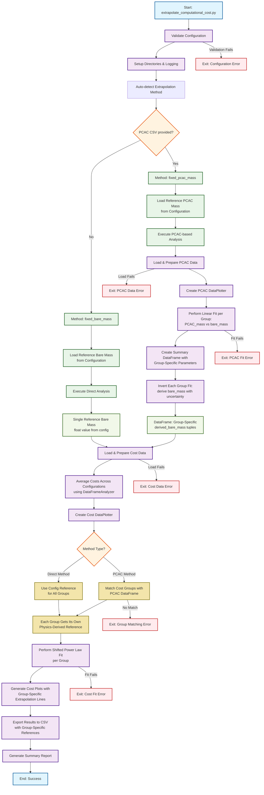

# Computational Cost Extrapolation Process Flow

This flowchart illustrates the process flow for the
`extrapolate_computational_cost.py` script, which automatically detects
and applies the appropriate extrapolation method based on input files
provided.

## Key Process Components

### 1. **Automatic Method Detection**
- **Input Analysis**: Script examines command-line arguments
- **Method Selection**: 
  - `fixed_pcac_mass` if PCAC CSV provided (`-i_pcac`)
  - `fixed_bare_mass` if only processed CSV provided (`-i_proc`)

### 2. **PCAC-based Analysis Path**
- **PCAC Data Processing**: Load plateau PCAC mass estimates
- **Linear Fitting**: PCAC mass vs bare mass relationship
- **Inversion**: Convert reference PCAC mass to bare mass with
  uncertainty
- **Uncertainty Propagation**: Uses gvar objects for error handling

### 3. **Direct Analysis Path**
- **Configuration**: Uses pre-configured reference bare mass value
- **Direct Processing**: Skips PCAC analysis step

### 4. **Common Cost Analysis**
- **Data Preparation**: Load computational cost data
- **Configuration Averaging**: Average across multiple configurations
- **Curve Fitting**: Shifted power law fit for cost extrapolation
- **Visualization**: Generate plots with extrapolation lines

### 5. **Output Generation**
- **CSV Export**: Extrapolated cost predictions with uncertainties
- **Plot Generation**: Professional visualizations with fit curves
- **Summary Reporting**: Analysis results and statistics

## Input Requirements

| Method | Required Files | Purpose |
|--------|---------------|---------|
| `fixed_bare_mass` | `processed_parameter_values.csv` | Direct cost extrapolation |
| `fixed_pcac_mass` | `processed_parameter_values.csv` `plateau_PCAC_mass_estimates.csv` | PCAC-mediated extrapolation |

## Output Files

- **CSV**: `computational_cost_extrapolation.csv` (in output directory)
- **Plots**: Cost and PCAC analysis plots (in plots directory)
- **Logs**: Detailed execution logs (if logging enabled)
