# Extract Plateau PCAC Mass Script Flowchart

## Design Goal
Extract plateau PCAC mass values from PCAC mass time series using
jackknife analysis and robust plateau detection methods. The script
processes HDF5 files from calculate_PCAC_mass.py, detects plateau
regions using configurable sigma thresholds, and exports results to both
CSV and HDF5 formats.

The script implements PCAC-specific configuration including optional
symmetrization, configurable plateau search ranges, and comprehensive
error handling with detailed success/failure tracking.

## Flowchart

```mermaid
flowchart TD
    %% START
    Start([Start: extract_plateau_PCAC_mass.py]) --> ParseArgs[Parse CLI Arguments:<br/>input_hdf5_file, output_directory<br/>output filenames, logging options]
    
    %% SETUP PHASE
    ParseArgs --> ValidateConfig[Validate PCAC Configuration:<br/>validate_pcac_config function<br/>Check time offset & search ranges]
    ValidateConfig --> SetupLogging[Setup Logging:<br/>create_script_logger<br/>Optional file logging with verbose]
    
    %% PARAMETER LOGGING
    SetupLogging --> LogStart[Log Script Start:<br/>PCAC mass plateau extraction]
    LogStart --> LogParams[Log Input Parameters:<br/>Input file, output directory<br/>HDF5 and CSV filenames]
    
    %% CORE PROCESSING PHASE
    LogParams --> ProcessGroups[Process All Groups:<br/>process_all_groups function<br/>Core plateau detection logic]
    ProcessGroups --> LoadConfig[Load PCAC Configuration:<br/>INPUT_DATASETS mapping<br/>APPLY_SYMMETRIZATION flag<br/>PLATEAU_SEARCH_RANGE settings]
    LoadConfig --> LoadSharedConfig[Load Shared Configuration:<br/>PLATEAU_DETECTION_SIGMA_THRESHOLDS<br/>MIN_PLATEAU_SIZE<br/>Error handling settings]
    
    %% GROUP DISCOVERY AND PROCESSING
    LoadSharedConfig --> InitAnalyzer[Initialize HDF5Analyzer:<br/>Find valid analysis groups<br/>Extract parent metadata]
    InitAnalyzer --> FindValidGroups[Find Valid Groups:<br/>Search for required datasets<br/>PCAC_mass_jackknife_samples]
    FindValidGroups --> CheckGroups{Groups Found?}
    CheckGroups -- No --> NoGroups[Warning: No Results<br/>Log warning message<br/>Exit with error code]
    CheckGroups -- Yes --> GroupLoop[For Each Valid Group...]
    
    %% INDIVIDUAL GROUP PROCESSING
    GroupLoop --> ProcessAnalysisGroup[Process Analysis Group:<br/>process_analysis_group function<br/>Individual plateau detection]
    ProcessAnalysisGroup --> LoadGroupData[Load Group Datasets:<br/>jackknife_samples, mean_values<br/>error_values from HDF5]
    LoadGroupData --> CheckSymmetrization{APPLY_SYMMETRIZATION<br/>== True?}
    CheckSymmetrization -- Yes --> ApplySymmetry["Apply Symmetrization:<br/>C_sym = 0.5 * C + C_reflected<br/>Optional truncation to T/2"]
    CheckSymmetrization -- No --> PlateauDetection[Plateau Detection Phase...]
    ApplySymmetry --> PlateauDetection
    
    %% PLATEAU DETECTION ALGORITHM
    PlateauDetection --> SearchPlateaus[Search for Plateau Regions:<br/>Multiple sigma thresholds<br/>Range-based detection method]
    SearchPlateaus --> ApplyThresholds["Apply Sigma Thresholds:<br/>Test multiple threshold values<br/>1.0, 1.5, 2.0, 2.5, 3.0, 4.0, 5.0"]
    ApplyThresholds --> ValidateSize["Validate Plateau Size:<br/>MIN_PLATEAU_SIZE = 5 points<br/>Check plateau search range"]
    ValidateSize --> SelectBestPlateau[Select Best Plateau:<br/>Weighted range method<br/>Prefer central regions]
    
    %% PLATEAU ESTIMATION
    SelectBestPlateau --> CheckPlateauFound{Plateau Found?}
    CheckPlateauFound -- No --> RecordFailure[Record Group Failure:<br/>Add to failed results<br/>Log failure reason]
    CheckPlateauFound -- Yes --> EstimatePlateauValue[Estimate Plateau Value:<br/>Inverse variance weighted mean<br/>Calculate plateau bounds]
    EstimatePlateauValue --> CalcStatistics[Calculate Statistics:<br/>Individual sample results<br/>Group-level estimates]
    CalcStatistics --> RecordSuccess[Record Group Success:<br/>Store plateau mean/error<br/>Sigma threshold used]
    
    %% RESULT PROCESSING
    RecordFailure --> NextGroup{More Groups?}
    RecordSuccess --> NextGroup
    NextGroup -- Yes --> GroupLoop
    NextGroup -- No --> CheckResults{Results Available?}
    CheckResults -- No --> NoResults[Error: No Results<br/>Log warning and exit<br/>Return error code]
    CheckResults -- Yes --> ExportPhase[Export Results Phase...]
    
    %% EXPORT TO CSV
    ExportPhase --> ExportCSV[Export to CSV:<br/>export_to_csv function<br/>Format results with metadata]
    ExportCSV --> BuildCSVPath[Build CSV Output Path:<br/>Join output_directory + filename<br/>Use OUTPUT_COLUMN_PREFIX]
    BuildCSVPath --> FormatCSVData[Format CSV Data:<br/>Include group metadata<br/>Plateau estimates and diagnostics]
    FormatCSVData --> WriteCSV[Write CSV File:<br/>Use configured delimiter<br/>Float precision settings]
    
    %% EXPORT TO HDF5
    WriteCSV --> ExportHDF5[Export to HDF5:<br/>export_to_hdf5 function<br/>Visualization-optimized format]
    ExportHDF5 --> BuildHDF5Path[Build HDF5 Output Path:<br/>Join output_directory + filename<br/>Copy input file structure]
    BuildHDF5Path --> CopyParentStructure[Copy Parent Structure:<br/>Preserve group hierarchy<br/>Copy constant parameters]
    CopyParentStructure --> SaveProcessedData[Save Processed Data:<br/>Time series samples<br/>Plateau estimates per group]
    SaveProcessedData --> AddDocumentation[Add Documentation:<br/>Analysis metadata<br/>Source file reference]
    
    %% COMPLETION AND REPORTING
    AddDocumentation --> CountResults[Count Results:<br/>n_success vs n_total groups<br/>Calculate success rate]
    CountResults --> ReportSummary[Report Summary:<br/>Display success/total counts<br/>Show relative output path]
    ReportSummary --> LogEnd[Log Script End:<br/>Mark successful completion<br/>Include success statistics]
    LogEnd --> End([End: Extraction Complete])
    
    %% ERROR HANDLING PATHS
    NoGroups --> End
    NoResults --> End
    
    %% STYLING
    classDef processBox fill:#e1f5fe,stroke:#0277bd,stroke-width:2px
    classDef dataBox fill:#f3e5f5,stroke:#7b1fa2,stroke-width:2px
    classDef decisionBox fill:#fff3e0,stroke:#ef6c00,stroke-width:2px
    classDef plateauBox fill:#e8f5e8,stroke:#2e7d32,stroke-width:2px
    classDef exportBox fill:#f1f8e9,stroke:#33691e,stroke-width:2px
    classDef successBox fill:#e8f5e8,stroke:#1b5e20,stroke-width:2px
    classDef errorBox fill:#ffebee,stroke:#c62828,stroke-width:2px
    
    class ParseArgs,ValidateConfig,SetupLogging,LogStart,LogParams processBox
    class LoadGroupData,LoadConfig,LoadSharedConfig,FormatCSVData,SaveProcessedData,AddDocumentation dataBox
    class CheckGroups,CheckSymmetrization,CheckPlateauFound,NextGroup,CheckResults decisionBox
    class PlateauDetection,SearchPlateaus,ApplyThresholds,ValidateSize,SelectBestPlateau,EstimatePlateauValue,CalcStatistics plateauBox
    class ExportCSV,ExportHDF5,BuildCSVPath,BuildHDF5Path,CopyParentStructure,WriteCSV exportBox
    class RecordSuccess,ReportSummary,LogEnd,End successBox
    class NoGroups,NoResults,RecordFailure errorBox
```



## Key Features

### PCAC-Specific Configuration
- **validate_pcac_config()**: Validates PCAC-specific parameters
  including time offset and search ranges
- **INPUT_DATASETS**: Mapping to "PCAC_mass_jackknife_samples",
  "PCAC_mass_mean_values", "PCAC_mass_error_values"
- **TIME_OFFSET = 2**: PCAC mass time series starts at t=2
- **Optional Symmetrization**: APPLY_SYMMETRIZATION with optional
  truncation to T/2

### Robust Plateau Detection
- **Multi-Threshold Search**: Tests sigma thresholds [1.0, 1.5, 2.0,
  2.5, 3.0, 4.0, 5.0]
- **Weighted Range Method**: Robust plateau detection algorithm
  preferring central regions
- **Minimum Size Validation**: MIN_PLATEAU_SIZE = 5 points minimum
- **Configurable Search Range**: min_start=2, max_end=-2 for boundary
  exclusion

### Comprehensive Export System
- **Dual Format Output**: Both CSV and HDF5 exports with different
  optimization goals
- **CSV Export**: Human-readable tabular format with metadata and
  diagnostics
- **HDF5 Export**: Visualization-optimized format preserving time series
  structure
- **Metadata Preservation**: Copies parent group attributes and analysis
  documentation

## Analysis Algorithm

### Plateau Detection Process
```
1. Load PCAC mass time series (jackknife samples)
2. Optional: Apply symmetrization C_sym(t) = 0.5 * [C(t) + C(T-t)]
3. Optional: Truncate to T/2 after symmetrization  
4. For each sigma threshold:
   - Search for plateau regions using weighted range method
   - Validate plateau size >= MIN_PLATEAU_SIZE
   - Check plateau bounds within search range
5. Select best plateau (prefer central, larger plateaus)
6. Calculate inverse variance weighted mean over plateau region
7. Estimate plateau error using jackknife statistics
```

### Success/Failure Tracking
- **Group-Level Resilience**: Individual group failures don't stop
  processing
- **Comprehensive Logging**: Records failure reasons and success
  statistics
- **Result Summary**: Reports n_success/n_total with detailed
  diagnostics

## CLI Usage

```bash
# Basic usage with defaults
python extract_plateau_PCAC_mass.py -i pcac_mass_analysis.h5 -o results_dir

# Custom output filenames
python extract_plateau_PCAC_mass.py \
    -i pcac_mass_analysis.h5 \
    -o results_dir \
    -out_h5 custom_plateaus.h5 \
    -out_csv custom_estimates.csv

# With comprehensive logging
python extract_plateau_PCAC_mass.py \
    -i pcac_mass_analysis.h5 \
    -o results_dir \
    -log_on \
    -v
```

## Configuration Parameters

### PCAC-Specific Settings
- **Symmetrization**: APPLY_SYMMETRIZATION = True,
  SYMMETRIZATION_TRUNCATION = True
- **Search Range**: min_start=2, max_end=-2, prefer_central=True
- **Output Prefix**: "PCAC" for column names like "PCAC_plateau_mean"

### Shared Detection Settings
- **Sigma Thresholds**: [1.0, 1.5, 2.0, 2.5, 3.0, 4.0, 5.0] for robust
  detection
- **Minimum Plateau Size**: 5 time points minimum
- **Estimation Method**: Inverse variance weighted averaging

## Architecture Insights
- **Configuration-Driven**: Uses hierarchical configuration (shared +
  PCAC-specific)
- **HDF5Analyzer Integration**: Leverages project's HDF5 infrastructure
  for group discovery
- **Error-Tolerant Processing**: Continues processing despite individual
  group failures
- **Dual Export Strategy**: CSV for analysis, HDF5 for visualization
  pipeline