# Extract Plateau Pion Mass Script Flowchart

## Design Goal
Extract plateau pion effective mass values from pion effective mass time
series using jackknife analysis and robust plateau detection methods.
The script processes HDF5 files from calculate_effective_mass.py,
detects plateau regions using the same sophisticated detection algorithm
as PCAC, and exports results to both CSV and HDF5 formats.

The script implements pion-specific configuration with no additional
symmetrization (already applied), different time offset, and optimized
search ranges for effective mass plateau characteristics.

## Flowchart

```mermaid
flowchart TD
    %% START
    Start([Start: extract_plateau_pion_mass.py]) --> ParseArgs[Parse CLI Arguments:<br/>input_hdf5_file, output_directory<br/>output filenames, logging options]
    
    %% SETUP PHASE
    ParseArgs --> ValidateConfig[Validate Pion Configuration:<br/>validate_pion_config function<br/>Check time offset & search ranges]
    ValidateConfig --> SetupLogging[Setup Logging:<br/>create_script_logger<br/>Optional file logging with verbose]
    
    %% PARAMETER LOGGING
    SetupLogging --> LogStart[Log Script Start:<br/>Pion mass plateau extraction]
    LogStart --> LogParams[Log Input Parameters:<br/>Input file, output directory<br/>HDF5 and CSV filenames]
    
    %% CORE PROCESSING PHASE
    LogParams --> ProcessGroups[Process All Groups:<br/>process_all_groups function<br/>Shared plateau detection core]
    ProcessGroups --> LoadPionConfig[Load Pion Configuration:<br/>INPUT_DATASETS mapping<br/>pion_effective_mass datasets]
    LoadPionConfig --> LoadPionSettings[Load Pion Settings:<br/>TIME_OFFSET = 1<br/>APPLY_SYMMETRIZATION = False<br/>PLATEAU_SEARCH_RANGE config]
    LoadPionSettings --> LoadSharedConfig[Load Shared Configuration:<br/>PLATEAU_DETECTION_SIGMA_THRESHOLDS<br/>MIN_PLATEAU_SIZE = 5<br/>Error handling settings]
    
    %% GROUP DISCOVERY AND PROCESSING
    LoadSharedConfig --> InitAnalyzer[Initialize HDF5Analyzer:<br/>Find valid analysis groups<br/>Extract parent metadata]
    InitAnalyzer --> FindValidGroups[Find Valid Groups:<br/>Search for required datasets<br/>pion_effective_mass_jackknife_samples]
    FindValidGroups --> CheckGroups{Groups Found?}
    CheckGroups -- No --> NoGroups[Warning: No Results<br/>Log warning message<br/>Exit with error code]
    CheckGroups -- Yes --> GroupLoop[For Each Valid Group...]
    
    %% INDIVIDUAL GROUP PROCESSING
    GroupLoop --> ProcessAnalysisGroup[Process Analysis Group:<br/>process_analysis_group function<br/>Individual plateau detection]
    ProcessAnalysisGroup --> LoadGroupData[Load Group Datasets:<br/>pion jackknife_samples<br/>pion mean_values, error_values]
    LoadGroupData --> CheckSymmetrization{APPLY_SYMMETRIZATION<br/>== False?}
    CheckSymmetrization -- True --> SkipSymmetry[Skip Symmetrization:<br/>Data already symmetrized<br/>in calculate_effective_mass]
    CheckSymmetrization -- False --> PlateauDetection[Plateau Detection Phase...]
    SkipSymmetry --> PlateauDetection
    
    %% PLATEAU DETECTION ALGORITHM
    PlateauDetection --> SearchPlateaus[Search for Plateau Regions:<br/>Same multi-threshold algorithm<br/>Weighted range method]
    SearchPlateaus --> ApplyThresholds["Apply Sigma Thresholds:<br/>Test multiple threshold values<br/>1.0, 1.5, 2.0, 2.5, 3.0, 4.0, 5.0"]
    ApplyThresholds --> ApplyPionRange["Apply Pion Search Range:<br/>min_start = 3 (vs PCAC = 2)<br/>max_end = -1 (vs PCAC = -2)"]
    ApplyPionRange --> ValidateSize["Validate Plateau Size:<br/>MIN_PLATEAU_SIZE = 5 points<br/>Same as PCAC analysis"]
    ValidateSize --> SelectBestPlateau[Select Best Plateau:<br/>Weighted range method<br/>Prefer central regions]
    
    %% PLATEAU ESTIMATION
    SelectBestPlateau --> CheckPlateauFound{Plateau Found?}
    CheckPlateauFound -- No --> RecordFailure[Record Group Failure:<br/>Add to failed results<br/>Log failure reason]
    CheckPlateauFound -- Yes --> EstimatePlateauValue[Estimate Plateau Value:<br/>Inverse variance weighted mean<br/>Calculate plateau bounds]
    EstimatePlateauValue --> CalcStatistics[Calculate Statistics:<br/>Individual sample results<br/>Group-level estimates]
    CalcStatistics --> RecordSuccess[Record Group Success:<br/>Store plateau mean/error<br/>Sigma threshold used]
    
    %% RESULT PROCESSING
    RecordFailure --> NextGroup{More Groups?}
    RecordSuccess --> NextGroup
    NextGroup -- Yes --> GroupLoop
    NextGroup -- No --> CheckResults{Results Available?}
    CheckResults -- No --> NoResults[Error: No Results<br/>Log warning and exit<br/>Return error code]
    CheckResults -- Yes --> ExportPhase[Export Results Phase...]
    
    %% EXPORT TO CSV
    ExportPhase --> ExportCSV[Export to CSV:<br/>export_to_csv function<br/>Format with pion metadata]
    ExportCSV --> BuildCSVPath[Build CSV Output Path:<br/>plateau_pion_mass_estimates.csv<br/>Use pion OUTPUT_COLUMN_PREFIX]
    BuildCSVPath --> FormatCSVData[Format CSV Data:<br/>Include group metadata<br/>pion_plateau_mean, pion_plateau_error]
    FormatCSVData --> WriteCSV[Write CSV File:<br/>Same delimiter and precision<br/>Pion-specific column names]
    
    %% EXPORT TO HDF5
    WriteCSV --> ExportHDF5[Export to HDF5:<br/>export_to_hdf5 function<br/>plateau_pion_mass_extraction.h5]
    ExportHDF5 --> BuildHDF5Path[Build HDF5 Output Path:<br/>Pion-specific filename<br/>Copy input file structure]
    BuildHDF5Path --> CopyParentStructure[Copy Parent Structure:<br/>Preserve group hierarchy<br/>Copy constant parameters]
    CopyParentStructure --> SaveProcessedData[Save Processed Data:<br/>pion_time_series_samples<br/>pion_plateau_estimates]
    SaveProcessedData --> AddDocumentation[Add Documentation:<br/>Pion analysis metadata<br/>Source file reference]
    
    %% COMPLETION AND REPORTING
    AddDocumentation --> CountResults[Count Results:<br/>n_success vs n_total groups<br/>Calculate success rate]
    CountResults --> ReportSummary[Report Summary:<br/>Display success/total counts<br/>Show relative output path]
    ReportSummary --> LogEnd[Log Script End:<br/>Pion effective mass completed<br/>Include success statistics]
    LogEnd --> End([End: Extraction Complete])
    
    %% ERROR HANDLING PATHS
    NoGroups --> End
    NoResults --> End
    
    %% STYLING
    classDef processBox fill:#e1f5fe,stroke:#0277bd,stroke-width:2px
    classDef dataBox fill:#f3e5f5,stroke:#7b1fa2,stroke-width:2px
    classDef decisionBox fill:#fff3e0,stroke:#ef6c00,stroke-width:2px
    classDef plateauBox fill:#e8f5e8,stroke:#2e7d32,stroke-width:2px
    classDef exportBox fill:#f1f8e9,stroke:#33691e,stroke-width:2px
    classDef pionBox fill:#fff8e1,stroke:#f57f17,stroke-width:2px
    classDef successBox fill:#e8f5e8,stroke:#1b5e20,stroke-width:2px
    classDef errorBox fill:#ffebee,stroke:#c62828,stroke-width:2px
    
    class ParseArgs,ValidateConfig,SetupLogging,LogStart,LogParams processBox
    class LoadGroupData,LoadPionConfig,LoadSharedConfig,FormatCSVData,SaveProcessedData,AddDocumentation dataBox
    class CheckGroups,CheckSymmetrization,CheckPlateauFound,NextGroup,CheckResults decisionBox
    class PlateauDetection,SearchPlateaus,ApplyThresholds,ValidateSize,SelectBestPlateau,EstimatePlateauValue,CalcStatistics plateauBox
    class ExportCSV,ExportHDF5,BuildCSVPath,BuildHDF5Path,CopyParentStructure,WriteCSV exportBox
    class LoadPionSettings,ApplyPionRange,SkipSymmetry pionBox
    class RecordSuccess,ReportSummary,LogEnd,End successBox
    class NoGroups,NoResults,RecordFailure errorBox
```



## Key Features

### Pion-Specific Configuration
- **validate_pion_config()**: Validates pion-specific parameters
  including time offset and search ranges
- **INPUT_DATASETS**: Mapping to
  "pion_effective_mass_jackknife_samples",
  "pion_effective_mass_mean_values", "pion_effective_mass_error_values"
- **TIME_OFFSET = 1**: Pion effective mass time series starts at t=1 (vs
  t=2 for PCAC)
- **No Additional Symmetrization**: APPLY_SYMMETRIZATION = False
  (already done in calculate_effective_mass.py)

### Optimized Search Parameters
- **Pion Search Range**: min_start=3, max_end=-1 (vs PCAC: min_start=2,
  max_end=-2)
- **Same Detection Algorithm**: Uses identical multi-threshold plateau
  detection as PCAC
- **Same Quality Standards**: MIN_PLATEAU_SIZE = 5, same sigma
  thresholds [1.0-5.0]
- **Same Estimation Method**: Inverse variance weighted averaging

### Shared Core Architecture
- **Identical Processing Logic**: Uses same process_all_groups function
  as PCAC script
- **Same Error Handling**: Group-level failure isolation with
  comprehensive tracking
- **Same Export Strategy**: Dual CSV/HDF5 output with different
  optimization goals
- **Same Statistical Methods**: Jackknife analysis and weighted
  averaging

## Key Differences from PCAC Extraction

### Configuration Differences
| Parameter | PCAC Value | Pion Value | Reason |
|-----------|------------|------------|---------|
| TIME_OFFSET | 2 | 1 | PCAC starts at t=2, effective mass at t=1 |
| APPLY_SYMMETRIZATION | True | False | Effective mass pre-symmetrized |
| Search min_start | 2 | 3 | Effective mass needs more boundary exclusion |
| Search max_end | -2 | -1 | Different boundary conditions |
| Output prefix | "PCAC" | "pion" | Column naming: pion_plateau_mean |

### Input Data Sources
- **PCAC Script**: Processes output from calculate_PCAC_mass.py
- **Pion Script**: Processes output from calculate_effective_mass.py
- **Data Structure**: Both use same jackknife sample format but
  different physics content

## Analysis Algorithm (Identical Core)

### Plateau Detection Process
```
1. Load pion effective mass time series (jackknife samples)
2. Skip symmetrization (already applied in calculate_effective_mass.py)
3. For each sigma threshold [1.0, 1.5, 2.0, 2.5, 3.0, 4.0, 5.0]:
   - Search for plateau regions using weighted range method
   - Apply pion-specific search range (start=3, end=-1)
   - Validate plateau size >= 5 points
4. Select best plateau (prefer central, larger plateaus)
5. Calculate inverse variance weighted mean over plateau region
6. Estimate plateau error using jackknife statistics
```

## CLI Usage

```bash
# Basic usage with defaults
python extract_plateau_pion_mass.py -i effective_mass_analysis.h5 -o results_dir

# Custom output filenames
python extract_plateau_pion_mass.py \
    -i effective_mass_analysis.h5 \
    -o results_dir \
    -out_h5 custom_pion_plateaus.h5 \
    -out_csv custom_pion_estimates.csv

# With comprehensive logging
python extract_plateau_pion_mass.py \
    -i effective_mass_analysis.h5 \
    -o results_dir \
    -log_on \
    -v
```

## Output Files

### CSV Format
- **Filename**: "plateau_pion_mass_estimates.csv" (default)
- **Key Columns**: pion_plateau_mean, pion_plateau_error,
  pion_plateau_start_time, pion_plateau_end_time
- **Metadata**: Same group parameters, but with pion-specific
  diagnostics

### HDF5 Format
- **Filename**: "plateau_pion_mass_extraction.h5" (default)
- **Structure**: pion_time_series_samples, pion_plateau_estimates,
  pion_individual_sigma_thresholds
- **Optimization**: Designed for visualization pipeline
  (visualize_plateau_extraction.py)

## Architecture Insights
- **Shared Foundation**: Identical core algorithm with physics-specific
  configuration
- **Pre-Processing Awareness**: Accounts for symmetrization already
  applied in effective mass calculation
- **Search Range Optimization**: Adjusted boundaries for effective mass
  plateau characteristics
- **Parallel Processing**: Can be run alongside PCAC extraction for
  comparative analysis