# Visualize Plateau Extraction Script Flowchart

## Design Goal
Create high-quality multi-panel visualizations of plateau extraction
results from both PCAC mass and pion effective mass analyses. The script
reads extraction results from HDF5 files and generates plots showing
individual jackknife samples with their detected plateau regions,
matching the output quality of the original extract_plateau_PCAC_mass.py
script.

The script implements unified visualization infrastructure that adapts
automatically to different analysis types while maintaining consistent
high-quality output and comprehensive error handling.

## Flowchart

```mermaid
flowchart TD
    %% START
    Start([Start: visualize_plateau_extraction.py]) --> ParseArgs[Parse CLI Arguments:<br/>analysis_type required choice<br/>input_hdf5_file, plots_directory]
    
    %% VALIDATION PHASE
    ParseArgs --> ValidateAnalysisType[Validate Analysis Type:<br/>validate_analysis_type function<br/>Check pcac_mass or pion_mass]
    ValidateAnalysisType --> ValidateConfig[Validate Visualization Config:<br/>validate_visualization_config<br/>Check plotting parameters]
    ValidateConfig --> SetupLogging[Setup Logging:<br/>create_script_logger<br/>Optional file logging with verbose]
    
    %% CONFIGURATION PHASE
    SetupLogging --> LogStart[Log Script Start:<br/>Plateau extraction visualization]
    LogStart --> LogParams[Log Input Parameters:<br/>Analysis type, input file<br/>Plots directory, clear flag]
    LogParams --> GetAnalysisConfig[Get Analysis Configuration:<br/>get_analysis_config function<br/>Load type-specific settings]
    GetAnalysisConfig --> LogAnalysisType[Log Analysis Type:<br/>Configured for description<br/>PCAC mass or pion effective mass]
    
    %% VISUALIZATION INFRASTRUCTURE SETUP
    LogAnalysisType --> PrepareTools[Prepare Visualization Tools:<br/>prepare_visualization_tools function<br/>Setup managers and builders]
    PrepareTools --> SetupFileManager[Setup File Manager:<br/>PlotFileManager for plots_directory<br/>Handle subdirectory creation]
    SetupFileManager --> SetupTitleBuilder[Setup Title Builder:<br/>PlotTitleBuilder with constants<br/>TITLE_LABELS_BY_COLUMN_NAME]
    SetupTitleBuilder --> CheckClearPlots{clear_existing_plots<br/>== True?}
    CheckClearPlots -- Yes --> ClearExistingPlots[Clear Existing Plots:<br/>Remove old plot files<br/>Prepare clean directories]
    CheckClearPlots -- No --> ProcessHDF5[Process HDF5 File...]
    ClearExistingPlots --> ProcessHDF5
    
    %% HDF5 FILE PROCESSING
    ProcessHDF5 --> ValidateInputFile[Validate Input File:<br/>Check file exists and readable<br/>Log processing start]
    ValidateInputFile --> OpenHDF5File[Open HDF5 File:<br/>Read mode for extraction results<br/>h5py.File context manager]
    OpenHDF5File --> FindGroups[Find Extraction Groups:<br/>find_extraction_groups function<br/>Search for required datasets]
    FindGroups --> CheckGroupsFound{Valid Groups Found?}
    CheckGroupsFound -- No --> NoGroups[Warning: No Valid Groups<br/>Log warning message<br/>Return empty results]
    CheckGroupsFound -- Yes --> LogGroupsFound[Log Groups Found:<br/>Number of groups to visualize]
    
    %% GROUP PROCESSING LOOP
    LogGroupsFound --> GroupLoop[For Each Valid Group...]
    GroupLoop --> ProcessGroup[Process Group Visualization:<br/>process_group_visualization function<br/>Core plotting logic]
    ProcessGroup --> ValidateGroupType[Validate Group Type:<br/>Check isinstance h5py.Group<br/>Skip invalid items]
    ValidateGroupType --> LoadExtractionResults[Load Extraction Results:<br/>load_extraction_results_from_group<br/>Time series and plateau data]
    
    %% DATA LOADING AND VALIDATION
    LoadExtractionResults --> LoadTimeSeries[Load Time Series Data:<br/>analysis_config input_datasets<br/>time_series_samples dataset]
    LoadTimeSeries --> LoadPlateauEstimates[Load Plateau Estimates:<br/>plateau_estimates dataset<br/>Individual sample results]
    LoadPlateauEstimates --> LoadSigmaThresholds[Load Sigma Thresholds:<br/>sigma_thresholds dataset<br/>Detection parameters used]
    LoadSigmaThresholds --> LoadConfigLabels[Load Configuration Labels:<br/>config_labels dataset<br/>Gauge configuration identifiers]
    LoadConfigLabels --> ValidateDataConsistency[Validate Data Consistency:<br/>Check array dimensions match<br/>Samples vs labels count]
    ValidateDataConsistency --> CheckDataValid{Data Valid?}
    CheckDataValid -- No --> SkipGroup[Skip Group:<br/>Log validation failure<br/>Continue to next group]
    CheckDataValid -- Yes --> ApplyTrimming[Apply Data Trimming:<br/>analysis_config trimming settings<br/>Optional boundary removal]
    
    %% FIGURE CREATION SETUP
    ApplyTrimming --> SplitIntoFigures[Split Into Figures:<br/>split_extractions_into_figures<br/>Max samples per figure]
    SplitIntoFigures --> CalcFigureCount[Calculate Figure Count:<br/>Based on samples_per_figure<br/>layout_config settings]
    CalcFigureCount --> FigureLoop[For Each Figure...]
    
    %% INDIVIDUAL FIGURE CREATION
    FigureLoop --> CreateMultiPanel[Create Multi-Panel Figure:<br/>create_multi_panel_figure function<br/>Setup layout and styling]
    CreateMultiPanel --> SetupSubplots[Setup Subplots:<br/>Grid arrangement calculation<br/>subplot_spacing configuration]
    SetupSubplots --> ApplyLayoutConfig[Apply Layout Config:<br/>figure_size, margins<br/>hspace, wspace settings]
    ApplyLayoutConfig --> SampleLoop[For Each Sample in Figure...]
    
    %% INDIVIDUAL SAMPLE PLOTTING
    SampleLoop --> PlotTimeSeries[Plot Time Series:<br/>Individual jackknife sample<br/>Time series data points]
    PlotTimeSeries --> HighlightPlateau[Highlight Plateau Region:<br/>Detected plateau bounds<br/>Shaded rectangle overlay]
    HighlightPlateau --> AddPlateauAnnotation[Add Plateau Annotation:<br/>Plateau value and error<br/>Sigma threshold used]
    AddPlateauAnnotation --> ApplyPlotStyling[Apply Plot Styling:<br/>PLOT_STYLING configuration<br/>Colors, markers, fonts]
    ApplyPlotStyling --> SetAxisLabels[Set Axis Labels:<br/>Time axis and mass axis<br/>Analysis-specific labels]
    SetAxisLabels --> AddConfigLabel[Add Configuration Label:<br/>Sample configuration ID<br/>Top-right corner placement]
    AddConfigLabel --> NextSample{More Samples<br/>in Figure?}
    NextSample -- Yes --> SampleLoop
    NextSample -- No --> FinalizeLayout[Finalize Figure Layout:<br/>Adjust spacing and margins<br/>Add overall title]
    
    %% FIGURE OUTPUT
    FinalizeLayout --> GenerateFilename[Generate Filename:<br/>Build plot filename<br/>file_manager.plot_path]
    GenerateFilename --> SaveFigure[Save Figure:<br/>High-resolution PNG output<br/>matplotlib savefig]
    SaveFigure --> CleanupMatplotlib[Cleanup Matplotlib:<br/>plt.close figure<br/>Free memory resources]
    CleanupMatplotlib --> RecordPlotPath[Record Plot Path:<br/>Add to plot_paths list<br/>Track created files]
    RecordPlotPath --> NextFigure{More Figures<br/>for Group?}
    NextFigure -- Yes --> FigureLoop
    NextFigure -- No --> RecordGroupResult[Record Group Result:<br/>Success status, plot count<br/>Error messages if any]
    
    %% GROUP COMPLETION
    SkipGroup --> NextGroup{More Groups?}
    RecordGroupResult --> NextGroup
    NextGroup -- Yes --> GroupLoop
    NextGroup -- No --> ReportStatistics[Report Final Statistics:<br/>report_final_statistics function<br/>Success/failure summary]
    
    %% COMPLETION AND REPORTING
    ReportStatistics --> LogSummary[Log Detailed Summary:<br/>Total groups processed<br/>Successful vs failed counts]
    LogSummary --> LogPlotCounts[Log Plot Counts:<br/>Total plots created<br/>Per-group breakdown]
    LogPlotCounts --> CheckOverallSuccess{Any Plots Created?}
    CheckOverallSuccess -- Yes --> SuccessMessage[Success Message:<br/>Display plot count<br/>Show relative output path]
    CheckOverallSuccess -- No --> WarningMessage[Warning Message:<br/>No plots created<br/>Check input and logs]
    SuccessMessage --> LogEnd[Log Script End:<br/>Mark successful completion<br/>Include final statistics]
    WarningMessage --> LogEnd
    LogEnd --> End([End: Visualization Complete])
    
    %% ERROR HANDLING PATHS
    NoGroups --> End
    
    %% STYLING
    classDef processBox fill:#e1f5fe,stroke:#0277bd,stroke-width:2px
    classDef dataBox fill:#f3e5f5,stroke:#7b1fa2,stroke-width:2px
    classDef decisionBox fill:#fff3e0,stroke:#ef6c00,stroke-width:2px
    classDef plotBox fill:#e8f5e8,stroke:#2e7d32,stroke-width:2px
    classDef configBox fill:#fff8e1,stroke:#f57f17,stroke-width:2px
    classDef successBox fill:#e8f5e8,stroke:#1b5e20,stroke-width:2px
    classDef errorBox fill:#ffebee,stroke:#c62828,stroke-width:2px
    
    class ParseArgs,ValidateAnalysisType,ValidateConfig,SetupLogging,LogStart,LogParams processBox
    class LoadTimeSeries,LoadPlateauEstimates,LoadSigmaThresholds,LoadConfigLabels,ValidateDataConsistency,ApplyTrimming dataBox
    class CheckClearPlots,CheckGroupsFound,CheckDataValid,NextSample,NextFigure,NextGroup,CheckOverallSuccess decisionBox
    class CreateMultiPanel,PlotTimeSeries,HighlightPlateau,AddPlateauAnnotation,ApplyPlotStyling,SetAxisLabels,SaveFigure plotBox
    class GetAnalysisConfig,LogAnalysisType,SetupFileManager,SetupTitleBuilder,ApplyLayoutConfig configBox
    class SuccessMessage,LogEnd,End successBox
    class NoGroups,SkipGroup,WarningMessage errorBox
```



## Key Features

### Unified Analysis Type Support
- **Dynamic Configuration**: get_analysis_config() loads type-specific
  settings for PCAC vs pion
- **Analysis Validation**: validate_analysis_type() ensures valid
  analysis_type parameter
- **Adaptive Plotting**: Automatically adjusts visualization style based
  on analysis type
- **Dataset Mapping**: Uses analysis-specific dataset names
  (PCAC_time_series_samples vs pion_time_series_samples)

### Advanced Visualization Infrastructure
- **PlotFileManager**: Handles plot file paths, subdirectory creation,
  and naming conventions
- **PlotTitleBuilder**: Generates descriptive plot titles using
  constants.TITLE_LABELS_BY_COLUMN_NAME
- **Layout Management**: Configurable multi-panel layout with
  samples_per_figure control
- **High-Quality Output**: Professional matplotlib styling with
  configurable DPI and formatting

### Sophisticated Data Processing
- **Multi-Level Loading**: Time series samples, plateau estimates, sigma
  thresholds, configuration labels
- **Data Validation**: Comprehensive consistency checking between
  datasets
- **Optional Trimming**: Analysis-specific boundary removal for cleaner
  visualization
- **Figure Batching**: Intelligent splitting of samples across multiple
  figures

## Visualization Architecture

### Multi-Panel Plot Structure
```
1. Each group creates one or more figures
2. Each figure contains multiple sample panels (samples_per_figure)
3. Each panel shows:
   - Time series data points
   - Detected plateau region (highlighted)
   - Plateau value annotation
   - Sample configuration label
```

### Analysis-Type Configurations

#### PCAC Mass Analysis
- **Input Datasets**: PCAC_time_series_samples, PCAC_plateau_estimates,
  PCAC_individual_sigma_thresholds
- **Time Offset**: t=2 (PCAC mass starts at t=2)
- **Y-axis Label**: r"$am_{\mathrm{PCAC}}$"
- **Plot Subdirectory**: "plateau_extraction_pcac"
- **Trimming**: trim_start_points=4, trim_end_points=3

#### Pion Mass Analysis
- **Input Datasets**: pion_time_series_samples, pion_plateau_estimates,
  pion_individual_sigma_thresholds
- **Time Offset**: t=1 (effective mass starts at t=1)
- **Y-axis Label**: r"$am_{\pi}^{\mathrm{eff}}$"
- **Plot Subdirectory**: "plateau_extraction_pion"
- **Trimming**: trim_start_points=5, trim_end_points=2

## Data Flow Pipeline

### Input Processing
```
HDF5 File → Group Discovery → Dataset Loading → Validation → Trimming
```

### Visualization Pipeline
```
Data Arrays → Figure Batching → Multi-Panel Creation → Individual Plotting → Output Files
```

### Error Handling Strategy
- **Group-Level Isolation**: Failed groups don't stop overall processing
- **Data Validation**: Comprehensive checks before plotting attempts
- **Resource Management**: Proper matplotlib figure cleanup to prevent
  memory leaks
- **Detailed Logging**: Track success/failure rates with specific error
  messages

## CLI Usage

```bash
# PCAC mass visualization
python visualize_plateau_extraction.py \
    --analysis_type pcac_mass \
    -i plateau_PCAC_mass_extraction.h5 \
    -p plots_dir

# Pion mass visualization with options
python visualize_plateau_extraction.py \
    --analysis_type pion_mass \
    -i plateau_pion_mass_extraction.h5 \
    -p plots_dir \
    -clear \
    --verbose \
    -log_on

# With custom log directory
python visualize_plateau_extraction.py \
    --analysis_type pcac_mass \
    -i plateau_results.h5 \
    -p plots_dir \
    -log_dir logs \
    -log_name custom_viz.log
```

## Output Structure

### Directory Organization
```
plots_dir/
├── plateau_extraction_pcac/          # PCAC analysis plots
│   ├── group_name_1/
│   │   ├── samples_001_005.png
│   │   ├── samples_006_010.png
│   │   └── ...
│   └── group_name_2/
│       └── ...
└── plateau_extraction_pion/          # Pion analysis plots
    ├── group_name_1/
    └── ...
```

### Plot Features
- **Individual Time Series**: Each jackknife sample plotted as time
  series
- **Plateau Highlighting**: Detected plateau region shown as shaded
  rectangle
- **Value Annotations**: Plateau mean, error, and sigma threshold
  displayed
- **Configuration Labels**: Sample identification in each panel
- **Professional Styling**: High-DPI output with consistent formatting

## Architecture Insights
- **Unified Interface**: Single script handles both analysis types with
  automatic adaptation
- **Modular Design**: Separation of data loading, figure creation, and
  plotting logic
- **Configuration-Driven**: All styling and layout controlled through
  configuration dictionaries
- **Post-Processing Focus**: Designed to visualize results from
  extraction scripts rather than perform analysis
- **Quality Emphasis**: Matches output quality of original embedded
  visualization code