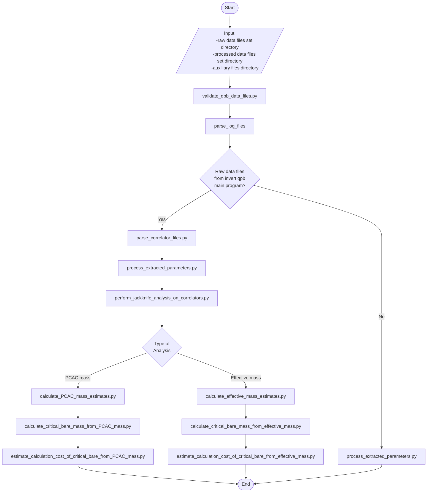

## flowchart

```mermaid
flowchart TD
    
    %% INITIATE SCRIPT
    Start([Start]) --> Inputs[/Input:
        -raw data files set directory
        -processed data files set directory
        -auxiliary files directory
        /]
    
    %% 
    Inputs --> Validation[
        validate_qpb_data_files.py
        ]

    %% RAW FILES PARSING
    Validation --> qpbFilesParsing[
        parse_log_files
        ]

    %% PARSING QPB FILES

    qpbFilesParsing --> InvertMainProgram{
            Raw data files 
            from invert qpb 
            main program?
            }

    InvertMainProgram -- No --> ProcessingRawFiles[
        process_extracted_parameters.py
        ]
    
    InvertMainProgram -- Yes --> InvertCorrelatorFilesParsing[
        parse_correlator_files.py
        ]

    InvertCorrelatorFilesParsing --> InvertProcessingRawFiles[
        process_extracted_parameters.py
        ]

    InvertProcessingRawFiles --> InvertJackknifeAnalysis[
        perform_jackknife_analysis_on_correlators.py
    ]

    InvertJackknifeAnalysis --> InvertAnalysisType{
        Type of 
        Analysis
    }

    InvertAnalysisType -- PCAC mass --> PCACMassEstimates[
        calculate_PCAC_mass_estimates.py
        ]

    PCACMassEstimates --> PCACCriticalMass[
        calculate_critical_bare_mass_from_PCAC_mass.py
        ]

    InvertAnalysisType -- Effective mass --> EffectiveMassEstimates[
        calculate_effective_mass_estimates.py
        ]

    EffectiveMassEstimates --> EffectiveCriticalMass[
        calculate_critical_bare_mass_from_effective_mass.py
        ]

    PCACCriticalMass --> PCACMassCost[
        estimate_calculation_cost_of_critical_bare_from_PCAC_mass.py
    ]

    PCACMassCost --> End

    EffectiveCriticalMass --> EffectiveMassCost[
        estimate_calculation_cost_of_critical_bare_from_effective_mass.py
        ]

    EffectiveMassCost --> End

    %% TERMINATE SCRIPT
    ProcessingRawFiles --> End([End])
```
