# QPB Data Analysis Main Pipeline Flowchart

## Overview

This document describes the complete main data analysis pipeline for the
`qpbDataTools` project. The pipeline processes raw data files from
the QPB C program through multiple stages: parsing, processing, and
multi-branch analysis.

## Pipeline Stages

The pipeline consists of **three main stages**:

1. **Parsing Stage**: Extract parameters and data from raw files
2. **Processing Stage**: Transform and analyze extracted data
3. **Analysis Stage**: Perform physics-specific calculations (only for
   correlator data)

The Analysis Stage splits into **two parallel branches** ("PCAC" and
"Pion"), each with **four sequential sub-stages**.

---

## Complete Pipeline Flowchart

```mermaid
flowchart TD
    %% ========================================================================
    %% ENTRY POINT
    %% ========================================================================
    Start([Data File Set Input]) --> CheckFiles{Data File Set<br/>Contains .dat Files?}
    
    %% ========================================================================
    %% STAGE 1: PARSING
    %% ========================================================================
    CheckFiles --> ParseLogs[STAGE 1A: Parsing Log Files<br/>parse_log_files.py<br/>━━━━━━━━━━━━━━━━━━━<br/>Input: .txt log files<br/>Output: single_valued.csv + multivalued.h5]
    
    CheckFiles -- Yes:<br/>Correlator data present --> ParseCorr[STAGE 1B: Parsing Correlator Files<br/>parse_correlator_files.py<br/>━━━━━━━━━━━━━━━━━━━<br/>Input: .dat correlator files<br/>Output: correlators_raw.h5]
    
    ParseLogs --> ProcessParams
    ParseCorr --> ProcessParams
    
    %% ========================================================================
    %% STAGE 2: PROCESSING
    %% ========================================================================
    ProcessParams[STAGE 2A: Processing Raw Parameters<br/>process_raw_parameters.py<br/>━━━━━━━━━━━━━━━━━━━<br/>Input: single_valued.csv + multivalued.h5<br/>Output: processed_parameter_values.csv]
    
    ProcessParams --> CheckCorrelators{Correlator Data<br/>Available?}
    
    CheckCorrelators -- No:<br/>No correlator files --> EndNonCorr([Pipeline End:<br/>Parameters Only])
    
    CheckCorrelators -- Yes:<br/>Has correlator data --> Jackknife[STAGE 2B: Jackknife Analysis<br/>apply_jackknife_analysis.py<br/>━━━━━━━━━━━━━━━━━━━<br/>Input: correlators_raw.h5<br/>Output: correlators_jackknife_analysis.h5]
    
    Jackknife --> VizJackknife[STAGE 2C: Visualize Jackknife Optional<br/>visualize_jackknife_samples.py<br/>━━━━━━━━━━━━━━━━━━━<br/>Output: jackknife sample plots]
    
    VizJackknife --> AnalysisBranch{Analysis Type<br/>Branches}
    
    %% ========================================================================
    %% STAGE 3: ANALYSIS - CORRELATOR CALCULATIONS (Both Branches)
    %% ========================================================================
    AnalysisBranch --> PCAC_Calc[STAGE 3.1: PCAC Branch<br/>calculate_PCAC_mass.py<br/>━━━━━━━━━━━━━━━━━━━<br/>Input: correlators_jackknife_analysis.h5<br/>Output: PCAC_mass_analysis.h5]
    
    AnalysisBranch --> Pion_Calc[STAGE 3.1: Pion Branch<br/>calculate_effective_mass.py<br/>━━━━━━━━━━━━━━━━━━━<br/>Input: correlators_jackknife_analysis.h5<br/>Output: pion_effective_mass_analysis.h5]
    
    PCAC_Calc --> VizCorr_PCAC[STAGE 3.1: Visualize Correlator Optional<br/>visualize_correlator_analysis.py -t pcac_mass<br/>━━━━━━━━━━━━━━━━━━━<br/>Output: PCAC correlator plots]
    
    Pion_Calc --> VizCorr_Pion[STAGE 3.1: Visualize Correlator Optional<br/>visualize_correlator_analysis.py -t pion_mass<br/>━━━━━━━━━━━━━━━━━━━<br/>Output: Pion correlator plots]
    
    %% ========================================================================
    %% STAGE 3: ANALYSIS - PLATEAU EXTRACTION (Both Branches)
    %% ========================================================================
    VizCorr_PCAC --> Extract_PCAC[STAGE 3.2: PCAC Branch<br/>extract_plateau_PCAC_mass.py<br/>━━━━━━━━━━━━━━━━━━━<br/>Input: PCAC_mass_analysis.h5<br/>Output: plateau_PCAC_mass_estimates.csv + .h5]
    
    VizCorr_Pion --> Extract_Pion[STAGE 3.2: Pion Branch<br/>extract_plateau_pion_mass.py<br/>━━━━━━━━━━━━━━━━━━━<br/>Input: pion_effective_mass_analysis.h5<br/>Output: plateau_pion_mass_estimates.csv + .h5]
    
    Extract_PCAC --> VizPlat_PCAC[STAGE 3.2: Visualize Plateau Optional<br/>visualize_plateau_extraction.py -t pcac_mass<br/>━━━━━━━━━━━━━━━━━━━<br/>Output: PCAC plateau plots]
    
    Extract_Pion --> VizPlat_Pion[STAGE 3.2: Visualize Plateau Optional<br/>visualize_plateau_extraction.py -t pion_mass<br/>━━━━━━━━━━━━━━━━━━━<br/>Output: Pion plateau plots]
    
    %% ========================================================================
    %% STAGE 3: ANALYSIS - CRITICAL MASS EXTRAPOLATION (Both Branches)
    %% ========================================================================
    VizPlat_PCAC --> Critical_PCAC[STAGE 3.3: PCAC Branch<br/>calculate_critical_mass_from_pcac.py<br/>━━━━━━━━━━━━━━━━━━━<br/>Input: plateau_PCAC_mass_estimates.csv<br/>Output: critical_bare_mass_from_pcac.csv]
    
    VizPlat_Pion --> Critical_Pion[STAGE 3.3: Pion Branch<br/>calculate_critical_mass_from_pion.py<br/>━━━━━━━━━━━━━━━━━━━<br/>Input: plateau_pion_mass_estimates.csv<br/>Output: critical_bare_mass_from_pion.csv]
    
    Critical_PCAC --> VizCrit[STAGE 3.3: Visualize Critical Mass<br/>visualize_critical_mass_analysis.py<br/>━━━━━━━━━━━━━━━━━━━<br/>Output: Critical mass extrapolation plots<br/>Both PCAC and Pion]
    
    Critical_Pion --> VizCrit
    
    %% ========================================================================
    %% STAGE 3: ANALYSIS - COST EXTRAPOLATION (Both Branches)
    %% ========================================================================
    VizCrit --> Cost_PCAC[STAGE 3.4: PCAC Branch<br/>extrapolate_cost_from_pcac.py<br/>━━━━━━━━━━━━━━━━━━━<br/>Input: critical_bare_mass_from_pcac.csv<br/>+ processed_parameter_values.csv<br/>Output: cost_extrapolation_from_pcac.csv]
    
    VizCrit --> Cost_Pion[STAGE 3.4: Pion Branch<br/>extrapolate_cost_from_pion.py<br/>━━━━━━━━━━━━━━━━━━━<br/>Input: critical_bare_mass_from_pion.csv<br/>+ processed_parameter_values.csv<br/>Output: cost_extrapolation_from_pion.csv]
    
    Cost_PCAC --> VizCost[STAGE 3.4: Visualize Cost Optional<br/>visualize_cost_extrapolation_analysis.py<br/>━━━━━━━━━━━━━━━━━━━<br/>Output: Cost extrapolation plots<br/>Both PCAC and Pion]
    
    Cost_Pion --> VizCost
    
    VizCost --> EndCorr([Pipeline End:<br/>Complete Analysis])
    
    %% ========================================================================
    %% STYLING
    %% ========================================================================
    classDef stageBox fill:#e3f2fd,stroke:#1976d2,stroke-width:3px
    classDef pcacBox fill:#f3e5f5,stroke:#7b1fa2,stroke-width:2px
    classDef pionBox fill:#fff3e0,stroke:#f57c00,stroke-width:2px
    classDef optionalBox fill:#f1f8e9,stroke:#689f38,stroke-width:2px,stroke-dasharray: 5 5
    classDef decisionBox fill:#fff9c4,stroke:#f57f17,stroke-width:2px
    classDef endBox fill:#c8e6c9,stroke:#388e3c,stroke-width:2px
    
    class ParseLogs,ParseCorr,ProcessParams,Jackknife stageBox
    class PCAC_Calc,Extract_PCAC,Critical_PCAC,Cost_PCAC pcacBox
    class Pion_Calc,Extract_Pion,Critical_Pion,Cost_Pion pionBox
    class VizJackknife,VizCorr_PCAC,VizCorr_Pion,VizPlat_PCAC,VizPlat_Pion,VizCrit,VizCost optionalBox
    class CheckFiles,CheckCorrelators,AnalysisBranch decisionBox
    class EndNonCorr,EndCorr endBox
```



---

## Stage Descriptions

### Stage 1: Parsing (Always Required)

**Purpose**: Extract structured data from raw QPB program output files.

#### 1A. Parse Log Files (`parse_log_files.py`)
- **Input**: `.txt` log files from QPB program execution
- **Processing**: 
  - Extracts simulation parameters from filenames and file contents
  - Classifies parameters as single-valued (constant) or multivalued
    (varies across configurations)
- **Output**: 
  - `single_valued_parameters.csv` - Parameters constant across all
    files
  - `multivalued_parameters.h5` - Parameters that vary (e.g., iteration
    counts)

#### 1B. Parse Correlator Files (`parse_correlator_files.py`)
- **Condition**: Only runs if `.dat` correlator files are present in
  data file set
- **Input**: `.dat` correlator data files from mesons/inversion programs
- **Processing**: 
  - Extracts correlator arrays (time-dependent measurements)
  - Organizes by lattice configuration and physical parameters
- **Output**: 
  - `correlators_raw_data.h5` - Hierarchical HDF5 with correlator arrays

---

### Stage 2: Processing (Always Required)

**Purpose**: Transform raw extracted data into analysis-ready format.

#### 2A. Process Raw Parameters (`process_raw_parameters.py`)
- **Input**: 
  - `single_valued_parameters.csv`
  - `multivalued_parameters.h5`
- **Processing**: 
  - Validates and transforms parameters
  - Calculates derived quantities (e.g., computational costs)
  - Handles missing values and data type conversions
- **Output**: 
  - `processed_parameter_values.csv` - Clean, validated parameter table

**Pipeline Branches Here**: If no correlator data exists, pipeline ends.
Otherwise, continue to 2B.

#### 2B. Apply Jackknife Analysis (`apply_jackknife_analysis.py`)
- **Condition**: Only runs if correlator data exists
- **Input**: `correlators_raw_data.h5`
- **Processing**: 
  - Applies jackknife resampling for statistical error estimation
  - Generates jackknife samples for each configuration
  - Calculates means and standard errors
- **Output**: 
  - `correlators_jackknife_analysis.h5` - Jackknife samples, means, and
    errors

#### 2C. Visualize Jackknife Samples (Optional)
- **Input**: `correlators_jackknife_analysis.h5`
- **Output**: Diagnostic plots showing jackknife sample distributions

---

### Stage 3: Analysis (Only for Correlator Data)

**Purpose**: Extract physics observables through multi-stage analysis
with two parallel branches.

The analysis splits into **PCAC** and **Pion** branches, which run in
parallel and share similar structure but operate on different physical
quantities.

---

#### 3.1 Correlator Calculations (Both Branches)

##### PCAC Branch: `calculate_PCAC_mass.py`
- **Input**: `correlators_jackknife_analysis.h5`
- **Processing**: 
  - Calculates PCAC (Partially Conserved Axial Current) mass from ratio
    of correlators
  - Applies physical definitions and symmetries
  - Processes all jackknife samples for error propagation
- **Output**: `PCAC_mass_analysis.h5` - Time-dependent PCAC mass values

##### Pion Branch: `calculate_effective_mass.py`
- **Input**: `correlators_jackknife_analysis.h5`
- **Processing**: 
  - Calculates pion effective mass from correlator time dependence
  - Applies logarithmic ratio method
  - Processes all jackknife samples
- **Output**: `pion_effective_mass_analysis.h5` - Time-dependent
  effective mass

##### Optional Visualization: `visualize_correlator_analysis.py`
- **Usage**: Must specify analysis type with `-t pcac_mass` or `-t
  pion_mass`
- **Output**: Correlator time-series plots with error bands

---

#### 3.2 Plateau Extraction (Both Branches)

**Purpose**: Identify stable (plateau) regions in time-series data for
reliable mass extraction.

##### PCAC Branch: `extract_plateau_PCAC_mass.py`
- **Input**: `PCAC_mass_analysis.h5`
- **Processing**: 
  - Searches for plateau regions using sigma threshold detection
  - Validates plateau stability across jackknife samples
  - Extracts plateau mean values with uncertainties
- **Output**: 
  - `plateau_PCAC_mass_estimates.csv` - Plateau values per configuration
  - `plateau_PCAC_mass_estimates.h5` - Detailed plateau data

##### Pion Branch: `extract_plateau_pion_mass.py`
- **Input**: `pion_effective_mass_analysis.h5`
- **Processing**: 
  - Applies same plateau detection algorithm as PCAC
  - Uses pion-specific detection parameters
- **Output**: 
  - `plateau_pion_mass_estimates.csv`
  - `plateau_pion_mass_estimates.h5`

##### Optional Visualization: `visualize_plateau_extraction.py`
- **Usage**: Must specify analysis type with `-t pcac_mass` or `-t
  pion_mass`
- **Output**: Multi-panel plots showing detected plateaus on time-series

---

#### 3.3 Critical Mass Extrapolation (Both Branches)

**Purpose**: Extrapolate to the chiral limit (zero mass) to find
critical bare quark mass.

##### PCAC Branch: `calculate_critical_mass_from_pcac.py`
- **Input**: `plateau_PCAC_mass_estimates.csv`
- **Processing**: 
  - Groups data by lattice parameters
  - Performs linear regression: PCAC_mass vs bare_mass
  - Extrapolates to PCAC_mass = 0 to find critical mass
  - Uses gvar/lsqfit for uncertainty propagation
- **Output**: `critical_bare_mass_from_pcac.csv` - Critical mass per
  parameter group

##### Pion Branch: `calculate_critical_mass_from_pion.py`
- **Input**: `plateau_pion_mass_estimates.csv`
- **Processing**: 
  - Identical methodology to PCAC branch
  - Extrapolates pion_mass to zero
- **Output**: `critical_bare_mass_from_pion.csv`

##### Visualization: `visualize_critical_mass_analysis.py`
- **Input**: Results from both branches + plateau CSV files
- **Processing**: 
  - Auto-detects analysis type or can specify explicitly
  - Creates extrapolation plots with fit lines
- **Output**: Linear extrapolation plots showing critical mass
  determination

---

#### 3.4 Cost Extrapolation (Both Branches)

**Purpose**: Estimate computational cost at critical mass values.

##### PCAC Branch: `extrapolate_cost_from_pcac.py`
- **Input**: 
  - `critical_bare_mass_from_pcac.csv`
  - `processed_parameter_values.csv`
- **Processing**: 
  - Correlates critical mass with computational metrics
  - Extrapolates computational cost to critical point
- **Output**: `cost_extrapolation_from_pcac.csv`

##### Pion Branch: `extrapolate_cost_from_pion.py`
- **Input**: 
  - `critical_bare_mass_from_pion.csv`
  - `processed_parameter_values.csv`
- **Processing**: Same as PCAC branch
- **Output**: `cost_extrapolation_from_pion.csv`

##### Optional Visualization: `visualize_cost_extrapolation_analysis.py`
- **Input**: Cost extrapolation results from both branches
- **Output**: Cost vs critical mass plots

---

## Data Flow Summary

```
Data File Set
├── .txt files (always)     → Stage 1A → Stage 2A → END (if no correlators)
└── .dat files (optional)   → Stage 1B ──┐
                                          ↓
                                     Stage 2B,2C → Stage 3 Branches
                                                   ├── PCAC: 3.1 → 3.2 → 3.3 → 3.4
                                                   └── Pion: 3.1 → 3.2 → 3.3 → 3.4
```

---

## Key Decision Points

1. **Entry**: Does data file set contain `.dat` correlator files?
   - **Yes**: Full pipeline (all stages)
   - **No**: Parameters-only pipeline (Stages 1A, 2A only)

2. **Stage 2**: Are correlator files available?
   - **Yes**: Continue to Stage 2B, 2C, then Stage 3
   - **No**: Pipeline terminates after Stage 2A

3. **Stage 3**: Analysis branch selection
   - **Both branches run in parallel** on the same data
   - PCAC and Pion analyses are independent but complementary
   - Results can be compared for consistency checks

---

## Optional Visualization Scripts

Several scripts offer optional visualization capabilities:

- **Stage 2C**: Jackknife sample diagnostics
- **Stage 3.1**: Correlator time-series (specify `-t` flag)
- **Stage 3.2**: Plateau detection visualization (specify `-t` flag)
- **Stage 3.3**: Critical mass extrapolation (auto-detects or specify
  `-t`)
- **Stage 3.4**: Cost extrapolation plots

---

## File Naming Conventions

### Input Files (Raw Data)
- `.txt` - QPB program log files
- `.dat` - Correlator data files
- `.err` - Error log files (not processed)

### Intermediate Files
- `*_parameters.csv` - Tabular parameter data
- `*_parameters.h5` - Array parameter data
- `*_analysis.h5` - Analysis results with jackknife samples

### Output Files
- `plateau_*.csv` - Plateau extraction results
- `critical_bare_mass_*.csv` - Critical mass values
- `cost_extrapolation_*.csv` - Cost analysis results

---

## Notes

- **Reproducibility**: All processing is deterministic; re-running
  produces identical results
- **Error Propagation**: Jackknife resampling ensures proper uncertainty
  quantification throughout
- **Modularity**: Each stage can be run independently if intermediate
  files exist
- **Validation**: Comprehensive validation at each stage with detailed
  logging
- **Parallel Branches**: PCAC and Pion analyses are independent and can
  be compared
