# Jackknife Analysis Script Flowchart

## Design Goal
Apply jackknife resampling to correlator data as a preprocessing step,
computing statistical averages and uncertainties while maintaining clean
HDF5 structure for downstream analysis. Uses CSV-driven parameter
grouping to ensure ALL parameters (including MPI_geometry) are properly
considered.

## Flowchart

```mermaid
flowchart TD
    %% START
    Start([Start Jackknife Analysis]) --> CLIValidation[Validate CLI Arguments:<br/>Input HDF5 file exists<br/>Processed CSV file exists<br/>Output directory writable<br/>Min configurations valid]
    
    %% SETUP
    CLIValidation --> SetupLogging[Initialize Logging:<br/>create_script_logger<br/>File or console logging]
    SetupLogging --> LoadInputs[Load Input Files:<br/>HDF5Analyzer for correlators<br/>load_csv for processed parameters]
    
    %% VALIDATION
    LoadInputs --> ValidateDatasets{Required Datasets<br/>Present?}
    ValidateDatasets -- Missing g5-g5 or g4γ5-g5 --> EarlyExit[Log: Missing required datasets<br/>Exit with error]
    ValidateDatasets -- Datasets found --> ValidateCSV{CSV Has Filename<br/>Column?}
    ValidateCSV -- Missing --> EarlyExit
    ValidateCSV -- Found --> CSVGrouping[CSV-Driven Grouping:<br/>DataFrameAnalyzer processed_df]
    
    %% CSV-DRIVEN GROUPING
    CSVGrouping --> GetGroupingParams[Get Grouping Parameters:<br/>group_by_multivalued_tunable_parameters<br/>filter_out=GROUPING_PARAMETERS]
    GetGroupingParams --> LogGroupingParams[Log Grouping Info:<br/>Grouping parameters list<br/>Filtered parameters list]
    LogGroupingParams --> MatchFilenames[Match CSV to HDF5:<br/>For each CSV group...]
    
    %% FILENAME MATCHING
    MatchFilenames --> ConvertExtensions[Convert Extensions:<br/>.txt → .dat<br/>Create filename set]
    ConvertExtensions --> FindHDF5Paths[Find HDF5 Paths:<br/>Match .dat filenames<br/>to HDF5 group paths]
    FindHDF5Paths --> CheckMatches{HDF5 Matches<br/>Found?}
    CheckMatches -- No matches --> LogUnmatched[Log: CSV files not in HDF5<br/>Track for final report]
    CheckMatches -- Has matches --> StoreGroupData[Store Group Data:<br/>group_key → hdf5_paths list]
    
    LogUnmatched --> CheckMoreCSVGroups{More CSV<br/>Groups?}
    StoreGroupData --> CheckMoreCSVGroups
    CheckMoreCSVGroups -- Yes --> MatchFilenames
    CheckMoreCSVGroups -- No --> ValidateGroups{Valid Groups<br/>Found?}
    
    %% PARAMETER GROUPING VALIDATION
    ValidateGroups -- No groups --> EarlyExit
    ValidateGroups -- Groups found --> LogGroupSummary[Log Grouping Summary:<br/>Total CSV groups<br/>Groups with HDF5 data<br/>Unmatched files count]
    LogGroupSummary --> InitProcessor[Initialize JackknifeProcessor:<br/>_jackknife_processor.JackknifeProcessor<br/>Configure derivative method]
    
    %% MAIN PROCESSING LOOP
    InitProcessor --> ProcessLoop[For Each Matched Group...]
    ProcessLoop --> LoadGroupData[Load Correlator Data:<br/>analyzer.dataset_values for g5-g5 & g4γ5-g5<br/>Stack into 2D arrays configs×time]
    
    LoadGroupData --> ValidateGroupData{Group Data Valid?}
    ValidateGroupData -- Invalid --> LogSkip[Log: Skipping group<br/>Continue to next group]
    ValidateGroupData -- Valid --> CheckMinConfigs{Sufficient<br/>Configurations?}
    CheckMinConfigs -- Too few configs --> LogInsufficient[Log: Insufficient configurations<br/>Track skipped count<br/>Continue to next group]
    CheckMinConfigs -- Enough configs --> ExtractMetadata[Extract Configuration Metadata:<br/>Configuration labels from filenames<br/>QPB filenames list]
    
    %% JACKKNIFE PROCESSING (from _jackknife_processor.py)
    ExtractMetadata --> JackknifeCore[Apply Jackknife Processing:<br/>processor.process_correlator_group]
    
    %% DETAILED JACKKNIFE STEPS
    JackknifeCore --> ValidateInput[validate_input_data:<br/>Check min configurations<br/>Validate array shapes<br/>Check for NaN/infinite values]
    ValidateInput --> GenerateSamples[generate_jackknife_samples:<br/>Create N jackknife replicas<br/>Each excluding 1 configuration]
    
    GenerateSamples --> CalcStatistics[calculate_jackknife_statistics:<br/>Compute mean & error estimates<br/>For g5-g5 and g4γ5-g5]
    CalcStatistics --> CalcDerivatives[calculate_finite_difference_derivative:<br/>Apply 4th-order centered difference<br/>Handle boundary conditions]
    CalcDerivatives --> PackageResults[Package Results:<br/>Samples, means, errors<br/>Clean dataset names: g5g5, g4g5g5 variants]
    
    %% CONTINUE PROCESSING
    PackageResults --> StoreResults[Store Group Results:<br/>Add to all_processing_results<br/>Include metadata & config data<br/>Track processed count]
    StoreResults --> LogSuccess[Log: Group processed successfully]
    LogSuccess --> CheckMoreGroups{More Groups<br/>to Process?}
    
    CheckMoreGroups -- Yes --> ProcessLoop
    CheckMoreGroups -- No --> ValidateResults{Any Groups<br/>Processed?}
    
    %% RESULTS HANDLING AND HDF5 OUTPUT
    ValidateResults -- None --> ProcessingFailed[Log: No groups processed<br/>Exit with error]
    ValidateResults -- Some/All --> CreateHDF5Output[Create Custom HDF5 Output:<br/>_hdf5_output._create_custom_hdf5_output<br/>CSV-driven parameter classification]
    
    %% HDF5 OUTPUT DETAILS
    CreateHDF5Output --> ClassifyParameters[Classify Parameters:<br/>DataFrameAnalyzer processed_csv<br/>Single-valued vs multivalued<br/>MPI_geometry classification]
    ClassifyParameters --> BuildHierarchy[Build HDF5 Hierarchy:<br/>Second-to-deepest: constant params<br/>Deepest: multivalued params<br/>PlotFilenameBuilder for names]
    BuildHierarchy --> StoreDatasets[Store Jackknife Datasets:<br/>Jackknife samples<br/>Mean values<br/>Error values<br/>Derivative variants]
    StoreDatasets --> StoreMetadata[Store Metadata Arrays:<br/>gauge_configuration_labels<br/>qpb_log_filenames]
    StoreMetadata --> CheckFilenameMatches{All Filenames<br/>Matched?}
    CheckFilenameMatches -- Some unmatched --> LogFilenameIssues[Log: Filename mismatch warnings<br/>Track skipped filenames<br/>Report count]
    CheckFilenameMatches -- All matched --> FinalReport
    LogFilenameIssues --> FinalReport[Generate Final Report:<br/>Successful groups count<br/>Skipped groups count<br/>Insufficient configs count<br/>Unmatched files count]
    
    %% FINAL STEPS
    FinalReport --> Cleanup[Cleanup:<br/>Close analyzer<br/>Close HDF5 files<br/>Terminate logging]
    Cleanup --> Success[Log: Analysis completed<br/>Console summary with warnings]
    
    %% ERROR PATHS
    LogSkip --> CheckMoreGroups
    LogInsufficient --> CheckMoreGroups
    ProcessingFailed --> End
    EarlyExit --> End
    Success --> End([End])
    
    %% STYLING
    classDef inputOutput fill:#e1f5fe
    classDef process fill:#f3e5f5
    classDef decision fill:#fff3e0
    classDef jackknife fill:#e8f5e8
    classDef config fill:#fce4ec
    classDef exit fill:#ffebee
    classDef success fill:#e8f8f5
    classDef hdf5 fill:#f0f4ff
    classDef csvDriven fill:#fff9c4
    
    class LoadInputs,CreateHDF5Output inputOutput
    class CLIValidation,SetupLogging,LoadGroupData,ExtractMetadata,StoreResults,Cleanup,BuildHierarchy,StoreDatasets,StoreMetadata process
    class ValidateDatasets,ValidateCSV,CheckMatches,CheckMoreCSVGroups,ValidateGroups,ValidateGroupData,CheckMinConfigs,ValidateResults,CheckMoreGroups,CheckFilenameMatches decision
    class JackknifeCore,ValidateInput,GenerateSamples,CalcStatistics,CalcDerivatives,PackageResults jackknife
    class InitProcessor config
    class EarlyExit,ProcessingFailed,LogSkip,LogInsufficient exit
    class Success success
    class ClassifyParameters,StoreDatasets hdf5
    class CSVGrouping,GetGroupingParams,MatchFilenames,ConvertExtensions,FindHDF5Paths csvDriven
```



## Key Design Principles

### CSV-Driven Grouping Innovation
**Problem Solved**: Previous HDF5-based grouping could only see
parameters in HDF5 attributes. Since MPI_geometry is extracted from log
file contents (Stage 2A) but not from filenames (Stage 1B), it was
missing from HDF5 and excluded from grouping.

**Solution**: Group using CSV first (which has ALL parameters), then
match to HDF5 paths.

**Flow**:
1. **Load CSV**: processed_parameter_values.csv from Stage 2A
2. **Group CSV**: Use
   DataFrameAnalyzer.group_by_multivalued_tunable_parameters
3. **Match Filenames**: Convert .txt → .dat, match to HDF5 group paths
4. **Process Groups**: Apply jackknife to matched HDF5 data
5. **Store Results**: Use CSV parameters for complete metadata

### Data Loading
Use HDF5Analyzer to load correlator data efficiently from Stage 1B
output.

### Parameter Grouping
Group by all multivalued tunable parameters except those in
GROUPING_PARAMETERS (typically Configuration_label, optionally
MPI_geometry).

### Descriptive Naming
Generate meaningful group names from parameter values using
PlotFilenameBuilder:
- `jackknife_analysis_KL_Brillouin_n1_m0p01_EpsMSCG1e-06_MPI444`
- Includes Overlap_operator_method (KL/Chebyshev/Bare)
- Uses abbreviated labels (MPI not MPI_geometry)
- Clean value formatting (444 not 4_4_4)

### Validation
Ensure sufficient data quality and quantity:
- Minimum configurations check (default: 2)
- Array shape validation
- NaN/infinity detection

### Jackknife Resampling
Create N samples, each excluding one configuration:
- Systematic leave-one-out resampling
- Independent processing of g5-g5 and g4γ5-g5
- Memory-efficient numpy operations

### Statistical Analysis
Compute means and errors for all quantities:
- Jackknife mean estimation
- Jackknife error estimation
- Propagate through derivative calculation

### Derivative Calculation
Apply finite differences with boundary management:
- 4th-order centered differences (configurable)
- Proper boundary condition handling
- Applied to each jackknife sample

### HDF5 Output
Custom structured output with CSV-driven metadata:
- Second-to-deepest level: Constant tunable parameters as attributes
- Deepest level: Multivalued tunable parameters as attributes
- Datasets: Jackknife samples, means, errors, derivatives
- Metadata arrays: Configuration labels, QPB filenames
- MPI_geometry stored as attribute (constant or multivalued)

## Data Flow

**Input Files**:
- `correlators_raw_data.h5`: Correlator data from Stage 1B
- `processed_parameter_values.csv`: Complete parameters from Stage 2A

↓

**CSV-Driven Grouping**: Organize by parameter combinations from CSV

↓

**Filename Matching**: Link CSV groups to HDF5 paths (.txt → .dat)

↓

**Processing**: Apply jackknife analysis to each matched group

↓

**Naming**: Create descriptive group names using PlotFilenameBuilder

↓

**Results**: Clean dataset names with comprehensive descriptions

↓

**Output**: HDF5 file with hierarchical structure + complete metadata

## Error Handling Strategy

- **Early Exit**: Check for required datasets and CSV columns before
  processing
- **Group-Level Resilience**: Skip invalid/insufficient groups, continue
  with others
- **Comprehensive Logging**: Track all decisions, matches, and failures
- **Graceful Degradation**: Process all valid groups, report skipped
  ones
- **Validation**: Multi-level data quality checks
- **Clear Reporting**: Distinguish between:
  - Groups skipped due to insufficient configurations
  - Groups skipped due to filename mismatches
  - CSV files without HDF5 matches

## Auxiliary Modules Detail

### _jackknife_config.py Configuration Module
- **GROUPING_PARAMETERS**: Parameters to exclude from grouping (e.g.,
  Configuration_label)
- **Dataset Naming Patterns**: Clean names like g5g5_mean_values,
  g4g5g5_derivative_jackknife_samples
- **Finite Difference Methods**: 2nd & 4th order stencils with
  coefficients and boundary handling
- **Processing Parameters**: Minimum configurations, validation rules
- **Dataset Descriptions**: Comprehensive documentation for all output
  datasets
- **Constants**: Default derivative method (4th order), compression
  settings, required datasets

### _jackknife_processor.py Processing Module
- **JackknifeProcessor Class**: Main orchestration of statistical
  analysis
- **validate_input_data**: Shape checking, NaN detection, minimum sample
  size validation
- **generate_jackknife_samples**: Statistical resampling with systematic
  exclusion
- **calculate_jackknife_statistics**: Mean & error computation using
  jackknife formulas
- **calculate_finite_difference_derivative**: 4th-order stencils with
  boundary handling
- **process_correlator_group**: Complete pipeline orchestration

### _hdf5_output.py Output Module
- **CSV-Driven Parameter Classification**: Uses DataFrameAnalyzer to
  classify parameters
- **_classify_parameters**: Separates single-valued and multivalued
  tunable parameters
- **_classify_mpi_geometry_storage**: Binary decision for MPI_geometry
  (constant vs multivalued)
- **_generate_group_name**: Uses PlotFilenameBuilder for consistent
  naming
- **_store_group_parameters**: Stores multivalued params as deepest
  group attributes
- **_store_constant_parameters**: Stores single-valued params as
  second-to-deepest attributes
- **_store_metadata_arrays**: Stores configuration labels and filenames
  as datasets
- **_create_custom_hdf5_output**: Main HDF5 creation with complete
  metadata handling

## Improvements Over Original

### Code Organization
- **Modular Design**: Four focused files instead of monolithic script
- **Separation of Concerns**: Config, processing, output, and
  orchestration separated
- **Reusable Components**: Processor and output modules can be used
  independently

### Data Handling
- **CSV-Driven Grouping**: Ensures ALL parameters used for grouping
- **HDF5Analyzer Integration**: Modern, efficient data management
- **Complete Parameter Awareness**: MPI_geometry and all CSV parameters
  considered
- **Clean Dataset Names**: Short, consistent naming convention
- **Descriptive Group Names**: Self-documenting with all relevant
  parameters
- **Hierarchical Structure**: Maintains input file organization with
  improvements

### Processing Features
- **Complete Parameter Set**: Includes constant params like
  Overlap_operator_method in group names
- **Robust Filename Matching**: Handles .txt → .dat conversion with
  graceful fallback
- **Insufficient Config Tracking**: Separate count from filename
  mismatches
- **Configurable Methods**: Support for multiple finite difference
  orders
- **Better Error Handling**: Continue processing despite individual
  failures

### Output Quality
- **Comprehensive Descriptions**: Every dataset thoroughly documented
- **Proper Metadata Storage**: Configuration labels, filenames as
  datasets
- **Complete Attribute Organization**: Both constant and multivalued
  parameters properly stored
- **MPI_geometry Handled**: Classified and stored correctly (attribute,
  not dataset)
- **Compression Support**: Configurable compression for efficient
  storage

### Documentation
- **Clear Configuration**: All parameters explicitly defined in config
  module
- **Detailed Logging**: Track processing decisions, matches, and
  outcomes
- **Modular Documentation**: Each module has clear responsibilities
- **User-Friendly Reports**: Comprehensive final summary with warnings

## Configuration Example

```python
# In _jackknife_config.py

GROUPING_PARAMETERS = [
    "Configuration_label",  # Always exclude individual configs
    # "MPI_geometry",       # Optionally exclude for combined analysis
]

# When MPI_geometry NOT in GROUPING_PARAMETERS:
# → Separate groups for MPI=(4,4,4) and MPI=(6,6,6)
# → More groups, better physics separation

# When MPI_geometry IN GROUPING_PARAMETERS:
# → Combined groups regardless of MPI_geometry
# → Fewer groups, better statistics (if physically justified)
```

## Console Output Example

```
======================================================================
  JACKKNIFE ANALYSIS COMPLETED
======================================================================
✓ CSV-driven grouping: 171 parameter groups
✓ Groups with sufficient data: 56
✓ Groups skipped (< 2 configs): 115
✓ Successfully processed: 56/56 groups
✓ Processed parameters from: processed_parameter_values.csv
✓ Results saved to: correlators_jackknife_analysis.h5

⚠ Note: 115 CSV files had no matching HDF5 data
  This means Stage 2A processed files that Stage 1B did not.
  These files were skipped (see log for details).
======================================================================
```
