# Jackknife Visualization Script Flowchart

## Design Goal
Visualize jackknife sample time series data from HDF5 jackknife analysis
results, creating multi-sample plots that show both individual sample
data and statistical averages with error bars for comprehensive analysis
validation.

## Flowchart

```mermaid
flowchart TD
    %% START
    Start([Start Jackknife Visualization]) --> CLIValidation[Validate CLI Arguments:<br/>Input HDF5 file exists<br/>Output directory writable<br/>Log configuration valid]
    
    %% SETUP
    CLIValidation --> SetupLogging[Initialize Logging:<br/>LoggingWrapper configuration<br/>File or console logging]
    SetupLogging --> LoadHDF5[Load Input HDF5:<br/>HDF5Analyzer initialization<br/>Load jackknife analysis results]
    
    %% VALIDATION
    LoadHDF5 --> CheckGroups{Active Groups<br/>Found?}
    CheckGroups -- No groups --> EarlyExit[Log: No groups found<br/>Exit with error]
    CheckGroups -- Groups found --> SetupManagers[Initialize Visualization Managers:<br/>PlotFileManager<br/>PlotLayoutManager<br/>PlotStyleManager<br/>PlotFilenameBuilder<br/>PlotTitleBuilder]
    
    %% PREPARATION
    SetupManagers --> PrepareBaseDir[Prepare Base Directory:<br/>JACKKNIFE_PLOTS_BASE_DIRECTORY<br/>Clear existing if requested]
    PrepareBaseDir --> LoadConfig[Load Configuration:<br/>JACKKNIFE_DATASETS_TO_PLOT<br/>SAMPLE_PLOT_STYLE<br/>AVERAGE_PLOT_STYLE<br/>SAMPLES_PER_PLOT]
    
    %% MAIN PROCESSING LOOP
    LoadConfig --> DatasetLoop[For Each Dataset in<br/>JACKKNIFE_DATASETS_TO_PLOT...]
    DatasetLoop --> CheckDatasetExists{Dataset Exists<br/>in HDF5?}
    CheckDatasetExists -- Not found --> LogSkipDataset[Log: Dataset not found<br/>Skip to next dataset]
    CheckDatasetExists -- Found --> CreateDatasetDir[Create Dataset Subdirectory:<br/>base_dir/dataset_name]
    
    %% GROUP PROCESSING
    CreateDatasetDir --> GroupLoop[For Each Active Group...]
    GroupLoop --> ProcessGroupData[Process Group Jackknife Data:<br/>process_group_jackknife_data]
    
    %% DETAILED GROUP PROCESSING
    ProcessGroupData --> CreateGroupDir[Create Group Subdirectory:<br/>dataset_dir/group_name]
    CreateGroupDir --> LoadJackknifeData[Load Jackknife Samples Data:<br/>analyzer.dataset_values<br/>2D array: n_samples × n_time]
    
    LoadJackknifeData --> ValidateData{Data is Valid<br/>2D Array?}
    ValidateData -- Invalid --> LogSkipGroup[Log: Invalid data<br/>Skip to next group]
    ValidateData -- Valid --> LoadGvarData[Load Corresponding Gvar Data:<br/>load_corresponding_gvar_data<br/>Mean values & error values]
    
    LoadGvarData --> ValidateGvarData{Gvar Data<br/>Available?}
    ValidateGvarData -- Missing --> LogSkipGroup
    ValidateGvarData -- Available --> LoadConfigLabels[Load Gauge Configuration Labels:<br/>load_gauge_configuration_labels<br/>For plot legends]
    
    %% PLOTTING PHASE
    LoadConfigLabels --> CreateMultiSamplePlots[Create Multi-Sample Plots:<br/>create_multi_sample_plots<br/>SAMPLES_PER_PLOT samples per plot]
    
    %% DETAILED PLOTTING PROCESS
    CreateMultiSamplePlots --> GetDatasetConfig[Get Dataset Plot Configuration:<br/>get_dataset_plot_config<br/>y_scale, x_start_index, x_end_offset<br/>x_label, y_label]
    GetDatasetConfig --> CalculatePlotCount[Calculate Number of Plots:<br/>n_plots = ceiling of n_samples / SAMPLES_PER_PLOT]
    
    CalculatePlotCount --> PlotLoop[For Each Plot Index...]
    PlotLoop --> ExtractSampleRange[Extract Sample Range:<br/>start_sample to end_sample<br/>Based on SAMPLES_PER_PLOT]
    
    ExtractSampleRange --> CreatePlot[Create Multi-Sample Plot:<br/>create_multi_sample_plot<br/>Apply dataset-specific configuration]
    
    %% PLOT CREATION DETAILS
    CreatePlot --> ApplySlicing[Apply Dataset Slicing:<br/>apply_dataset_slicing<br/>x_start_index, x_end_offset<br/>Time and data trimming]
    ApplySlicing --> PlotSamples[Plot Sample Data:<br/>SAMPLE_PLOT_STYLE<br/>markers, alpha, colors]
    PlotSamples --> PlotAverage[Plot Average with Error Bars:<br/>AVERAGE_PLOT_STYLE<br/>Error bars with capsize/capthick]
    
    PlotAverage --> SetAxisProperties[Set Axis Properties:<br/>y_scale: linear or log<br/>LaTeX labels: x_label, y_label<br/>Font sizes]
    SetAxisProperties --> AddPlotMetadata[Add Plot Metadata:<br/>Title with group metadata<br/>Legend with sample info<br/>Grid for readability]
    
    %% SAVE AND CONTINUE
    AddPlotMetadata --> GenerateFilename[Generate Plot Filename:<br/>generate_multi_sample_plot_filename<br/>Include sample range info]
    GenerateFilename --> SavePlot[Save Plot:<br/>fig.savefig with DPI=150<br/>bbox_inches='tight']
    SavePlot --> CloseFigure[Close Figure:<br/>plt.close fig<br/>Free memory]
    
    CloseFigure --> CheckMorePlots{More Plots for<br/>this Group?}
    CheckMorePlots -- Yes --> PlotLoop
    CheckMorePlots -- No --> CheckMoreGroups{More Groups for<br/>this Dataset?}
    
    CheckMoreGroups -- Yes --> GroupLoop
    CheckMoreGroups -- No --> CheckMoreDatasets{More Datasets<br/>to Process?}
    
    CheckMoreDatasets -- Yes --> DatasetLoop
    CheckMoreDatasets -- No --> ValidateResults{Any Plots<br/>Created?}
    
    %% COMPLETION
    ValidateResults -- None --> ProcessingFailed[Log: No plots created<br/>Exit with warning]
    ValidateResults -- Some/All --> LogSuccess[Log: Visualization completed<br/>Report total plots created<br/>Show output directory]
    
    %% CLEANUP
    LogSuccess --> Cleanup[Cleanup:<br/>Close HDF5 analyzer<br/>Terminate logging]
    Cleanup --> Success[Report Success:<br/>Display plot count and location]
    
    %% ERROR PATHS
    LogSkipDataset --> CheckMoreDatasets
    LogSkipGroup --> CheckMoreGroups
    EarlyExit --> End
    ProcessingFailed --> End
    Success --> End([End])
    
    %% STYLING
    classDef inputOutput fill:#e1f5fe
    classDef process fill:#f3e5f5
    classDef decision fill:#fff3e0
    classDef plotting fill:#e8f5e8
    classDef config fill:#fce4ec
    classDef exit fill:#ffebee
    classDef success fill:#e8f8f5
    classDef visualization fill:#f0f4ff
    
    class LoadHDF5,LoadJackknifeData,LoadGvarData,LoadConfigLabels inputOutput
    class CLIValidation,SetupLogging,SetupManagers,PrepareBaseDir,CreateDatasetDir,CreateGroupDir,LoadConfig process
    class CheckGroups,CheckDatasetExists,ValidateData,ValidateGvarData,CheckMorePlots,CheckMoreGroups,CheckMoreDatasets,ValidateResults decision
    class CreateMultiSamplePlots,CreatePlot,ApplySlicing,PlotSamples,PlotAverage,SetAxisProperties,AddPlotMetadata plotting
    class GetDatasetConfig,CalculatePlotCount config
    class EarlyExit,ProcessingFailed,LogSkipDataset,LogSkipGroup exit
    class Success,LogSuccess success
    class GenerateFilename,SavePlot,CloseFigure visualization
```

## Configuration Module Detail

### _jackknife_visualization_config.py
- **JACKKNIFE_DATASETS_TO_PLOT**: List of specific 2D jackknife datasets
  to visualize
  - `g4g5g5_derivative_jackknife_samples`
  - `g4g5g5_jackknife_samples` 
  - `g5g5_jackknife_samples`
- **Plot Styling Configuration**:
  - `SAMPLE_PLOT_STYLE`: Marker style, size, alpha for individual
    samples
  - `AVERAGE_PLOT_STYLE`: Error bar style, cap size/thickness for
    averages
  - `DEFAULT_FIGURE_SIZE`: (8, 6) plot dimensions
  - `SAMPLES_PER_PLOT`: 10 samples per multi-sample plot
- **Dataset-Specific Configurations**: 
  - **g5g5_jackknife_samples**: Log scale, start from t=1, full time
    range
  - **g4g5g5_jackknife_samples**: Linear scale, t=2 to t=end-2 range
  - **g4g5g5_derivative_jackknife_samples**: Linear scale, t=2 to
    t=end-2 range
- **LaTeX Axis Labels**: Proper mathematical notation for correlator
  types
- **Default Configuration**: Fallback settings for unspecified datasets

## Key Components

### Main Script (visualize_jackknife_samples.py)
- **CLI Interface**: Click-based command line with comprehensive options
- **HDF5Analyzer Integration**: Efficient loading of jackknife analysis
  results
- **Multi-Sample Visualization**: Groups samples into plots
  (SAMPLES_PER_PLOT per plot)
- **Dataset-Specific Handling**: Different configurations for different
  correlator types
- **Error Handling**: Robust validation and graceful failure handling

### Key Processing Steps

1. **Data Loading**: Use HDF5Analyzer to load jackknife samples and
   corresponding averages
2. **Configuration Application**: Apply dataset-specific plot settings
   (scales, ranges, labels)
3. **Sample Grouping**: Organize samples into multi-sample plots for
   better visualization
4. **Data Slicing**: Apply time range restrictions based on dataset
   requirements
5. **Dual Plotting**: Show both individual samples and statistical
   averages
6. **Style Application**: Use consistent styling for samples vs.
   averages
7. **Metadata Integration**: Include group information and configuration
   labels
8. **File Organization**: Create hierarchical directory structure
   matching datasets/groups

### Data Flow

**Input**: HDF5 file with jackknife analysis results (samples, means,
errors)  
↓  
**Dataset Selection**: Process only configured datasets
(JACKKNIFE_DATASETS_TO_PLOT)  
↓  
**Group Processing**: Handle each parameter group independently  
↓  
**Data Extraction**: Load 2D sample arrays and corresponding gvar
statistics  
↓  
**Configuration Application**: Apply dataset-specific plotting
parameters  
↓  
**Multi-Sample Plotting**: Create plots with SAMPLES_PER_PLOT samples
each  
↓  
**Style Application**: Use SAMPLE_PLOT_STYLE and AVERAGE_PLOT_STYLE  
↓  
**Output**: Hierarchical directory structure with PNG plot files

### Error Handling Strategy

- **Dataset Validation**: Check for required datasets before processing
- **Group-Level Resilience**: Skip invalid groups, continue with others
- **Data Quality Checks**: Validate 2D array structure and completeness
- **Gvar Data Validation**: Ensure corresponding statistical data exists
- **Plot-Level Recovery**: Continue plotting despite individual plot
  failures
- **Comprehensive Logging**: Track all decisions, successes, and
  failures

### Visualization Features

- **Multi-Sample Display**: Show multiple jackknife samples per plot for
  comparison
- **Statistical Overlay**: Overlay jackknife averages with error bars
- **Dataset-Specific Scaling**: Automatic log/linear scaling based on
  correlator type
- **Time Range Optimization**: Skip problematic time points (t=0 for
  g5g5, boundaries for derivatives)
- **LaTeX Typography**: Proper mathematical notation for physics
  quantities
- **Configuration Labels**: Include gauge configuration identifiers in
  legends
- **Consistent Styling**: Professional appearance with grid, legends,
  and proper fonts

## Improvements Over Basic Plotting

### Efficiency Features
- **Multi-Sample Plots**: Reduce plot count by grouping samples
  (configurable via SAMPLES_PER_PLOT)
- **Memory Management**: Close figures immediately after saving to
  prevent memory leaks
- **Batch Processing**: Process all datasets and groups in single script
  run

### Scientific Accuracy
- **Dataset-Specific Configurations**: Tailored settings for different
  correlator types
- **Proper Error Representation**: Error bars with appropriate styling
- **Time Range Management**: Skip problematic regions specific to each
  correlator
- **Scale Optimization**: Logarithmic scale for exponentially decaying
  correlators

### Organization
- **Hierarchical Output**: Mirrors input HDF5 structure in filesystem
- **Descriptive Filenames**: Include sample range information
- **Comprehensive Configuration**: Centralized styling and behavior
  settings
- **Metadata Integration**: Include group parameters and configuration
  info

### Professional Quality
- **Publication-Ready Plots**: High DPI (150), tight bounding boxes
- **Consistent Typography**: LaTeX mathematical notation
- **Visual Clarity**: Grid, legends, appropriate colors and markers
- **Error Bar Styling**: Clear, prominent error representation