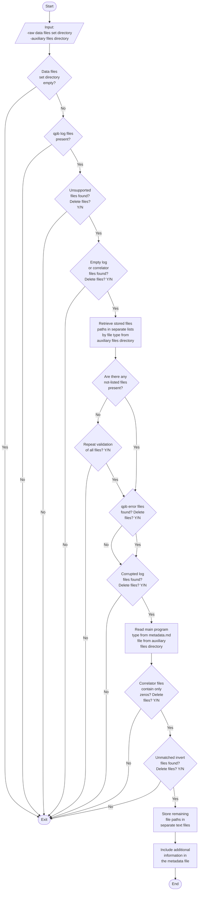

## validate_qpb_data_files.py flowchart

A validation script for qpb data files inside the data files set directory.

```mermaid
flowchart TD
    
    %% INITIATE SCRIPT
    Start([Start]) --> Inputs[/Input:
        -raw data files set directory
        -auxiliary files directory
        /]
    
    %% CHECK IF DATA FILES SET DIRECTORY IS EMPTY
    Inputs --> EmptyDirectory{
        Data files 
        set directory 
        empty?
        }
    EmptyDirectory -- Yes --> Exit([Exit])
    
    %% CHECK PRESENCE OF QPB LOG FILES
    EmptyDirectory -- No --> LogFiles{
        qpb log files 
        present?
        }
    LogFiles -- No --> Exit([Exit])

    %% REMOVE ANY UNSUPPORTED FILES FROM THE DIRECTORY
    LogFiles -- Yes --> UnsupportedFiles{
        Unsupported 
        files found?
        Delete files?
        Y/N
        }
    UnsupportedFiles -- No --> Exit([Exit program])

    %% REMOVE ANY EMPTY FILES FROM THE DIRECTORY
    UnsupportedFiles -- Yes --> EmptyTxtDatFiles{
        Empty log 
        or correlator 
        files found? 
        Delete files? Y/N
        }
    EmptyTxtDatFiles -- No --> Exit([Exit])
    
    %% RETRIEVE STORED FILE PATHS
    EmptyTxtDatFiles -- Yes --> RetrieveStored[
        Retrieve stored files
        paths in separate lists 
        by file type from 
        auxiliary files directory
    ]

    %% SELECT DATA FILES TO BE VALIDATED
    RetrieveStored --> NotListedFiles{
        Are there any 
        not-listed files 
        present?
        }
    NotListedFiles -- No --> RepeatValidation{
        Repeat validation 
        of all files? Y/N
        }
    RepeatValidation -- No --> Exit([Exit])

    %% KEEP OR REMOVE QPB ERROR FILES
    NotListedFiles -- Yes --> ErrorFiles
    RepeatValidation -- Yes --> ErrorFiles{
        qpb error files 
        found? Delete 
        files? Y/N
        }
    
    %% REMOVE CORRUPTED QPB DATA FILES
    ErrorFiles -- No --> CorruptedFiles
    ErrorFiles -- Yes --> CorruptedFiles{
        Corrupted log 
        files found? 
        Delete files? Y/N
        }
    CorruptedFiles -- No --> Exit([Exit])

    %% IDENTIFY MAIN PROGRAM TYPE AND REMOVE INCOMPATIBLE FILES
    CorruptedFiles -- Yes --> MainProgramType[
        Read main program 
        type from metadata.md 
        file from auxiliary 
        files directory
        ]

    %% CHECK IF CORRELATORS FILES CONTAIN ONLY ZERO VALUES
    MainProgramType --> CheckCorrelators{
        Correlator files 
        contain only 
        zeros? Delete 
        files? Y/N
        }
    CheckCorrelators -- No -->  Exit([Exit])

    %% REMOVE UNMATCHED INVERT FILES
    CheckCorrelators -- Yes --> UnmatchedInvertFiles{
        Unmatched invert 
        files found? 
        Delete files? Y/N
        }
    UnmatchedInvertFiles -- No --> Exit([Exit])

    %% STORE REMAINING FILE PATHS IN SEPARATE TEXT FILES
    UnmatchedInvertFiles -- Yes --> StoreFilePaths[
        Store remaining 
        file paths in 
        separate text files
        ]

    %% INCLUDE ADDITIONAL INFORMATION IN THE METADATA FILE
    StoreFilePaths --> Metadata[
        Include additional 
        information in 
        the metadata file
        ]

    %% TERMINATE SCRIPT
    Metadata --> End([End])
```
