# Critical Mass Extrapolation Module Dependency Diagram

```mermaid
graph TB
    %% Main entry points
    VIZ[visualize_critical_mass_analysis.py<br/>📊 Main Visualization Script]
    PCAC_CALC[calculate_critical_mass_from_pcac.py<br/>🧮 PCAC Critical Mass Calculator]  
    PION_CALC[calculate_critical_mass_from_pion.py<br/>🧮 Pion Critical Mass Calculator]

    %% Core modules
    CALC_CORE[_critical_mass_core.py<br/>🔧 Linear Fit & Export Functions]
    VIZ_CORE[_critical_mass_visualization_core.py<br/>📈 Plotting Functions]

    %% Configuration modules
    VIZ_CONFIG[_critical_mass_visualization_config.py<br/>⚙️ Visualization Config]
    PCAC_CONFIG[_pcac_critical_mass_config.py<br/>⚙️ PCAC Config]
    PION_CONFIG[_pion_critical_mass_config.py<br/>⚙️ Pion Config]
    SHARED_CONFIG[_critical_mass_shared_config.py<br/>⚙️ Shared Config]

    %% External library dependencies (grouped)
    LIB[📚 Library Components<br/>• DataFrameAnalyzer<br/>• PlotManagers<br/>• Validators<br/>• Logging Utils]
    EXT[🐍 External Libraries<br/>• numpy, pandas<br/>• matplotlib, gvar<br/>• lsqfit, click]

    %% Main script dependencies
    VIZ --> VIZ_CORE
    VIZ --> VIZ_CONFIG
    VIZ --> LIB

    %% Calculation script dependencies
    PCAC_CALC --> PCAC_CONFIG
    PCAC_CALC --> SHARED_CONFIG
    PCAC_CALC --> CALC_CORE
    PCAC_CALC --> LIB

    PION_CALC --> PION_CONFIG
    PION_CALC --> SHARED_CONFIG
    PION_CALC --> CALC_CORE
    PION_CALC --> LIB

    %% Core module dependencies
    CALC_CORE --> EXT
    VIZ_CORE --> VIZ_CONFIG
    VIZ_CORE --> LIB

    %% Configuration dependencies
    PCAC_CONFIG --> SHARED_CONFIG
    PION_CONFIG --> SHARED_CONFIG

    %% Styling
    classDef mainScript fill:#e1f5fe,stroke:#01579b,stroke-width:3px
    classDef coreModule fill:#f3e5f5,stroke:#4a148c,stroke-width:2px
    classDef configModule fill:#fff3e0,stroke:#e65100,stroke-width:2px
    classDef externalDep fill:#f1f8e9,stroke:#33691e,stroke-width:2px

    class VIZ,PCAC_CALC,PION_CALC mainScript
    class CALC_CORE,VIZ_CORE coreModule
    class VIZ_CONFIG,PCAC_CONFIG,PION_CONFIG,SHARED_CONFIG configModule
    class LIB,EXT externalDep
```

## Dependency Analysis

### **Entry Points (Blue)**
- **Three main scripts** for linear extrapolation analysis
- **Two calculation scripts**: Parallel processing pipelines for PCAC
  vs. pion mass data
- **One visualization script**: Unified plotting for both analysis types
  with extrapolation results

### **Core Modules (Purple)**
- **Shared calculation logic** for linear fitting and statistical
  analysis
- `_critical_mass_core.py`: Core functions
  (`load_and_validate_plateau_data`, `group_data_by_parameters`,
  `calculate_critical_mass_for_group`, `export_results_to_csv`)
- `_critical_mass_visualization_core.py`: Plotting functions
  (`create_critical_mass_extrapolation_plots`, data loading for
  visualization)

### **Configuration Modules (Orange)**
- **Hierarchical configuration** with clear analysis-type separation
- `_critical_mass_shared_config.py`: Common parameters (grouping
  parameters, fit quality thresholds, filtering criteria)
- **Analysis-specific configs**: `_pcac_critical_mass_config.py` and
  `_pion_critical_mass_config.py` both inherit from shared config
- `_critical_mass_visualization_config.py`: Independent plotting
  configuration (styling, layouts, analysis-specific plot settings)

### **External Dependencies (Green)**
- **Library components**: Project's internal data analysis and
  visualization infrastructure
- **External packages**: Scientific Python stack plus specialized
  fitting libraries (`gvar`, `lsqfit`)

## Key Architectural Insights

1. **Linear Extrapolation Focus**: All scripts perform linear fits to
   plateau mass vs. bare mass data to extrapolate critical mass values
   where plateau mass → 0

2. **Parallel Analysis Architecture**: PCAC and pion calculations use
   identical core logic but different input column mappings and
   validation rules

3. **Shared Statistical Foundation**: Both analysis types use the same
   linear fitting functions, quality metrics (R², χ²), and error
   propagation methods

4. **Independent Visualization Pipeline**: Visualization module operates
   on results CSV files, completely decoupled from calculation logic

5. **Configuration Inheritance**: Analysis-specific configs extend
   shared configuration, enabling consistent behavior while allowing
   type-specific customization

6. **Advanced Fitting Capabilities**: Integration with `gvar` and
   `lsqfit` for correlated error propagation and robust linear
   extrapolation

## Comparison with Other Modules

**Similarities to Plateau Extraction:**
- Parallel analysis architecture (PCAC + Pion)
- Shared core functions with analysis-specific configurations
- Independent visualization component

**Key Differences:**
- **Statistical Focus**: Linear extrapolation and fitting vs. plateau
  detection
- **Data Flow**: Processes plateau extraction results rather than raw
  time series
- **External Dependencies**: Specialized fitting libraries (`gvar`,
  `lsqfit`) for statistical analysis
- **Physics Goal**: Determines critical bare mass where physical mass
  vanishes (chiral limit)