# Plateau Extraction Module Dependency Diagram

```mermaid
graph TB
    %% Main entry points
    VIZ[visualize_plateau_extraction.py<br/>📊 Main Visualization Script]
    PCAC_EXT[extract_plateau_PCAC_mass.py<br/>🧮 PCAC Plateau Extractor]  
    PION_EXT[extract_plateau_pion_mass.py<br/>🧮 Pion Plateau Extractor]

    %% Core modules
    EXTRACT_CORE[_plateau_extraction_core.py<br/>🔧 Processing & Export Functions]
    VIZ_CORE[_plateau_visualization_core.py<br/>📈 Visualization Functions]

    %% Configuration modules
    VIZ_CONFIG[_plateau_visualization_config.py<br/>⚙️ Visualization Config]
    PCAC_CONFIG[_pcac_plateau_config.py<br/>⚙️ PCAC Config]
    PION_CONFIG[_pion_plateau_config.py<br/>⚙️ Pion Config]
    SHARED_CONFIG[_plateau_extraction_shared_config.py<br/>⚙️ Shared Config]

    %% External library dependencies (grouped)
    LIB[📚 Library Components<br/>• HDF5Analyzer<br/>• PlotManagers<br/>• Validators<br/>• Logging Utils]
    EXT[🐍 External Libraries<br/>• numpy, h5py<br/>• matplotlib<br/>• click, pandas]

    %% Main script dependencies
    VIZ --> VIZ_CORE
    VIZ --> VIZ_CONFIG
    VIZ --> LIB

    %% Extraction script dependencies
    PCAC_EXT --> PCAC_CONFIG
    PCAC_EXT --> SHARED_CONFIG
    PCAC_EXT --> EXTRACT_CORE
    PCAC_EXT --> LIB

    PION_EXT --> PION_CONFIG
    PION_EXT --> SHARED_CONFIG
    PION_EXT --> EXTRACT_CORE
    PION_EXT --> LIB

    %% Core module dependencies
    EXTRACT_CORE --> EXT
    VIZ_CORE --> VIZ_CONFIG
    VIZ_CORE --> LIB

    %% Configuration dependencies
    PCAC_CONFIG --> SHARED_CONFIG
    PION_CONFIG --> SHARED_CONFIG
    VIZ_CONFIG --> EXT

    %% Styling
    classDef mainScript fill:#e1f5fe,stroke:#01579b,stroke-width:3px
    classDef coreModule fill:#f3e5f5,stroke:#4a148c,stroke-width:2px
    classDef configModule fill:#fff3e0,stroke:#e65100,stroke-width:2px
    classDef externalDep fill:#f1f8e9,stroke:#33691e,stroke-width:2px

    class VIZ,PCAC_EXT,PION_EXT mainScript
    class EXTRACT_CORE,VIZ_CORE coreModule
    class VIZ_CONFIG,PCAC_CONFIG,PION_CONFIG,SHARED_CONFIG configModule
    class LIB,EXT externalDep
```

## Dependency Analysis

### **Entry Points (Blue)**
- **Three main scripts** that users directly execute
- **Two extraction scripts**: Each handles a specific analysis type
  (PCAC vs. pion masses)
- **One visualization script**: Unified script for plotting results from
  both analysis types

### **Core Modules (Purple)**
- **Reusable processing logic** shared across extraction and
  visualization workflows
- `_plateau_extraction_core.py`: Main processing functions
  (`process_all_groups`, `export_to_csv`, `export_to_hdf5`)
- `_plateau_visualization_core.py`: Plotting functions
  (`process_group_visualization`, data loading)

### **Configuration Modules (Orange)**
- **Hierarchical configuration structure** with clear separation of
  concerns
- `_plateau_extraction_shared_config.py`: Common parameters (sigma
  thresholds, CSV format, validation)
- **Analysis-specific configs**: `_pcac_plateau_config.py` and
  `_pion_plateau_config.py` both import shared config
- `_plateau_visualization_config.py`: Independent visualization
  configuration

### **External Dependencies (Green)**
- **Library components**: Project's internal infrastructure for HDF5
  handling, validation, and plotting
- **External packages**: Scientific Python stack plus data processing
  libraries

## Key Architectural Insights

1. **Dual Analysis Architecture**: Two parallel extraction pipelines
   (PCAC vs. pion) sharing common infrastructure but with type-specific
   configurations

2. **Shared Foundation**: Both analysis types rely on the same core
   processing functions and shared configuration, promoting code reuse
   and consistency

3. **Independent Visualization**: Visualization module is decoupled from
   extraction logic, with its own configuration and core functions

4. **Configuration Hierarchy**: Analysis-specific configs build upon
   shared configuration, avoiding duplication while allowing
   customization

5. **Clean Import Structure**: Each script imports only what it needs,
   with clear dependencies flowing from specific to general
   configurations

## Comparison with Correlator Calculations

**Similarities:**
- Clear separation between entry points, core modules, and configuration
- Shared configuration pattern for common parameters
- Library and external dependency structure

**Key Differences:**
- **Parallel vs. Hierarchical Config**: Plateau extraction has parallel
  analysis configs (PCAC + Pion), while correlator calculations has a
  hierarchical aggregation pattern
- **Unified Visualization**: Single visualization script handles both
  analysis types, rather than being embedded in calculation scripts
- **Export Focus**: Explicit separation of CSV and HDF5 export functions
  in the core module