# Correlator Calculations Module Dependency Diagram

```mermaid
graph TB
    %% Main entry points
    VCA[visualize_correlator_analysis.py<br/>📊 Main Visualization Script]
    PCAC[calculate_PCAC_mass.py<br/>🧮 PCAC Mass Calculator]  
    EFF[calculate_effective_mass.py<br/>🧮 Effective Mass Calculator]

    %% Core modules
    CORE[_correlator_analysis_core.py<br/>🔧 Core Utilities]
    VIZ_CORE[_correlator_visualization_core.py<br/>📈 Plotting Functions]

    %% Configuration modules
    VIZ_CONFIG[_correlator_visualization_config.py<br/>⚙️ Visualization Config]
    PCAC_CONFIG[_pcac_mass_config.py<br/>⚙️ PCAC Config]
    EFF_CONFIG[_effective_mass_config.py<br/>⚙️ Effective Mass Config]
    SHARED_CONFIG[_correlator_analysis_shared_config.py<br/>⚙️ Shared Config]

    %% External library dependencies (grouped)
    LIB[📚 Library Components<br/>• HDF5Analyzer<br/>• PlotManagers<br/>• Validators<br/>• Constants]
    EXT[🐍 External Libraries<br/>• numpy, h5py<br/>• matplotlib<br/>• click]

    %% Main script dependencies
    VCA --> CORE
    VCA --> VIZ_CORE
    VCA --> VIZ_CONFIG
    VCA --> LIB

    %% Calculation script dependencies
    PCAC --> PCAC_CONFIG
    PCAC --> SHARED_CONFIG
    PCAC --> CORE
    PCAC --> LIB

    EFF --> EFF_CONFIG
    EFF --> SHARED_CONFIG
    EFF --> CORE
    EFF --> LIB

    %% Core visualization dependencies
    VIZ_CORE --> VIZ_CONFIG
    VIZ_CORE --> LIB

    %% Configuration dependencies
    VIZ_CONFIG --> PCAC_CONFIG
    VIZ_CONFIG --> EFF_CONFIG

    %% Core utilities dependencies
    CORE --> EXT

    %% Styling
    classDef mainScript fill:#e1f5fe,stroke:#01579b,stroke-width:3px
    classDef coreModule fill:#f3e5f5,stroke:#4a148c,stroke-width:2px
    classDef configModule fill:#fff3e0,stroke:#e65100,stroke-width:2px
    classDef externalDep fill:#f1f8e9,stroke:#33691e,stroke-width:2px

    class VCA,PCAC,EFF mainScript
    class CORE,VIZ_CORE coreModule
    class VIZ_CONFIG,PCAC_CONFIG,EFF_CONFIG,SHARED_CONFIG configModule
    class LIB,EXT externalDep
```

## Dependency Analysis

### **Entry Points (Blue)**
- **Main scripts** that users directly execute
- Import both core utilities and configurations

### **Core Modules (Purple)**
- **Reusable logic** shared across multiple scripts
- `_correlator_analysis_core.py`: Data processing utilities
- `_correlator_visualization_core.py`: Plotting functions

### **Configuration Modules (Orange)**
- **Parameter definitions** and validation
- Clear hierarchy: `_correlator_visualization_config.py` aggregates
  analysis-specific configs
- Shared configuration for common constants

### **External Dependencies (Green)**
- **Library components**: Project's internal visualization
  infrastructure
- **External packages**: Standard scientific Python stack

## Key Architectural Insights

1. **Clean Separation**: Calculation scripts vs. visualization script
   with minimal overlap
2. **Configuration Hierarchy**: Visualization config aggregates
   analysis-specific configs
3. **Core Utilities**: Shared `_correlator_analysis_core.py` prevents
   code duplication
4. **Layered Dependencies**: External → Core → Config → Scripts (no
   circular dependencies)
5. **Modular Design**: Each analysis type has its own config but shares
   core functionality